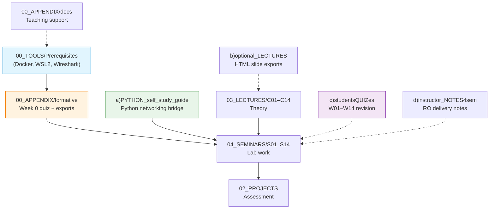

# 00_APPENDIX — Appendix, Week 0 and Supporting Material

Week 0 setup, optional bridge material and teaching aids for the COMPNET-EN course kit: environment checks, formative quizzes, a Python networking bridge pack, weekly multiple-choice revision questions, Romanian instructor delivery notes and supporting pedagogical documents.

## File and Folder Index

| Name | Description | Metric |
|---|---|---|
| [`README.md`](README.md) | Orientation for the appendix folder (you are reading it) | — |
| [`ACKNOWLEDGMENTS.md`](ACKNOWLEDGMENTS.md) | Attribution and third‑party credits for reused content | 138 lines |
| [`CHANGELOG.md`](CHANGELOG.md) | Appendix‑level change log (course kit versions and major edits) | 122 lines |
| [`LIVE_CODING_INSTRUCTOR_GUIDE.md`](LIVE_CODING_INSTRUCTOR_GUIDE.md) | Instructor guide for live coding sessions and classroom pacing | 380 lines |
| [`Makefile`](Makefile) | Week 0 automation entry points (quiz run, exports, validation) | 226 lines |
| [`requirements.txt`](requirements.txt) | Python dependencies for Week 0 quiz tooling (`PyYAML`, `pytest`, `ruff`) | 19 lines |
| [`ruff.toml`](ruff.toml) | Linter configuration aligned with the Week 0 scripts | 49 lines |
| [`a)PYTHON_self_study_guide/`](a%29PYTHON_self_study_guide/) | Optional Python bridge pack: guide, examples, formative quiz and slides | 46 files (recursive) |
| [`b)optional_LECTURES/`](b%29optional_LECTURES/) | Optional HTML exports of theory slides (S1–S14) | 15 files (recursive) |
| [`c)studentsQUIZes(multichoice_only)/`](c%29studentsQUIZes%28multichoice_only%29/) | Weekly student revision question bank (W01–W14) | 15 files (recursive) |
| [`d)instructor_NOTES4sem/`](d%29instructor_NOTES4sem/) | Romanian instructor outlines mapped to seminar weeks S01–S13 | 28 files (recursive) |
| [`docs/`](docs/) | Pedagogical notes, misconceptions, pair programming guidance and glossary | 11 files (recursive) |
| [`formative/`](formative/) | Week 0 formative assessment runner, YAML source and export tests | 13 files (recursive) |

## Visual Overview



## Usage

```bash
# from the repository root
cd 00_APPENDIX

# install Week 0 tooling dependencies (recommended in a venv)
python3 -m pip install -r requirements.txt

# run the Week 0 formative quiz (interactive)
python3 formative/run_quiz.py

# or use the Week 0 Makefile wrapper
make quiz

# export the Week 0 quiz to JSON or Moodle GIFT
make export-json
make export-moodle
```

> The Week 0 `Makefile` contains `test` and `lint` targets that assume a folder named `PYTHON_self_study_guide/`. In this repository version the folder is `a)PYTHON_self_study_guide/`, so run Python-bridge tests and linting from `a)PYTHON_self_study_guide/Makefile` instead.

## Design Notes

Week 0 material is kept in a single appendix folder so that environment checks, baseline quizzes and optional remediation do not fragment across lecture and seminar weeks. Student‑facing revision content is separated from instructor‑only notes to simplify selective distribution and to keep Romanian delivery text out of the English teaching flow.

## Cross-References and Context

### Prerequisites and Dependencies

| Prerequisite | Path | Why |
|---|---|---|
| Environment setup | [`../00_TOOLS/Prerequisites/`](../00_TOOLS/Prerequisites/) | Docker, WSL2 and Wireshark are assumed from S01 onward |
| Portainer setup | [`../00_TOOLS/Portainer/INIT_GUIDE/`](../00_TOOLS/Portainer/INIT_GUIDE/) | Container management is used in Docker‑based seminars (S08–S11, S13) and projects |
| PlantUML rendering (optional) | [`../00_TOOLS/plantuml/`](../00_TOOLS/plantuml/) | Diagram regeneration for lectures, seminars and projects when editing `.puml` sources |

### Appendix Components Mapped to the Course

| Appendix component | Lecture foundation | Seminar practice | Project extension | Quiz alignment |
|---|---|---|---|---|
| `formative/` | — | [`../04_SEMINARS/S01/`](../04_SEMINARS/S01/) (first lab assumes working tooling) | [`../02_PROJECTS/`](../02_PROJECTS/) (all projects depend on the toolchain) | Week 0 only |
| `a)PYTHON_self_study_guide/` | [`../03_LECTURES/C03/c3-intro-network-programming.md`](../03_LECTURES/C03/c3-intro-network-programming.md) | [`../04_SEMINARS/S02/`](../04_SEMINARS/S02/), [`../04_SEMINARS/S03/`](../04_SEMINARS/S03/) and [`../04_SEMINARS/S04/`](../04_SEMINARS/S04/) | [`../02_PROJECTS/01_network_applications/`](../02_PROJECTS/01_network_applications/) | Weeks 02–04, 08 (socket and transport topics recur) |
| `b)optional_LECTURES/` | [`../03_LECTURES/`](../03_LECTURES/) (canonical Markdown) | [`../04_SEMINARS/`](../04_SEMINARS/) | — | Weeks 01–14 |
| `c)studentsQUIZes(multichoice_only)/` | [`../03_LECTURES/`](../03_LECTURES/) | [`../04_SEMINARS/`](../04_SEMINARS/) | [`../02_PROJECTS/COURSE_SEMINAR_MAPPING.md`](../02_PROJECTS/COURSE_SEMINAR_MAPPING.md) | Weeks 01–14 |
| `d)instructor_NOTES4sem/` | [`../03_LECTURES/README.md`](../03_LECTURES/README.md) (week map) | [`../04_SEMINARS/`](../04_SEMINARS/) (delivery) | [`../02_PROJECTS/`](../02_PROJECTS/) (notes reference project‑adjacent tasks) | Weeks 01–13 |
| `docs/` | — | — | — | — |

### Week Map

| Week | Lecture (theory) | Seminar (lab) | Student quiz | Instructor notes (RO) | Portainer guide | Optional HTML lecture |
|---:|---|---|---|---|---|---|
| 1 | [`C01`](../03_LECTURES/C01/c1-network-fundamentals.md) | [`S01`](../04_SEMINARS/S01/) | [`W01`](c%29studentsQUIZes%28multichoice_only%29/COMPnet_W01_Questions.md) | [`S01`](d%29instructor_NOTES4sem/roCOMPNETclass_S01-instructor-outline-v3.md) | — | [`S1Theory`](b%29optional_LECTURES/S1Theory_Network_fundamentals_EN.html) |
| 2 | [`C02`](../03_LECTURES/C02/c2-architectural-models.md) | [`S02`](../04_SEMINARS/S02/) | [`W02`](c%29studentsQUIZes%28multichoice_only%29/COMPnet_W02_Questions.md) | [`S02`](d%29instructor_NOTES4sem/roCOMPNETclass_S02-instructor-outline-v2.md) | — | [`S2Theory`](b%29optional_LECTURES/S2Theory_Architectural_models_OSI_and_TCP_IP_EN.html) |
| 3 | [`C03`](../03_LECTURES/C03/c3-intro-network-programming.md) | [`S03`](../04_SEMINARS/S03/) | [`W03`](c%29studentsQUIZes%28multichoice_only%29/COMPnet_W03_Questions.md) | [`S03`](d%29instructor_NOTES4sem/roCOMPNETclass_S03-instructor-outline-v2.md) | — | [`S3Theory`](b%29optional_LECTURES/S3Theory_UDP_Broadcast_Multicast_TCP_Tunnels_EN.html) |
| 4 | [`C04`](../03_LECTURES/C04/c4-physical-and-data-link.md) | [`S04`](../04_SEMINARS/S04/) | [`W04`](c%29studentsQUIZes%28multichoice_only%29/COMPnet_W04_Questions.md) | [`S04`](d%29instructor_NOTES4sem/roCOMPNETclass_S04-instructor-outline-v2.md) | — | [`S4Theory`](b%29optional_LECTURES/S4Theory_Physical_and_data_link_layer_EN.html) |
| 5 | [`C05`](../03_LECTURES/C05/c5-network-layer-addressing.md) | [`S05`](../04_SEMINARS/S05/) | [`W05`](c%29studentsQUIZes%28multichoice_only%29/COMPnet_W05_Questions.md) | [`S05`](d%29instructor_NOTES4sem/roCOMPNETclass_S05-instructor-outline-v2.md) | — | [`S5Theory`](b%29optional_LECTURES/S5Theory_Network_layer__IP_addressing_and_subnetting_EN.html) |
| 6 | [`C06`](../03_LECTURES/C06/c6-nat-arp-dhcp-ndp-icmp.md) | [`S06`](../04_SEMINARS/S06/) | [`W06`](c%29studentsQUIZes%28multichoice_only%29/COMPnet_W06_Questions.md) | [`S06`](d%29instructor_NOTES4sem/roCOMPNETclass_S06-instructor-outline-v2.md) | — | [`S6Theory`](b%29optional_LECTURES/S6Theory_NAT_PAT_ARP_DHCP_NDP_and_ICMP_EN.html) |
| 7 | [`C07`](../03_LECTURES/C07/c7-routing-protocols.md) | [`S07`](../04_SEMINARS/S07/) | [`W07`](c%29studentsQUIZes%28multichoice_only%29/COMPnet_W07_Questions.md) | [`S07`](d%29instructor_NOTES4sem/roCOMPNETclass_S07-instructor-outline-v2.md) | — | [`S7Theory`](b%29optional_LECTURES/S7Theory_Routing_protocols_EN.html) |
| 8 | [`C08`](../03_LECTURES/C08/c8-transport-layer.md) | [`S08`](../04_SEMINARS/S08/) | [`W08`](c%29studentsQUIZes%28multichoice_only%29/COMPnet_W08_Questions.md) | [`S08`](d%29instructor_NOTES4sem/roCOMPNETclass_S08-instructor-outline-v2.md) | [`SEMINAR08`](../00_TOOLS/Portainer/SEMINAR08/) | [`S8Theory`](b%29optional_LECTURES/S8Theory_Transport_layer_EN.html) |
| 9 | [`C09`](../03_LECTURES/C09/c9-session-presentation.md) | [`S09`](../04_SEMINARS/S09/) | [`W09`](c%29studentsQUIZes%28multichoice_only%29/COMPnet_W09_Questions.md) | [`S09`](d%29instructor_NOTES4sem/roCOMPNETclass_S09-instructor-outline-v2.md) | [`SEMINAR09`](../00_TOOLS/Portainer/SEMINAR09/) | [`S9Theory`](b%29optional_LECTURES/S9Theory_Session_and_presentation_concepts_EN.html) |
| 10 | [`C10`](../03_LECTURES/C10/c10-http-application-layer.md) | [`S10`](../04_SEMINARS/S10/) | [`W10`](c%29studentsQUIZes%28multichoice_only%29/COMPnet_W10_Questions.md) | [`S10`](d%29instructor_NOTES4sem/roCOMPNETclass_S10-instructor-outline-v2.md) | [`SEMINAR10`](../00_TOOLS/Portainer/SEMINAR10/) | [`S10Theory`](b%29optional_LECTURES/S10Theory_Application-layer_protocols_EN.html) |
| 11 | [`C11`](../03_LECTURES/C11/c11-ftp-dns-ssh.md) | [`S11`](../04_SEMINARS/S11/) | [`W11`](c%29studentsQUIZes%28multichoice_only%29/COMPnet_W11_Questions.md) | [`S11`](d%29instructor_NOTES4sem/roCOMPNETclass_S11-instructor-outline-v2.md) | [`SEMINAR11`](../00_TOOLS/Portainer/SEMINAR11/) | [`S11Theory`](b%29optional_LECTURES/S11Theory_FTP_DNS_and_SSH_EN.html) |
| 12 | [`C12`](../03_LECTURES/C12/c12-email-protocols.md) | [`S12`](../04_SEMINARS/S12/) | [`W12`](c%29studentsQUIZes%28multichoice_only%29/COMPnet_W12_Questions.md) | [`S12`](d%29instructor_NOTES4sem/roCOMPNETclass_S12-instructor-outline-v2.md) | — | [`S12Theory`](b%29optional_LECTURES/S12Theory_Email_protocols_EN.html) |
| 13 | [`C13`](../03_LECTURES/C13/c13-iot-security.md) | [`S13`](../04_SEMINARS/S13/) | [`W13`](c%29studentsQUIZes%28multichoice_only%29/COMPnet_W13_Questions.md) | [`S13`](d%29instructor_NOTES4sem/roCOMPNETclass_S13-instructor-outline-v2.md) | [`SEMINAR13`](../00_TOOLS/Portainer/SEMINAR13/) | [`S13Theory`](b%29optional_LECTURES/S13Theory_IoT_and_network_security_EN.html) |
| 14 | [`C14`](../03_LECTURES/C14/c14-revision-and-exam-prep.md) | [`S14`](../04_SEMINARS/S14/) | [`W14`](c%29studentsQUIZes%28multichoice_only%29/COMPnet_W14_Questions.md) | — | — | [`S14Theory`](b%29optional_LECTURES/S14Theory_Integrated_RECAP_EN.html) |

### Downstream Dependencies

- The repository root [`README.md`](../README.md) lists `00_APPENDIX/` in the top‑level structure table.
- `03_LECTURES/README.md` and each `03_LECTURES/CNN/README.md` link to Romanian instructor notes under `d)instructor_NOTES4sem/`.
- `04_SEMINARS/README.md` links to both the quiz bank (`c)studentsQUIZes…`) and the instructor notes.
- `00_TOOLS/Prerequisites/Prerequisites_CHECKS.md` links into `00_APPENDIX/docs/` (misconceptions supplement).

### Suggested Learning Sequence

`00_TOOLS/Prerequisites/` → `00_APPENDIX/formative/` → `00_APPENDIX/a)PYTHON_self_study_guide/` (if needed) → `04_SEMINARS/S01/` → `03_LECTURES/C01/` (weekly cycle thereafter)

## Selective Clone

Method A — Git sparse-checkout (requires Git ≥ 2.25)

```bash
git clone --filter=blob:none --sparse https://github.com/antonioclim/COMPNET-EN.git
cd COMPNET-EN
git sparse-checkout set 00_APPENDIX
```

To add a sibling later (example):

```bash
git sparse-checkout add 00_TOOLS/Prerequisites
```

Method B — Direct download (no Git required)

```text
https://github.com/antonioclim/COMPNET-EN/tree/main/00_APPENDIX
```

## Version and Provenance

| Item | Value |
|---|---|
| Appendix change log | [`CHANGELOG.md`](CHANGELOG.md) |
| Course kit version noted in Week 0 tooling | 1.6.0 (2026-01-25) |
| Primary author (course kit) | ing. dr. Antonio Clim — ASE Bucharest, CSIE |
