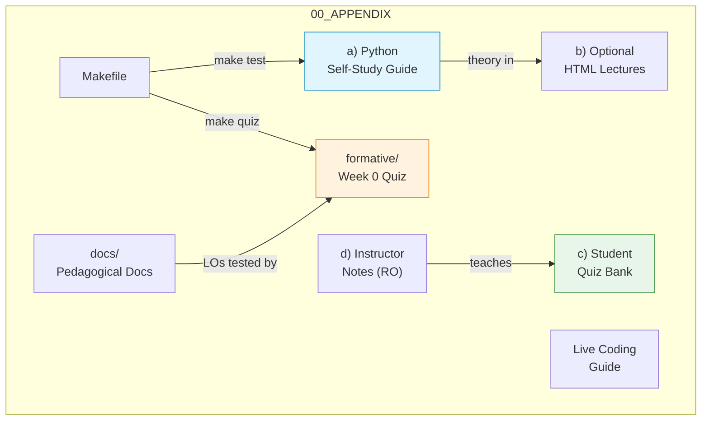
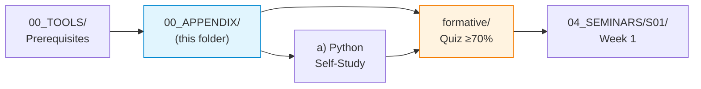

# 00_APPENDIX — Week 0 Prerequisites and Course Support Materials
## Computer Networks — ASE Bucharest, CSIE | ing. dr. Antonio Clim

Prerequisite kit and ancillary materials for the 14-week Computer Networks laboratory course. Students must complete the environment setup and diagnostic quiz here before Week 1. Instructors will find Romanian seminar outlines, a live-coding guide and a 612-question bilingual quiz bank.

## Learning Objectives

| ID | Objective | Bloom level | Assessment |
|---|---|---|---|
| LO0.1 | Configure a complete WSL2 + Docker environment | Apply | Quiz Q1–Q2 |
| LO0.2 | Distinguish Docker images from containers | Understand | Quiz Q3, Q10 |
| LO0.3 | Apply port mapping between host and containers | Apply | Quiz Q4–Q5 |
| LO0.4 | Convert between bytes and strings in Python | Apply | Quiz Q6–Q7 |
| LO0.5 | Create and configure basic TCP sockets | Apply | Quiz Q8–Q9 |

Full mapping: [`docs/learning_objectives.md`](docs/learning_objectives.md)

## Quick Start

### Step 1 — verify the environment

```bash
cd ../00_TOOLS/Prerequisites/
chmod +x verify_lab_environment.sh
./verify_lab_environment.sh
```

All checks should show a green tick.

### Step 2 — complete the Python self-study guide

1. Read [`../00_TOOLS/Prerequisites/Prerequisites.md`](../00_TOOLS/Prerequisites/Prerequisites.md)
2. Work through [`a)PYTHON_self_study_guide/`](a%29PYTHON_self_study_guide/)
3. Run the examples in `a)PYTHON_self_study_guide/examples/`

### Step 3 — test your knowledge

```bash
make quiz          # interactive, 10 questions
```

Target: score 70% or higher to proceed to Week 1.

### Step 4 — review common mistakes

Read [`docs/misconceptions.md`](docs/misconceptions.md) — 12 errors to avoid.

## Folder Structure

```
00_APPENDIX/
├── a)PYTHON_self_study_guide/       # Python transition guide (2 222-line core doc)
│   ├── PRESENTATIONS_EN/            #   10 HTML slide decks
│   ├── cheatsheets/                 #   quick-reference card
│   ├── comparisons/                 #   Rosetta Stone + misconceptions by language
│   ├── docs/                        #   troubleshooting + weekly checkpoints
│   ├── examples/                    #   4 annotated scripts + tests/
│   ├── formative/                   #   quiz (31 q) + Parsons problems
│   ├── images/                      #   screenshot placeholder
│   └── Makefile                     #   guide-specific automation
├── b)optional_LECTURES/             # 14 HTML lecture exports (S1–S14)
├── c)studentsQUIZes(multichoice_only)/  # 612 bilingual quiz items (W01–W14)
├── d)instructor_NOTES4sem/          # 27 Romanian instructor outlines (S01–S13)
├── docs/                            # 10 pedagogical documents (2 911 lines)
├── formative/                       # Week 0 quiz (10 q) + LMS export pipeline
├── ACKNOWLEDGMENTS.md               # Contributors and credits
├── CHANGELOG.md                     # Version history for Week 0 materials
├── LIVE_CODING_INSTRUCTOR_GUIDE.md  # Technique guide for in-class live coding
├── Makefile                         # Root-level automation (quiz, test, lint, export)
├── README.md                        # ← this file
├── requirements.txt                 # pip dependencies (PyYAML, pytest, ruff)
└── ruff.toml                        # Python linter configuration
```

## File Index (root-level files)

| File | Lines | Purpose |
|---|---|---|
| [`Makefile`](Makefile) | 195 | Build automation: `quiz`, `test`, `lint`, `validate`, `export`, `ci` |
| [`requirements.txt`](requirements.txt) | 14 | pip install dependencies |
| [`ruff.toml`](ruff.toml) | 41 | Ruff linter rules and per-file overrides |
| [`CHANGELOG.md`](CHANGELOG.md) | — | Version history for the prerequisite kit |
| [`ACKNOWLEDGMENTS.md`](ACKNOWLEDGMENTS.md) | — | Contributors and pedagogical collaboration credits |
| [`LIVE_CODING_INSTRUCTOR_GUIDE.md`](LIVE_CODING_INSTRUCTOR_GUIDE.md) | — | Session structure, technique and post-session checklist for live coding |

## Using the Makefile

```bash
make help          # list all targets

# quiz
make quiz          # interactive (10 questions)
make quiz-review   # show answers
make quiz-random   # randomised order

# development
make test          # smoke tests for Python examples
make test-exports  # export function unit tests
make lint          # ruff or flake8
make validate      # YAML, JSON and Python syntax

# export
make export-json   # JSON for LMS import
make export-moodle # Moodle GIFT format

# combined
make all           # lint + test + validate
make ci            # lint + validate + test + test-exports
make clean         # remove generated files and caches
```

## Self-Assessment Checklist

Before proceeding to Week 1, confirm you can:

- [ ] Start WSL2 and Docker without errors
- [ ] Access Portainer at `http://localhost:9000`
- [ ] Run `verify_lab_environment.sh` with all checks passing
- [ ] Score 70% or higher on `make quiz`
- [ ] Explain the container/image distinction to a peer
- [ ] Write a TCP client that connects and sends a message
- [ ] Convert between bytes and strings without encoding errors
- [ ] Identify the correct socket call sequence for server vs client

## Visual Overview



## Cross-References

### Prerequisites

| Prerequisite | Path | Reason |
|---|---|---|
| Environment setup | [`../00_TOOLS/Prerequisites/`](../00_TOOLS/Prerequisites/) | Docker, WSL2 and Portainer must be configured |
| Verification script | [`../00_TOOLS/Prerequisites/verify_lab_environment.sh`](../00_TOOLS/Prerequisites/verify_lab_environment.sh) | Automated check before quiz |

### Lecture ↔ Seminar ↔ Quiz ↔ Instructor Notes

This folder serves Week 0 (no dedicated lecture or seminar). From Week 1 onward, the mapping is:

| Week | Lecture | Seminar | Quiz (in `c)`) | Instructor notes (in `d)`) |
|---|---|---|---|---|
| 01 | [`03_LECTURES/C01/`](../03_LECTURES/C01/) | [`04_SEMINARS/S01/`](../04_SEMINARS/S01/) | W01 (16 items) | S01 |
| 02 | [`03_LECTURES/C02/`](../03_LECTURES/C02/) | [`04_SEMINARS/S02/`](../04_SEMINARS/S02/) | W02 (36 items) | S02 |
| 03 | [`03_LECTURES/C03/`](../03_LECTURES/C03/) | [`04_SEMINARS/S03/`](../04_SEMINARS/S03/) | W03 (36 items) | S03 |
| 04 | [`03_LECTURES/C04/`](../03_LECTURES/C04/) | [`04_SEMINARS/S04/`](../04_SEMINARS/S04/) | W04 (49 items) | S04 |
| 05 | [`03_LECTURES/C05/`](../03_LECTURES/C05/) | [`04_SEMINARS/S05/`](../04_SEMINARS/S05/) | W05 (47 items) | S05 |
| 06 | [`03_LECTURES/C06/`](../03_LECTURES/C06/) | [`04_SEMINARS/S06/`](../04_SEMINARS/S06/) | W06 (55 items) | S06 |
| 07 | [`03_LECTURES/C07/`](../03_LECTURES/C07/) | [`04_SEMINARS/S07/`](../04_SEMINARS/S07/) | W07 (28 items) | S07 |
| 08 | [`03_LECTURES/C08/`](../03_LECTURES/C08/) | [`04_SEMINARS/S08/`](../04_SEMINARS/S08/) | W08 (35 items) | S08 |
| 09 | [`03_LECTURES/C09/`](../03_LECTURES/C09/) | — | W09 (35 items) | S09 |
| 10 | [`03_LECTURES/C10/`](../03_LECTURES/C10/) | [`04_SEMINARS/S09/`](../04_SEMINARS/S09/) | W10 (52 items) | S10 |
| 11 | [`03_LECTURES/C11/`](../03_LECTURES/C11/) | [`04_SEMINARS/S10/`](../04_SEMINARS/S10/) | W11 (60 items) | S11 |
| 12 | [`03_LECTURES/C12/`](../03_LECTURES/C12/) | [`04_SEMINARS/S11/`](../04_SEMINARS/S11/) | W12 (59 items) | S12 |
| 13 | [`03_LECTURES/C13/`](../03_LECTURES/C13/) | [`04_SEMINARS/S12/`](../04_SEMINARS/S12/) | W13 (53 items) | S13 |
| 14 | [`03_LECTURES/C14/`](../03_LECTURES/C14/) | [`04_SEMINARS/S13/`](../04_SEMINARS/S13/) | W14 (51 items) | — |

### Downstream Dependencies

The repository root [`../README.md`](../README.md) links into this directory. The Portainer init guide at [`../00_TOOLS/Portainer/INIT_GUIDE/`](../00_TOOLS/Portainer/INIT_GUIDE/) references the environment setup described here. No CI pipeline file exists within `00_APPENDIX/` itself, but the Makefile's `ci` target simulates a local CI run.

### Suggested Learning Sequence



## Troubleshooting

Full guide: [`docs/troubleshooting.md`](docs/troubleshooting.md)

| Problem | Solution |
|---|---|
| Docker not starting | `sudo service docker start` |
| Port 9000 in use | `sudo lsof -i :9000`, then stop the conflicting process |
| WSL networking issues | see `docs/troubleshooting.md` |
| Python import errors | `pip install -r requirements.txt` |
| Permission denied | `chmod +x script.sh` |

## Selective Clone

**Method A — sparse-checkout (Git 2.25+):**

```bash
git clone --filter=blob:none --sparse https://github.com/antonioclim/COMPNET-EN.git
cd COMPNET-EN
git sparse-checkout set 00_APPENDIX
```

To add a specific subfolder only:

```bash
git sparse-checkout set "00_APPENDIX/a)PYTHON_self_study_guide"
```

**Method B — browse on GitHub:**

```
https://github.com/antonioclim/COMPNET-EN/tree/main/00_APPENDIX
```

## Version

| Field | Value |
|---|---|
| Version | 1.6.0 |
| Last updated | January 2026 |
| Author | ing. dr. Antonio Clim |
| Institution | ASE Bucharest, CSIE |
| Python | 3.11+ |

---

*Week 0 — Computer Networks | Academy of Economic Studies, Bucharest*
*Faculty of Cybernetics, Statistics and Economic Informatics*
