# PRESENTATIONS_EN — HTML Slides for the Python Networking Bridge

Ten self-contained HTML slide decks that mirror the structure of the Python bridge guide and give a browser-first way to revise key Python networking idioms before attempting the course seminars and projects.

## File and Folder Index

| Name | Description | Metric |
|---|---|---|
| [`README.md`](README.md) | Orientation for the HTML slides | — |
| [`01_introduction_setup.html`](01_introduction_setup.html) | Module 01: Python setup, virtual environments and a first script | 1,560 lines |
| [`02_reading_python_code.html`](02_reading_python_code.html) | Module 02: Reading Python code for C, C++, JavaScript and Java backgrounds | 1,634 lines |
| [`03_data_types_networking.html`](03_data_types_networking.html) | Module 03: `bytes`, `str`, encoding and network payload handling | 1,047 lines |
| [`04_socket_programming.html`](04_socket_programming.html) | Module 04: TCP and UDP sockets (`bind`, `listen`, `connect`) | 1,128 lines |
| [`05_code_organisation.html`](05_code_organisation.html) | Module 05: Modules, packages and the `if __name__ == "__main__"` guard | 561 lines |
| [`06_cli_interfaces.html`](06_cli_interfaces.html) | Module 06: `argparse` patterns for networking tools | 565 lines |
| [`07_packet_analysis.html`](07_packet_analysis.html) | Module 07: Packet analysis entry points (pcap reading, Scapy introduction) | 545 lines |
| [`08_concurrency.html`](08_concurrency.html) | Module 08: Concurrency patterns for servers (threads, `select`, async overview) | 561 lines |
| [`09_http_protocols.html`](09_http_protocols.html) | Module 09: HTTP requests, JSON handling and REST interactions in Python | 576 lines |
| [`10_debugging_best_practices.html`](10_debugging_best_practices.html) | Module 10: Debugging patterns (`logging`, `pdb`) for network code | 617 lines |

## Visual Overview

```mermaid
flowchart LR
    M01["01 setup"] --> M02["02 read code"] --> M03["03 bytes/str"] --> M04["04 sockets"]
    M04 --> M05["05 organisation"] --> M06["06 CLI"] --> M07["07 packet analysis"]
    M07 --> M08["08 concurrency"] --> M09["09 HTTP"] --> M10["10 debugging"]

    style M04 fill:#e8f5e9,stroke:#388e3c
    style M07 fill:#fff3e0,stroke:#f57c00
    style M09 fill:#f3e5f5,stroke:#7b1fa2
```



## Usage

Open any file directly in a browser. If your browser blocks local file cross-links, serve the folder with a tiny HTTP server:

```bash
cd "00_APPENDIX/a)PYTHON_self_study_guide/PRESENTATIONS_EN"
python3 -m http.server 8000
# then open: http://localhost:8000/04_socket_programming.html
```

## Cross-References and Context

### Prerequisites and Dependencies

| Prerequisite | Path | Why |
|---|---|---|
| Python bridge guide | [`../PYTHON_NETWORKING_GUIDE.md`](../PYTHON_NETWORKING_GUIDE.md) | Slides are a summary of the longer explanations |
| Runnable examples | [`../examples/`](../examples/) | Exercises that correspond to Modules 03, 04 and 08 |

### Module Mapping to the Course

| Module | Related lecture | Related seminar | Related project | Related quiz |
|---:|---|---|---|---|
| 01 setup | — | — | — | Week 0 formative: [`../../formative/`](../../formative/) |
| 03 bytes/str | [`../../../03_LECTURES/C03/c3-intro-network-programming.md`](../../../03_LECTURES/C03/c3-intro-network-programming.md) | [`../../../04_SEMINARS/S04/`](../../../04_SEMINARS/S04/) (binary framing) | [`../../../02_PROJECTS/01_network_applications/`](../../../02_PROJECTS/01_network_applications/) | [`../../c)studentsQUIZes(multichoice_only)/COMPnet_W04_Questions.md`](../../c%29studentsQUIZes%28multichoice_only%29/COMPnet_W04_Questions.md) |
| 04 sockets | [`../../../03_LECTURES/C03/c3-intro-network-programming.md`](../../../03_LECTURES/C03/c3-intro-network-programming.md) | [`../../../04_SEMINARS/S02/`](../../../04_SEMINARS/S02/) | [`../../../02_PROJECTS/01_network_applications/S01_multi_client_tcp_chat_text_protocol_and_presence.md`](../../../02_PROJECTS/01_network_applications/S01_multi_client_tcp_chat_text_protocol_and_presence.md) | [`../../c)studentsQUIZes(multichoice_only)/COMPnet_W02_Questions.md`](../../c%29studentsQUIZes%28multichoice_only%29/COMPnet_W02_Questions.md) |
| 07 packet analysis | [`../../../03_LECTURES/C01/c1-network-fundamentals.md`](../../../03_LECTURES/C01/c1-network-fundamentals.md) | [`../../../04_SEMINARS/S01/`](../../../04_SEMINARS/S01/), [`../../../04_SEMINARS/S07/`](../../../04_SEMINARS/S07/) | — | [`../../c)studentsQUIZes(multichoice_only)/COMPnet_W01_Questions.md`](../../c%29studentsQUIZes%28multichoice_only%29/COMPnet_W01_Questions.md) |
| 08 concurrency | [`../../../03_LECTURES/C03/c3-intro-network-programming.md`](../../../03_LECTURES/C03/c3-intro-network-programming.md) | [`../../../04_SEMINARS/S03/`](../../../04_SEMINARS/S03/) (multi-client server patterns) | [`../../../02_PROJECTS/01_network_applications/S01_multi_client_tcp_chat_text_protocol_and_presence.md`](../../../02_PROJECTS/01_network_applications/S01_multi_client_tcp_chat_text_protocol_and_presence.md) | — |
| 09 HTTP | [`../../../03_LECTURES/C10/c10-http-application-layer.md`](../../../03_LECTURES/C10/c10-http-application-layer.md) | [`../../../04_SEMINARS/S08/`](../../../04_SEMINARS/S08/) (HTTP on the wire) | [`../../../02_PROJECTS/01_network_applications/S03_http11_socket_server_no_framework_static_files.md`](../../../02_PROJECTS/01_network_applications/S03_http11_socket_server_no_framework_static_files.md) | [`../../c)studentsQUIZes(multichoice_only)/COMPnet_W10_Questions.md`](../../c%29studentsQUIZes%28multichoice_only%29/COMPnet_W10_Questions.md) |

Rows are selective: the modules are a Python bridge, not a second copy of the lecture sequence.

### Downstream Dependencies

No other repository components require these HTML files to run. They are referenced from:

- [`../README.md`](../README.md) (bridge pack overview)
- [`../PYTHON_NETWORKING_GUIDE.md`](../PYTHON_NETWORKING_GUIDE.md) (reading path)

### Suggested Learning Sequence

`../PYTHON_NETWORKING_GUIDE.md` → open the matching HTML module → run the corresponding script in `../examples/` → proceed to the relevant seminar

## Selective Clone

Method A — Git sparse-checkout (requires Git ≥ 2.25)

```bash
git clone --filter=blob:none --sparse https://github.com/antonioclim/COMPNET-EN.git
cd COMPNET-EN
git sparse-checkout set "00_APPENDIX/a)PYTHON_self_study_guide/PRESENTATIONS_EN"
```

Method B — Direct download (no Git required)

```text
https://github.com/antonioclim/COMPNET-EN/tree/main/00_APPENDIX/a)PYTHON_self_study_guide/PRESENTATIONS_EN
```

## Version and Provenance

| Item | Value |
|---|---|
| Source context | Part of the optional Python bridge pack |
| Companion text | [`../PYTHON_NETWORKING_GUIDE.md`](../PYTHON_NETWORKING_GUIDE.md) |
