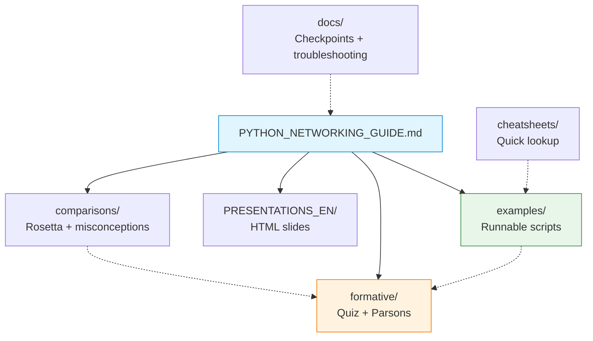

# a)PYTHON_self_study_guide — Python Networking Bridge Pack

Optional remediation pack for students who must write network code in Python during seminars and projects but come from C, C++, JavaScript, Java or Kotlin. The folder combines a long-form guide, runnable examples, self-check quizzes, Parsons problems, quick-reference notes and lightweight HTML slide decks.

## File and Folder Index

| Name | Description | Metric |
|---|---|---|
| [`README.md`](README.md) | Orientation for the Python bridge pack (you are reading it) | — |
| [`PYTHON_NETWORKING_GUIDE.md`](PYTHON_NETWORKING_GUIDE.md) | Long-form guide (Python networking patterns, cross-language notes) | 2,222 lines |
| [`Makefile`](Makefile) | Local automation: run examples, quizzes, Parsons problems, lint and tests | 314 lines |
| [`examples/`](examples/) | Annotated Python scripts (sockets, bytes/encoding, `struct`, error handling) | 13 files (recursive) |
| [`formative/`](formative/) | Python-focused formative quiz (31 questions) and Parsons runner | 9 files (recursive) |
| [`comparisons/`](comparisons/) | Rosetta Stone and misconception lists by language background | 3 files |
| [`cheatsheets/`](cheatsheets/) | Fast lookup notes for common Python networking idioms | 2 files |
| [`docs/`](docs/) | Self-check checkpoints and troubleshooting scenarios | 3 files |
| [`PRESENTATIONS_EN/`](PRESENTATIONS_EN/) | HTML slide decks mirroring the guide structure (10 modules) | 11 files |
| [`images/`](images/) | Image placeholders referenced by the guide and HTML slides | 2 files |

## Visual Overview



## Usage

```bash
# from the repository root
cd "00_APPENDIX/a)PYTHON_self_study_guide"

# see available targets
make help

# run the socket example (reads args; see script footer for usage)
python3 examples/01_socket_tcp.py help

# run the Python bridge formative quiz
make quiz

# run Parsons problems (code line reordering)
make parsons

# run the included tests
make test-all
```

If you only need the written material, open `PYTHON_NETWORKING_GUIDE.md` in GitHub and ignore the automation.

## Design Notes

The pack is structured around a single guide so that students can move from concept explanation to runnable code without switching repositories or tooling. Cross-language comparisons are separated into their own folder to avoid interrupting the networking narrative while still making misconceptions explicit for students changing language ecosystems.

## Cross-References and Context

### Prerequisites and Dependencies

| Prerequisite | Path | Why |
|---|---|---|
| Week 0 environment check | [`../formative/`](../formative/) | Python and tooling must work locally before attempting socket labs |
| General prerequisites | [`../../00_TOOLS/Prerequisites/`](../../00_TOOLS/Prerequisites/) | Docker, WSL2 and packet tools are assumed by the course labs |
| Course schedule context | [`../../04_SEMINARS/README.md`](../../04_SEMINARS/README.md) | Seminar S02 onward expects working Python fluency |

### Bridge Pack Mapped to Lectures, Seminars, Projects and Quizzes

| Bridge pack area | Lecture foundation | Seminar practice | Project extension | Quiz alignment |
|---|---|---|---|---|
| `PYTHON_NETWORKING_GUIDE.md` | [`../../03_LECTURES/C03/c3-intro-network-programming.md`](../../03_LECTURES/C03/c3-intro-network-programming.md), [`../../03_LECTURES/C08/c8-transport-layer.md`](../../03_LECTURES/C08/c8-transport-layer.md) | [`../../04_SEMINARS/S02/`](../../04_SEMINARS/S02/), [`../../04_SEMINARS/S03/`](../../04_SEMINARS/S03/) and [`../../04_SEMINARS/S04/`](../../04_SEMINARS/S04/) | [`../../02_PROJECTS/01_network_applications/S01_multi_client_tcp_chat_text_protocol_and_presence.md`](../../02_PROJECTS/01_network_applications/S01_multi_client_tcp_chat_text_protocol_and_presence.md), [`../../02_PROJECTS/01_network_applications/S03_http11_socket_server_no_framework_static_files.md`](../../02_PROJECTS/01_network_applications/S03_http11_socket_server_no_framework_static_files.md) | [`../c)studentsQUIZes(multichoice_only)/COMPnet_W02_Questions.md`](../c%29studentsQUIZes%28multichoice_only%29/COMPnet_W02_Questions.md), [`../c)studentsQUIZes(multichoice_only)/COMPnet_W03_Questions.md`](../c%29studentsQUIZes%28multichoice_only%29/COMPnet_W03_Questions.md), [`../c)studentsQUIZes(multichoice_only)/COMPnet_W04_Questions.md`](../c%29studentsQUIZes%28multichoice_only%29/COMPnet_W04_Questions.md) |
| `examples/` | [`../../03_LECTURES/C03/c3-intro-network-programming.md`](../../03_LECTURES/C03/c3-intro-network-programming.md) | [`../../04_SEMINARS/S02/`](../../04_SEMINARS/S02/), [`../../04_SEMINARS/S04/`](../../04_SEMINARS/S04/) | [`../../02_PROJECTS/01_network_applications/`](../../02_PROJECTS/01_network_applications/) | Weeks 02–04 |
| `formative/` | — (Python skill check) | [`../../04_SEMINARS/S02/`](../../04_SEMINARS/S02/) (readiness) | — | — |
| `comparisons/` | — | — | — | — |

### Downstream Dependencies

- `00_TOOLS/Prerequisites/README.md` links to this folder as the course’s Python remediation option.
- `03_LECTURES/README.md` and `03_LECTURES/C03/README.md` link to this folder as assumed preparation for socket programming.
- `02_PROJECTS/01_network_applications/README.md` links to this folder as the Python baseline for network application projects.

### Suggested Learning Sequence

`00_TOOLS/Prerequisites/` → `00_APPENDIX/formative/` → `00_APPENDIX/a)PYTHON_self_study_guide/` → `04_SEMINARS/S02/`

## Selective Clone

Method A — Git sparse-checkout (requires Git ≥ 2.25)

```bash
git clone --filter=blob:none --sparse https://github.com/antonioclim/COMPNET-EN.git
cd COMPNET-EN
git sparse-checkout set "00_APPENDIX/a)PYTHON_self_study_guide"
```

Method B — Direct download (no Git required)

```text
https://github.com/antonioclim/COMPNET-EN/tree/main/00_APPENDIX/a)PYTHON_self_study_guide
```

## Version and Provenance

| Item | Value |
|---|---|
| Folder owner | Student support materials (optional) |
| Change log | [`../CHANGELOG.md`](../CHANGELOG.md) |
| Quiz runner version markers | `formative/run_quiz.py` header and YAML metadata |
