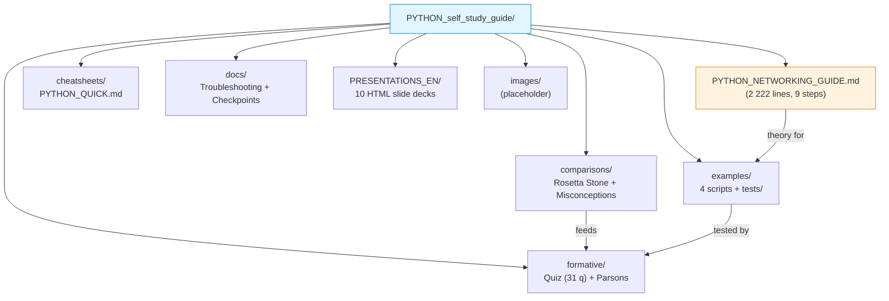

# Python Self-Study Guide for Computer Networks
## Version 5.1 — Multi-Language Transition Guide

> **Status:** optional, not assessed  
> **Course:** Computer Networks — ASE Bucharest, CSIE  
> **Environment:** WSL2 + Ubuntu 22.04 + Docker + Python 3.10+

A translation-oriented guide for students who already program in C, C++, JavaScript, Java or Kotlin and need to read and write Python code for laboratory exercises. This is not a Python course from scratch; it maps existing programming knowledge onto Python syntax and networking idioms.

## File / Folder Index

| Path | Description | Metric |
|---|---|---|
| [`PYTHON_NETWORKING_GUIDE.md`](PYTHON_NETWORKING_GUIDE.md) | Complete 9-step networking guide | 2 222 lines |
| [`Makefile`](Makefile) | Build automation: quiz, parsons, test, lint targets | 50+ targets |
| [`comparisons/`](comparisons/) | Side-by-side code in 5 languages and misconception guides | 2 files, 455 lines |
| [`formative/`](formative/) | Quiz (31 questions), Parsons problems, CLI runner | 5 files + subdirs |
| [`cheatsheets/`](cheatsheets/) | Quick-reference card for socket API, struct and argparse | 1 file, 178 lines |
| [`docs/`](docs/) | Troubleshooting (16 scenarios) and weekly self-check checkpoints | 2 files, 815 lines |
| [`examples/`](examples/) | Annotated Python scripts with unit tests | 4 scripts, 3 test files |
| [`PRESENTATIONS_EN/`](PRESENTATIONS_EN/) | 10 HTML slide decks (browser-viewable) | 10 files |
| [`images/`](images/) | Screenshot directory (placeholder) | naming convention only |

## Visual Overview



## Quick Start

### 1. Verify the environment

```bash
make check
```

Expected output: Python 3.10+, `socket`, `struct` and `pyyaml` modules available.

### 2. Take a diagnostic quiz

```bash
make quiz-quick    # 10 questions, ~10 minutes
```

Score interpretation: 80%+ → ready for labs (skim the guide); 60–79% → review weak sections; below 60% → work through the full guide.

### 3. Choose a learning path

| Background | Start with | Quiz filter | Estimated time |
|---|---|---|---|
| C / C++ | [Rosetta Stone](comparisons/ROSETTA_STONE.md) | `make quiz-c` | 2–3 hours |
| JavaScript | [Misconceptions](comparisons/MISCONCEPTIONS_BY_BACKGROUND.md) | `make quiz-js` | 2–3 hours |
| Java | [Rosetta Stone](comparisons/ROSETTA_STONE.md) | `make quiz-java` | 1–2 hours |
| Kotlin | [Misconceptions](comparisons/MISCONCEPTIONS_BY_BACKGROUND.md) | `make quiz-kotlin` | 1–2 hours |
| Multiple languages | Diagnostic quiz first | `make quiz-quick` | varies |

## Make Targets (abridged)

```bash
make help              # full target listing
make quiz              # 31-question interactive quiz
make quiz-quick        # 10 random questions
make quiz-c            # C/C++ programmer filter
make parsons           # all Parsons problems
make test              # smoke tests for examples
make lint              # ruff / flake8 check
make check             # environment verification
```

## Lab Week Correspondence

| Weeks | Lab topic | Guide section | Key Python constructs |
|---|---|---|---|
| 1–2 | Network fundamentals | Rosetta Stone: TCP/UDP | `socket` basics |
| 3–4 | Sockets, binary protocols | struct parsing | `bytes`, `struct.pack/unpack` |
| 5 | CLI, IP addressing | argparse | command-line interfaces |
| 6–10 | Application protocols | HTTP, JSON | `requests`, `json` module |
| 11–14 | Advanced topics | Concurrency, debugging | `threading`, `logging` |

## Cross-References

| Prerequisite | Path | Reason |
|---|---|---|
| Environment setup | [`../../00_TOOLS/Prerequisites/`](../../00_TOOLS/Prerequisites/) | Docker and WSL2 must be configured before running examples |
| Week 0 orientation | [`../`](../) | Root appendix README with full learning path |

| This folder | Lecture | Seminar | Quiz |
|---|---|---|---|
| Socket examples (01) | [`03_LECTURES/C01/`](../../03_LECTURES/C01/) | [`04_SEMINARS/S01/`](../../04_SEMINARS/S01/) | [`W01`](../c%29studentsQUIZes%28multichoice_only%29/COMPnet_W01_Questions.md) |
| Bytes/struct examples (02, 03) | [`03_LECTURES/C03/`](../../03_LECTURES/C03/) | [`04_SEMINARS/S04/`](../../04_SEMINARS/S04/) | [`W03`](../c%29studentsQUIZes%28multichoice_only%29/COMPnet_W03_Questions.md) |
| Error handling (04) | [`03_LECTURES/C08/`](../../03_LECTURES/C08/) | [`04_SEMINARS/S08/`](../../04_SEMINARS/S08/) | [`W08`](../c%29studentsQUIZes%28multichoice_only%29/COMPnet_W08_Questions.md) |
| Concurrency (slide 08) | [`03_LECTURES/C03/`](../../03_LECTURES/C03/) | [`04_SEMINARS/S03/`](../../04_SEMINARS/S03/) | [`W03`](../c%29studentsQUIZes%28multichoice_only%29/COMPnet_W03_Questions.md) |

### Downstream Dependencies

The root [`../README.md`](../README.md) links to this guide as Step 2 of the Week 0 learning path. The root-level Makefile references `PYTHON_self_study_guide/examples/` for test targets.

**Suggested sequence:** `../../00_TOOLS/Prerequisites/` → `../` (Week 0 orientation) → this folder → `../../04_SEMINARS/S01/`

## Selective Clone

**Method A — sparse-checkout (Git 2.25+):**

```bash
git clone --filter=blob:none --sparse https://github.com/antonioclim/COMPNET-EN.git
cd COMPNET-EN
git sparse-checkout set "00_APPENDIX/a)PYTHON_self_study_guide"
```

**Method B — browse on GitHub:**

```
https://github.com/antonioclim/COMPNET-EN/tree/main/00_APPENDIX/a)PYTHON_self_study_guide
```

## Version

| Field | Value |
|---|---|
| Version | 5.1 |
| Last updated | January 2026 |
| Author | ing. dr. Antonio Clim |
| Institution | ASE Bucharest, CSIE |

---

*Python Self-Study Guide — Computer Networks Course*
*ASE Bucharest, CSIE — ing. dr. Antonio Clim*
