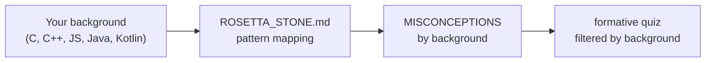

# comparisons — Cross-Language Notes for Python Networking

Side-by-side code and misconception notes for students who already programme in another language but must complete COMPNET labs and projects in Python. The focus is translation of known patterns (sockets, bytes, errors) rather than a general Python introduction.

## File and Folder Index

| Name | Description | Metric |
|---|---|---|
| [`README.md`](README.md) | Orientation for the comparisons folder | — |
| [`ROSETTA_STONE.md`](ROSETTA_STONE.md) | Same networking patterns written in five languages | 226 lines |
| [`MISCONCEPTIONS_BY_BACKGROUND.md`](MISCONCEPTIONS_BY_BACKGROUND.md) | Pitfalls grouped by source language (C, C++, JavaScript, Java, Kotlin) | 229 lines |

## Visual Overview



## Usage

```bash
# from the bridge pack root
cd "00_APPENDIX/a)PYTHON_self_study_guide"

# read the Rosetta Stone first, then the misconceptions for your background

# run the quiz subset tailored to your background
make quiz-c
make quiz-js
make quiz-java
make quiz-kotlin
```

## Design Notes

The comparisons are kept separate so that the main guide can stay protocol-driven and language-agnostic where possible. Misconceptions are made explicit because many networking bugs in early labs are language-transfer errors rather than protocol misunderstandings.

## Cross-References and Context

### Prerequisites and Dependencies

| Prerequisite | Path | Why |
|---|---|---|
| Python bridge guide | [`../PYTHON_NETWORKING_GUIDE.md`](../PYTHON_NETWORKING_GUIDE.md) | Explanations for each pattern shown in the comparisons |
| Python bridge quiz | [`../formative/`](../formative/) | Quiz filters depend on the YAML metadata and runner |

### Lecture, Seminar, Project and Quiz Mapping

| This folder | Lecture | Seminar | Project | Quiz |
|---|---|---|---|---|
| Cross-language socket and bytes patterns | [`../../../03_LECTURES/C03/c3-intro-network-programming.md`](../../../03_LECTURES/C03/c3-intro-network-programming.md) | [`../../../04_SEMINARS/S02/`](../../../04_SEMINARS/S02/) | [`../../../02_PROJECTS/01_network_applications/`](../../../02_PROJECTS/01_network_applications/) | [`../../c)studentsQUIZes(multichoice_only)/COMPnet_W02_Questions.md`](../../c%29studentsQUIZes%28multichoice_only%29/COMPnet_W02_Questions.md) |

### Downstream Dependencies

No other repository component requires these files to run. They are referenced by:

- `../README.md` (bridge pack overview)
- `../../docs/README.md` (misconceptions supplement)

### Suggested Learning Sequence

`ROSETTA_STONE.md` → `MISCONCEPTIONS_BY_BACKGROUND.md` → `make quiz-<background>` → proceed to `../../../04_SEMINARS/S02/`

## Selective Clone

Method A — Git sparse-checkout (requires Git ≥ 2.25)

```bash
git clone --filter=blob:none --sparse https://github.com/antonioclim/COMPNET-EN.git
cd COMPNET-EN
git sparse-checkout set "00_APPENDIX/a)PYTHON_self_study_guide/comparisons"
```

Method B — Direct download (no Git required)

```text
https://github.com/antonioclim/COMPNET-EN/tree/main/00_APPENDIX/a)PYTHON_self_study_guide/comparisons
```

## Version and Provenance

| Item | Value |
|---|---|
| Scope | Optional student aid within the Python bridge pack |
| Quiz filters | Implemented in `../formative/run_quiz.py` and configured in `../formative/quiz.yaml` |
