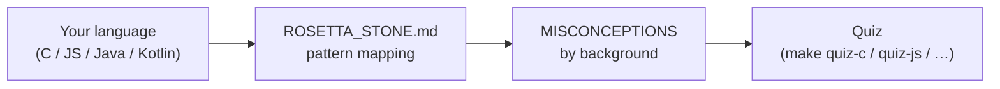

# Cross-Language Comparisons

Side-by-side code and misconception guides for students approaching Python from C, C++, JavaScript, Java or Kotlin. These documents treat Python not as a new language to learn from zero but as a target to translate existing programming knowledge into.

| File | Lines | Purpose |
|---|---|---|
| [`ROSETTA_STONE.md`](ROSETTA_STONE.md) | 226 | Identical algorithms (socket creation, byte packing, error handling) written in five languages |
| [`MISCONCEPTIONS_BY_BACKGROUND.md`](MISCONCEPTIONS_BY_BACKGROUND.md) | 229 | Categorised pitfalls grouped by source language (e.g. C programmers expecting manual memory management) |

## Usage

Start with the Rosetta Stone to map familiar patterns to Python syntax. Then read the misconceptions document for your primary language background to pre-empt common errors.



## Cross-References

| Related resource | Path | Relationship |
|---|---|---|
| Full networking guide | [`../PYTHON_NETWORKING_GUIDE.md`](../PYTHON_NETWORKING_GUIDE.md) | Detailed Python explanations for each pattern |
| Language-specific quizzes | [`../formative/quiz.yaml`](../formative/quiz.yaml) | Questions filtered by source-language background |
| Cheatsheet | [`../cheatsheets/PYTHON_QUICK.md`](../cheatsheets/PYTHON_QUICK.md) | Compact reference after the comparison is understood |

**Suggested sequence:** Rosetta Stone → Misconceptions → `make quiz-<lang>` → proceed to labs.

## Selective Clone

**Method A — sparse-checkout (Git 2.25+):**

```bash
git clone --filter=blob:none --sparse https://github.com/antonioclim/COMPNET-EN.git
cd COMPNET-EN
git sparse-checkout set "00_APPENDIX/a)PYTHON_self_study_guide/comparisons"
```

**Method B — browse on GitHub:**

```
https://github.com/antonioclim/COMPNET-EN/tree/main/00_APPENDIX/a)PYTHON_self_study_guide/comparisons
```
