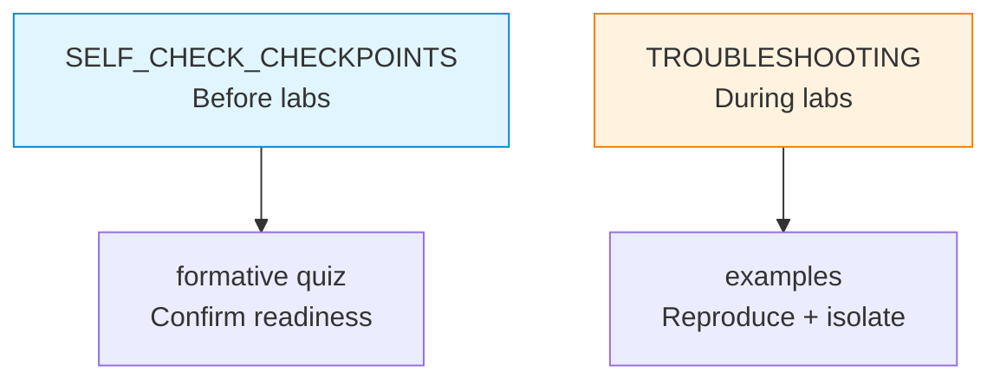

# docs — Checkpoints and Troubleshooting for the Python Bridge

Supporting notes for the Python bridge workflow: readiness checkpoints aligned to seminar expectations and a troubleshooting catalogue for common Python-in-networking failure modes.

## File and Folder Index

| Name | Description | Metric |
|---|---|---|
| [`README.md`](README.md) | Orientation for the support documentation | — |
| [`SELF_CHECK_CHECKPOINTS.md`](SELF_CHECK_CHECKPOINTS.md) | Readiness criteria organised by week and topic | 280 lines |
| [`TROUBLESHOOTING.md`](TROUBLESHOOTING.md) | Error scenarios with symptoms, causes and fixes | 535 lines |

## Visual Overview



## Usage

- Before a seminar: read the matching section in `SELF_CHECK_CHECKPOINTS.md` and run the formative quiz filters if needed.
- During a seminar: match the stack trace or error message to a scenario in `TROUBLESHOOTING.md` and apply the fix.

## Design Notes

The checkpoints act as a shared contract between instructors and students about what a Python-based networking lab assumes. Troubleshooting is separated because it is accessed by symptom rather than by learning order.

## Cross-References and Context

### Prerequisites and Dependencies

| Prerequisite | Path | Why |
|---|---|---|
| Python bridge pack root | [`../README.md`](../README.md) | Context for how checkpoints map to the guide, examples and quizzes |
| Root appendix troubleshooting | [`../../docs/troubleshooting.md`](../../docs/troubleshooting.md) | Environment and Docker issues that are not Python-specific |

### Lecture, Seminar, Project and Quiz Mapping

| File | Lecture | Seminar | Project | Quiz |
|---|---|---|---|---|
| `SELF_CHECK_CHECKPOINTS.md` | [`../../../03_LECTURES/C03/`](../../../03_LECTURES/C03/) (network programming baseline) | [`../../../04_SEMINARS/S02/`](../../../04_SEMINARS/S02/) onward | [`../../../02_PROJECTS/01_network_applications/`](../../../02_PROJECTS/01_network_applications/) | `../formative/` (bridge quiz) |
| `TROUBLESHOOTING.md` | — | — | — | — |

### Downstream Dependencies

No automation depends on these documents. They are referenced by other bridge-pack READMEs and can be linked from seminar delivery notes when recurring issues appear.

### Suggested Learning Sequence

Before labs: `SELF_CHECK_CHECKPOINTS.md` → `../formative/` (optional) → lab work. During labs: `TROUBLESHOOTING.md` as needed.

## Selective Clone

Method A — Git sparse-checkout (requires Git ≥ 2.25)

```bash
git clone --filter=blob:none --sparse https://github.com/antonioclim/COMPNET-EN.git
cd COMPNET-EN
git sparse-checkout set "00_APPENDIX/a)PYTHON_self_study_guide/docs"
```

Method B — Direct download (no Git required)

```text
https://github.com/antonioclim/COMPNET-EN/tree/main/00_APPENDIX/a)PYTHON_self_study_guide/docs
```

## Version and Provenance

| Item | Value |
|---|---|
| Scope | Optional student support within the Python bridge pack |
| Companion content | `../PYTHON_NETWORKING_GUIDE.md`, `../examples/`, `../formative/` |
