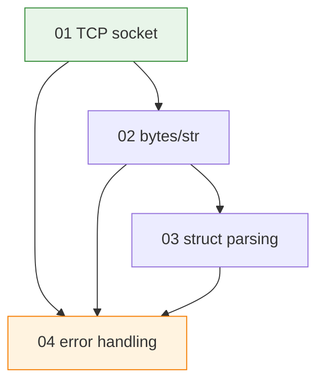

# examples — Runnable Python Networking Snippets

Annotated Python scripts used as stepping stones for COMPNET seminar work: basic TCP sockets, byte and text handling, binary parsing with `struct` and defensive error handling. Each script is self-contained, designed for terminal execution and tested via `pytest`.

## File and Folder Index

| Name | Description | Metric |
|---|---|---|
| [`README.md`](README.md) | Orientation for the examples folder | — |
| [`01_socket_tcp.py`](01_socket_tcp.py) | TCP client and server skeleton with timeouts and logging | 307 lines |
| [`02_bytes_vs_str.py`](02_bytes_vs_str.py) | `bytes`/`str` conversions, encoding pitfalls and safe decoding | 472 lines |
| [`03_struct_parsing.py`](03_struct_parsing.py) | Binary message parsing and packing using `struct` | 428 lines |
| [`04_error_handling.py`](04_error_handling.py) | Patterns for networking error handling, retries and timeouts | 515 lines |
| [`tests/`](tests/) | Pytest suite for smoke and behaviour checks of the examples | 8 files (recursive) |

## Visual Overview



## Usage

```bash
cd "00_APPENDIX/a)PYTHON_self_study_guide/examples"

# start a TCP server on port 8080
python3 01_socket_tcp.py server 8080

# in a second terminal: send a message to the server
python3 01_socket_tcp.py client 127.0.0.1 8080 "Hello"

# run the other scripts (read the usage footer inside each file)
python3 02_bytes_vs_str.py
python3 03_struct_parsing.py
python3 04_error_handling.py

# run tests
python3 -m pytest -q
```

## Design Notes

The examples are deliberately small and heavily annotated because their role is to bridge from lecture concepts to seminar tasks where protocol correctness and debugging discipline matter more than framework use. Tests are included to anchor expected behaviour and to provide a repeatable check before students embed fragments into projects.

## Cross-References and Context

### Prerequisites and Dependencies

| Prerequisite | Path | Why |
|---|---|---|
| Python bridge guide | [`../PYTHON_NETWORKING_GUIDE.md`](../PYTHON_NETWORKING_GUIDE.md) | Narrative context for why each script exists |
| Week 0 tooling check | [`../../formative/`](../../formative/) | Confirms Python execution and basic CLI competence |

### Lecture ↔ Seminar ↔ Project ↔ Quiz Mapping

| Example | Lecture | Seminar | Project | Quiz |
|---|---|---|---|---|
| `01_socket_tcp.py` | [`../../../03_LECTURES/C03/c3-intro-network-programming.md`](../../../03_LECTURES/C03/c3-intro-network-programming.md) | [`../../../04_SEMINARS/S02/`](../../../04_SEMINARS/S02/), [`../../../04_SEMINARS/S03/`](../../../04_SEMINARS/S03/) | [`../../../02_PROJECTS/01_network_applications/S01_multi_client_tcp_chat_text_protocol_and_presence.md`](../../../02_PROJECTS/01_network_applications/S01_multi_client_tcp_chat_text_protocol_and_presence.md) | [`../../c)studentsQUIZes(multichoice_only)/COMPnet_W02_Questions.md`](../../c%29studentsQUIZes%28multichoice_only%29/COMPnet_W02_Questions.md) |
| `02_bytes_vs_str.py` | — | [`../../../04_SEMINARS/S04/`](../../../04_SEMINARS/S04/) | [`../../../02_PROJECTS/01_network_applications/S06_tcp_pub_sub_broker_topics_and_deterministic_routing.md`](../../../02_PROJECTS/01_network_applications/S06_tcp_pub_sub_broker_topics_and_deterministic_routing.md) | [`../../c)studentsQUIZes(multichoice_only)/COMPnet_W04_Questions.md`](../../c%29studentsQUIZes%28multichoice_only%29/COMPnet_W04_Questions.md) |
| `03_struct_parsing.py` | — | [`../../../04_SEMINARS/S04/`](../../../04_SEMINARS/S04/) | [`../../../02_PROJECTS/01_network_applications/S06_tcp_pub_sub_broker_topics_and_deterministic_routing.md`](../../../02_PROJECTS/01_network_applications/S06_tcp_pub_sub_broker_topics_and_deterministic_routing.md) | [`../../c)studentsQUIZes(multichoice_only)/COMPnet_W04_Questions.md`](../../c%29studentsQUIZes%28multichoice_only%29/COMPnet_W04_Questions.md) |
| `04_error_handling.py` | [`../../../03_LECTURES/C08/c8-transport-layer.md`](../../../03_LECTURES/C08/c8-transport-layer.md) (timeouts, retransmission rationale) | Used across labs | Used across projects | — |

### Downstream Dependencies

- `pytest -q` in the repository CI workflow runs the tests under [`tests/`](tests/).
- The bridge-pack `Makefile` calls these scripts and tests during `make check`.

### Suggested Learning Sequence

`01_socket_tcp.py` → `02_bytes_vs_str.py` → `03_struct_parsing.py` → `04_error_handling.py` → `../../../04_SEMINARS/S02/`

## Selective Clone

Method A — Git sparse-checkout (requires Git ≥ 2.25)

```bash
git clone --filter=blob:none --sparse https://github.com/antonioclim/COMPNET-EN.git
cd COMPNET-EN
git sparse-checkout set "00_APPENDIX/a)PYTHON_self_study_guide/examples"
```

If you plan to run tests, also include the Python dependencies:

```bash
git sparse-checkout add 00_APPENDIX/requirements.txt
```

Method B — Direct download (no Git required)

```text
https://github.com/antonioclim/COMPNET-EN/tree/main/00_APPENDIX/a)PYTHON_self_study_guide/examples
```

## Version and Provenance

| Item | Value |
|---|---|
| Scope | Optional student code examples for Python networking |
| Test runner | `pytest` (see `tests/`) |
