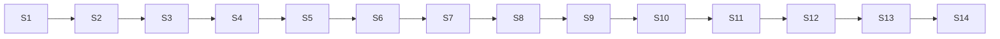

# b)optional_LECTURES — Optional HTML Exports of Theory Slides

Static HTML exports of the theory slide decks (S1–S14). They are optional reading and exist for offline access or fast browsing; the canonical, editable lecture sources live under `03_LECTURES/`.

## File and Folder Index

| Name | Description | Metric |
|---|---|---|
| [`README.md`](README.md) | Orientation for the optional lecture exports | — |
| [`S1Theory_Network_fundamentals_EN.html`](S1Theory_Network_fundamentals_EN.html) | Week 1: Network fundamentals | 288 lines |
| [`S2Theory_Architectural_models_OSI_and_TCP_IP_EN.html`](S2Theory_Architectural_models_OSI_and_TCP_IP_EN.html) | Week 2: OSI and TCP/IP architectural models | 256 lines |
| [`S3Theory_UDP_Broadcast_Multicast_TCP_Tunnels_EN.html`](S3Theory_UDP_Broadcast_Multicast_TCP_Tunnels_EN.html) | Week 3: UDP, broadcast, multicast and TCP tunnels | 256 lines |
| [`S4Theory_Physical_and_data_link_layer_EN.html`](S4Theory_Physical_and_data_link_layer_EN.html) | Week 4: Physical and data link layers | 288 lines |
| [`S5Theory_Network_layer__IP_addressing_and_subnetting_EN.html`](S5Theory_Network_layer__IP_addressing_and_subnetting_EN.html) | Week 5: IP addressing and subnetting | 288 lines |
| [`S6Theory_NAT_PAT_ARP_DHCP_NDP_and_ICMP_EN.html`](S6Theory_NAT_PAT_ARP_DHCP_NDP_and_ICMP_EN.html) | Week 6: NAT/PAT, ARP, DHCP, NDP and ICMP | 288 lines |
| [`S7Theory_Routing_protocols_EN.html`](S7Theory_Routing_protocols_EN.html) | Week 7: Routing protocols | 288 lines |
| [`S8Theory_Transport_layer_EN.html`](S8Theory_Transport_layer_EN.html) | Week 8: Transport layer | 288 lines |
| [`S9Theory_Session_and_presentation_concepts_EN.html`](S9Theory_Session_and_presentation_concepts_EN.html) | Week 9: Session and presentation concepts | 282 lines |
| [`S10Theory_Application-layer_protocols_EN.html`](S10Theory_Application-layer_protocols_EN.html) | Week 10: Application-layer protocols | 288 lines |
| [`S11Theory_FTP_DNS_and_SSH_EN.html`](S11Theory_FTP_DNS_and_SSH_EN.html) | Week 11: FTP, DNS and SSH | 288 lines |
| [`S12Theory_Email_protocols_EN.html`](S12Theory_Email_protocols_EN.html) | Week 12: Email protocols | 288 lines |
| [`S13Theory_IoT_and_network_security_EN.html`](S13Theory_IoT_and_network_security_EN.html) | Week 13: IoT and network security | 288 lines |
| [`S14Theory_Integrated_RECAP_EN.html`](S14Theory_Integrated_RECAP_EN.html) | Week 14: Integrated recap | 277 lines |

## Visual Overview



## Usage

Open any file directly in a browser. If you want stable navigation between decks, serve the folder locally:

```bash
cd "00_APPENDIX/b)optional_LECTURES"
python3 -m http.server 8000
# then open: http://localhost:8000/S8Theory_Transport_layer_EN.html
```

## Design Notes

The HTML files are treated as read-only exports. Lecture edits should be made in `03_LECTURES/` and re-exported, so that diagrams, scenarios and cross references remain consistent with the rest of the repository.

## Cross-References and Context

### Prerequisites and Dependencies

| Prerequisite | Path | Why |
|---|---|---|
| Canonical lecture sources | [`../../03_LECTURES/`](../../03_LECTURES/) | Markdown is the editable source of truth |

### Lecture ↔ Seminar ↔ Project ↔ Quiz Mapping

| HTML deck | Canonical lecture | Scheduled seminar week | Student quiz |
|---|---|---|---|
| S1 | [`C01`](../../03_LECTURES/C01/c1-network-fundamentals.md) | [`S01`](../../04_SEMINARS/S01/) | [`W01`](../c%29studentsQUIZes%28multichoice_only%29/COMPnet_W01_Questions.md) |
| S2 | [`C02`](../../03_LECTURES/C02/c2-architectural-models.md) | [`S02`](../../04_SEMINARS/S02/) | [`W02`](../c%29studentsQUIZes%28multichoice_only%29/COMPnet_W02_Questions.md) |
| S3 | [`C03`](../../03_LECTURES/C03/c3-intro-network-programming.md) | [`S03`](../../04_SEMINARS/S03/) | [`W03`](../c%29studentsQUIZes%28multichoice_only%29/COMPnet_W03_Questions.md) |
| S4 | [`C04`](../../03_LECTURES/C04/c4-physical-and-data-link.md) | [`S04`](../../04_SEMINARS/S04/) | [`W04`](../c%29studentsQUIZes%28multichoice_only%29/COMPnet_W04_Questions.md) |
| S5 | [`C05`](../../03_LECTURES/C05/c5-network-layer-addressing.md) | [`S05`](../../04_SEMINARS/S05/) | [`W05`](../c%29studentsQUIZes%28multichoice_only%29/COMPnet_W05_Questions.md) |
| S6 | [`C06`](../../03_LECTURES/C06/c6-nat-arp-dhcp-ndp-icmp.md) | [`S06`](../../04_SEMINARS/S06/) | [`W06`](../c%29studentsQUIZes%28multichoice_only%29/COMPnet_W06_Questions.md) |
| S7 | [`C07`](../../03_LECTURES/C07/c7-routing-protocols.md) | [`S07`](../../04_SEMINARS/S07/) | [`W07`](../c%29studentsQUIZes%28multichoice_only%29/COMPnet_W07_Questions.md) |
| S8 | [`C08`](../../03_LECTURES/C08/c8-transport-layer.md) | [`S08`](../../04_SEMINARS/S08/) | [`W08`](../c%29studentsQUIZes%28multichoice_only%29/COMPnet_W08_Questions.md) |
| S9 | [`C09`](../../03_LECTURES/C09/c9-session-presentation.md) | [`S09`](../../04_SEMINARS/S09/) | [`W09`](../c%29studentsQUIZes%28multichoice_only%29/COMPnet_W09_Questions.md) |
| S10 | [`C10`](../../03_LECTURES/C10/c10-http-application-layer.md) | [`S10`](../../04_SEMINARS/S10/) | [`W10`](../c%29studentsQUIZes%28multichoice_only%29/COMPnet_W10_Questions.md) |
| S11 | [`C11`](../../03_LECTURES/C11/c11-ftp-dns-ssh.md) | [`S11`](../../04_SEMINARS/S11/) | [`W11`](../c%29studentsQUIZes%28multichoice_only%29/COMPnet_W11_Questions.md) |
| S12 | [`C12`](../../03_LECTURES/C12/c12-email-protocols.md) | [`S12`](../../04_SEMINARS/S12/) | [`W12`](../c%29studentsQUIZes%28multichoice_only%29/COMPnet_W12_Questions.md) |
| S13 | [`C13`](../../03_LECTURES/C13/c13-iot-security.md) | [`S13`](../../04_SEMINARS/S13/) | [`W13`](../c%29studentsQUIZes%28multichoice_only%29/COMPnet_W13_Questions.md) |
| S14 | [`C14`](../../03_LECTURES/C14/c14-revision-and-exam-prep.md) | [`S14`](../../04_SEMINARS/S14/) | [`W14`](../c%29studentsQUIZes%28multichoice_only%29/COMPnet_W14_Questions.md) |

For topic-driven seminar and project links, consult each lecture folder’s `README.md` under `03_LECTURES/CNN/`.

### Portainer Links

Container-based seminars are supported by Portainer guides:

| Seminar | Portainer guide |
|---|---|
| S08 | [`../../00_TOOLS/Portainer/SEMINAR08/`](../../00_TOOLS/Portainer/SEMINAR08/) |
| S09 | [`../../00_TOOLS/Portainer/SEMINAR09/`](../../00_TOOLS/Portainer/SEMINAR09/) |
| S10 | [`../../00_TOOLS/Portainer/SEMINAR10/`](../../00_TOOLS/Portainer/SEMINAR10/) |
| S11 | [`../../00_TOOLS/Portainer/SEMINAR11/`](../../00_TOOLS/Portainer/SEMINAR11/) |
| S13 | [`../../00_TOOLS/Portainer/SEMINAR13/`](../../00_TOOLS/Portainer/SEMINAR13/) |

### Downstream Dependencies

No build or CI step requires these HTML files. They are linked from:

- `../README.md` (appendix overview)
- `../../03_LECTURES/README.md` (optional slide access)

### Suggested Learning Sequence

Read the relevant `03_LECTURES/CNN/` Markdown first, then use the matching HTML deck for revision.

## Selective Clone

Method A — Git sparse-checkout (requires Git ≥ 2.25)

```bash
git clone --filter=blob:none --sparse https://github.com/antonioclim/COMPNET-EN.git
cd COMPNET-EN
git sparse-checkout set "00_APPENDIX/b)optional_LECTURES"
```

Method B — Direct download (no Git required)

```text
https://github.com/antonioclim/COMPNET-EN/tree/main/00_APPENDIX/b)optional_LECTURES
```

## Version and Provenance

| Item | Value |
|---|---|
| Source of truth | `03_LECTURES/` Markdown lecture files |
| Change log | [`../CHANGELOG.md`](../CHANGELOG.md) |
