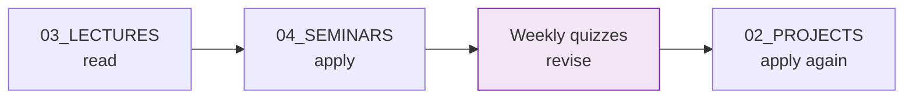

# c)studentsQUIZes(multichoice_only) — Weekly Revision Question Bank (W01–W14)

Student-facing revision bank organised by teaching week. Each Markdown file contains lecture-aligned questions, lab-aligned questions and answer feedback to support self-study and exam preparation.

## File and Folder Index

| Name | Description | Metric |
|---|---|---|
| [`README.md`](README.md) | Orientation for the weekly question bank | — |
| [`COMPnet_W01_Questions.md`](COMPnet_W01_Questions.md) | Week 01 questions (network basics) | 271 lines, 16 questions |
| [`COMPnet_W02_Questions.md`](COMPnet_W02_Questions.md) | Week 02 questions (models, sockets and transport basics) | 602 lines, 35 questions |
| [`COMPnet_W03_Questions.md`](COMPnet_W03_Questions.md) | Week 03 questions (network programming, TCP/UDP patterns) | 823 lines, 49 questions |
| [`COMPnet_W04_Questions.md`](COMPnet_W04_Questions.md) | Week 04 questions (framing, bytes and protocol parsing) | 1,170 lines, 75 questions |
| [`COMPnet_W05_Questions.md`](COMPnet_W05_Questions.md) | Week 05 questions (IP addressing and subnetting) | 801 lines, 47 questions |
| [`COMPnet_W06_Questions.md`](COMPnet_W06_Questions.md) | Week 06 questions (NAT, ARP, DHCP, ICMP and neighbour discovery) | 1,126 lines, 77 questions |
| [`COMPnet_W07_Questions.md`](COMPnet_W07_Questions.md) | Week 07 questions (routing concepts and tools) | 730 lines, 46 questions |
| [`COMPnet_W08_Questions.md`](COMPnet_W08_Questions.md) | Week 08 questions (transport protocols and socket behaviour) | 787 lines, 55 questions |
| [`COMPnet_W09_Questions.md`](COMPnet_W09_Questions.md) | Week 09 questions (session and presentation concepts) | 723 lines, 53 questions |
| [`COMPnet_W10_Questions.md`](COMPnet_W10_Questions.md) | Week 10 questions (application protocols and HTTP concepts) | 728 lines, 52 questions |
| [`COMPnet_W11_Questions.md`](COMPnet_W11_Questions.md) | Week 11 questions (FTP, DNS and SSH) | 1,218 lines, 60 questions |
| [`COMPnet_W12_Questions.md`](COMPnet_W12_Questions.md) | Week 12 questions (email protocols and mail security basics) | 1,237 lines, 61 questions |
| [`COMPnet_W13_Questions.md`](COMPnet_W13_Questions.md) | Week 13 questions (IoT and network security topics) | 1,699 lines, 86 questions |
| [`COMPnet_W14_Questions.md`](COMPnet_W14_Questions.md) | Week 14 questions (integrated recap and exam revision) | 1,549 lines, 79 questions |

Total size: 791 questions across 14 weeks.

## Visual Overview



## Usage

- Students: work through the week’s lecture and lab, then attempt the corresponding `COMPnet_WNN_Questions.md` file without looking at the answers.
- Instructors: extract questions into an LMS question bank or use them as in-class checks.

The files are Markdown sources. They are not automatically imported by the repository tooling.

## Design Notes

Questions are grouped by source (lecture, lab) and include immediate feedback to support self-correction. Some weeks also include non-multiple-choice formats described in text (for example matching or ordering prompts), even though the folder name highlights the dominant question type.

## Cross-References and Context

### Prerequisites and Dependencies

| Prerequisite | Path | Why |
|---|---|---|
| Course week schedule | [`../../04_SEMINARS/README.md`](../../04_SEMINARS/README.md) | Defines how weeks map to lectures and labs |
| Optional slide exports | [`../b)optional_LECTURES/`](../b%29optional_LECTURES/) | HTML lecture decks that correspond to each week |

### Week Mapping

| Week | Lecture (theory) | Seminar (lab) | Optional HTML lecture | Instructor notes (RO) |
|---:|---|---|---|---|
| 1 | [`C01`](../../03_LECTURES/C01/c1-network-fundamentals.md) | [`S01`](../../04_SEMINARS/S01/) | [`S1Theory`](../b%29optional_LECTURES/S1Theory_Network_fundamentals_EN.html) | [`S01`](../d%29instructor_NOTES4sem/roCOMPNETclass_S01-instructor-outline-v3.md) |
| 2 | [`C02`](../../03_LECTURES/C02/c2-architectural-models.md) | [`S02`](../../04_SEMINARS/S02/) | [`S2Theory`](../b%29optional_LECTURES/S2Theory_Architectural_models_OSI_and_TCP_IP_EN.html) | [`S02`](../d%29instructor_NOTES4sem/roCOMPNETclass_S02-instructor-outline-v2.md) |
| 3 | [`C03`](../../03_LECTURES/C03/c3-intro-network-programming.md) | [`S03`](../../04_SEMINARS/S03/) | [`S3Theory`](../b%29optional_LECTURES/S3Theory_UDP_Broadcast_Multicast_TCP_Tunnels_EN.html) | [`S03`](../d%29instructor_NOTES4sem/roCOMPNETclass_S03-instructor-outline-v2.md) |
| 4 | [`C04`](../../03_LECTURES/C04/c4-physical-and-data-link.md) | [`S04`](../../04_SEMINARS/S04/) | [`S4Theory`](../b%29optional_LECTURES/S4Theory_Physical_and_data_link_layer_EN.html) | [`S04`](../d%29instructor_NOTES4sem/roCOMPNETclass_S04-instructor-outline-v2.md) |
| 5 | [`C05`](../../03_LECTURES/C05/c5-network-layer-addressing.md) | [`S05`](../../04_SEMINARS/S05/) | [`S5Theory`](../b%29optional_LECTURES/S5Theory_Network_layer__IP_addressing_and_subnetting_EN.html) | [`S05`](../d%29instructor_NOTES4sem/roCOMPNETclass_S05-instructor-outline-v2.md) |
| 6 | [`C06`](../../03_LECTURES/C06/c6-nat-arp-dhcp-ndp-icmp.md) | [`S06`](../../04_SEMINARS/S06/) | [`S6Theory`](../b%29optional_LECTURES/S6Theory_NAT_PAT_ARP_DHCP_NDP_and_ICMP_EN.html) | [`S06`](../d%29instructor_NOTES4sem/roCOMPNETclass_S06-instructor-outline-v2.md) |
| 7 | [`C07`](../../03_LECTURES/C07/c7-routing-protocols.md) | [`S07`](../../04_SEMINARS/S07/) | [`S7Theory`](../b%29optional_LECTURES/S7Theory_Routing_protocols_EN.html) | [`S07`](../d%29instructor_NOTES4sem/roCOMPNETclass_S07-instructor-outline-v2.md) |
| 8 | [`C08`](../../03_LECTURES/C08/c8-transport-layer.md) | [`S08`](../../04_SEMINARS/S08/) | [`S8Theory`](../b%29optional_LECTURES/S8Theory_Transport_layer_EN.html) | [`S08`](../d%29instructor_NOTES4sem/roCOMPNETclass_S08-instructor-outline-v2.md) |
| 9 | [`C09`](../../03_LECTURES/C09/c9-session-presentation.md) | [`S09`](../../04_SEMINARS/S09/) | [`S9Theory`](../b%29optional_LECTURES/S9Theory_Session_and_presentation_concepts_EN.html) | [`S09`](../d%29instructor_NOTES4sem/roCOMPNETclass_S09-instructor-outline-v2.md) |
| 10 | [`C10`](../../03_LECTURES/C10/c10-http-application-layer.md) | [`S10`](../../04_SEMINARS/S10/) | [`S10Theory`](../b%29optional_LECTURES/S10Theory_Application-layer_protocols_EN.html) | [`S10`](../d%29instructor_NOTES4sem/roCOMPNETclass_S10-instructor-outline-v2.md) |
| 11 | [`C11`](../../03_LECTURES/C11/c11-ftp-dns-ssh.md) | [`S11`](../../04_SEMINARS/S11/) | [`S11Theory`](../b%29optional_LECTURES/S11Theory_FTP_DNS_and_SSH_EN.html) | [`S11`](../d%29instructor_NOTES4sem/roCOMPNETclass_S11-instructor-outline-v2.md) |
| 12 | [`C12`](../../03_LECTURES/C12/c12-email-protocols.md) | [`S12`](../../04_SEMINARS/S12/) | [`S12Theory`](../b%29optional_LECTURES/S12Theory_Email_protocols_EN.html) | [`S12`](../d%29instructor_NOTES4sem/roCOMPNETclass_S12-instructor-outline-v2.md) |
| 13 | [`C13`](../../03_LECTURES/C13/c13-iot-security.md) | [`S13`](../../04_SEMINARS/S13/) | [`S13Theory`](../b%29optional_LECTURES/S13Theory_IoT_and_network_security_EN.html) | [`S13`](../d%29instructor_NOTES4sem/roCOMPNETclass_S13-instructor-outline-v2.md) |
| 14 | [`C14`](../../03_LECTURES/C14/c14-revision-and-exam-prep.md) | [`S14`](../../04_SEMINARS/S14/) | [`S14Theory`](../b%29optional_LECTURES/S14Theory_Integrated_RECAP_EN.html) | — |

### Portainer Links

Weeks with containerised seminars are supported by Portainer guides:

| Seminar | Portainer guide |
|---|---|
| S08 | [`../../00_TOOLS/Portainer/SEMINAR08/`](../../00_TOOLS/Portainer/SEMINAR08/) |
| S09 | [`../../00_TOOLS/Portainer/SEMINAR09/`](../../00_TOOLS/Portainer/SEMINAR09/) |
| S10 | [`../../00_TOOLS/Portainer/SEMINAR10/`](../../00_TOOLS/Portainer/SEMINAR10/) |
| S11 | [`../../00_TOOLS/Portainer/SEMINAR11/`](../../00_TOOLS/Portainer/SEMINAR11/) |
| S13 | [`../../00_TOOLS/Portainer/SEMINAR13/`](../../00_TOOLS/Portainer/SEMINAR13/) |

### Downstream Dependencies

This question bank is referenced from multiple repository entry points:

- `../../04_SEMINARS/README.md` (weekly quiz links)
- `../../02_PROJECTS/COURSE_SEMINAR_MAPPING.md` (revision alignment)
- `../../03_LECTURES/README.md` (week structure)

## Selective Clone

Method A — Git sparse-checkout (requires Git ≥ 2.25)

```bash
git clone --filter=blob:none --sparse https://github.com/antonioclim/COMPNET-EN.git
cd COMPNET-EN
git sparse-checkout set "00_APPENDIX/c)studentsQUIZes(multichoice_only)"
```

Method B — Direct download (no Git required)

```text
https://github.com/antonioclim/COMPNET-EN/tree/main/00_APPENDIX/c)studentsQUIZes(multichoice_only)
```

## Version and Provenance

| Item | Value |
|---|---|
| Content type | Student-facing revision sources |
| Change log | [`../CHANGELOG.md`](../CHANGELOG.md) |
