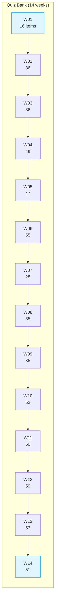

# Student Quiz Bank — Multiple-Choice Questions

Bilingual (English / Romanian) question pool for the 14-week Computer Networks course. Each file corresponds to one teaching week and contains lecture questions, lab questions and, in later weeks, numerical, drag-and-drop and gap-select items. All questions include per-option feedback with explanations in both languages.

## File Index

| File | Week | Topic | Items | Lines |
|---|---|---|---|---|
| [`COMPnet_W01_Questions.md`](COMPnet_W01_Questions.md) | 01 | Network fundamentals | 16 | 271 |
| [`COMPnet_W02_Questions.md`](COMPnet_W02_Questions.md) | 02 | Architectural models (OSI, TCP/IP) | 36 | 602 |
| [`COMPnet_W03_Questions.md`](COMPnet_W03_Questions.md) | 03 | Sockets, broadcast, multicast, tunnels | 36 | 823 |
| [`COMPnet_W04_Questions.md`](COMPnet_W04_Questions.md) | 04 | Physical and data link layer | 49 | 1170 |
| [`COMPnet_W05_Questions.md`](COMPnet_W05_Questions.md) | 05 | Network layer, IP addressing, subnetting | 47 | 801 |
| [`COMPnet_W06_Questions.md`](COMPnet_W06_Questions.md) | 06 | NAT/PAT, ARP, DHCP, NDP, ICMP | 55 | 1126 |
| [`COMPnet_W07_Questions.md`](COMPnet_W07_Questions.md) | 07 | Routing and security protocols | 28 | 730 |
| [`COMPnet_W08_Questions.md`](COMPnet_W08_Questions.md) | 08 | Transport layer | 35 | 787 |
| [`COMPnet_W09_Questions.md`](COMPnet_W09_Questions.md) | 09 | Session and presentation concepts | 35 | 723 |
| [`COMPnet_W10_Questions.md`](COMPnet_W10_Questions.md) | 10 | Application-layer protocols, TLS | 52 | 728 |
| [`COMPnet_W11_Questions.md`](COMPnet_W11_Questions.md) | 11 | FTP, DNS, SSH | 60 | 1218 |
| [`COMPnet_W12_Questions.md`](COMPnet_W12_Questions.md) | 12 | Email protocols | 59 | 1237 |
| [`COMPnet_W13_Questions.md`](COMPnet_W13_Questions.md) | 13 | IoT and network security | 53 | 1699 |
| [`COMPnet_W14_Questions.md`](COMPnet_W14_Questions.md) | 14 | Integrated recap | 51 | 1549 |

Total: 612 items across 13 464 lines.

## Question Format

Each question follows a consistent pattern:

```
### QN. `ID` — English Title / Romanian Title

*[Question Type]*

Question text [Romanian translation]

- **a)** Option A [Romanian]
- **b)** Option B [Romanian]
...

> Feedback: Explanation [Romanian explanation]
```

Question types vary by week: earlier weeks use multiple-choice exclusively, while later weeks add numerical, drag-and-drop into text and gap-select (select missing words) formats.

## Visual Overview



## Cross-References — Lecture, Seminar and Quiz Mapping

| Quiz week | Lecture | Seminar | Optional HTML lecture |
|---|---|---|---|
| W01 | [`03_LECTURES/C01/`](../../03_LECTURES/C01/) | [`04_SEMINARS/S01/`](../../04_SEMINARS/S01/) | [`../b)optional_LECTURES/S1Theory_Network_fundamentals_EN.html`](../b%29optional_LECTURES/S1Theory_Network_fundamentals_EN.html) |
| W02 | [`03_LECTURES/C02/`](../../03_LECTURES/C02/) | [`04_SEMINARS/S02/`](../../04_SEMINARS/S02/) | [`../b)optional_LECTURES/S2Theory_Architectural_models_OSI_and_TCP_IP_EN.html`](../b%29optional_LECTURES/S2Theory_Architectural_models_OSI_and_TCP_IP_EN.html) |
| W03 | [`03_LECTURES/C03/`](../../03_LECTURES/C03/) | [`04_SEMINARS/S03/`](../../04_SEMINARS/S03/) | [`../b)optional_LECTURES/S3Theory_UDP_Broadcast_Multicast_TCP_Tunnels_EN.html`](../b%29optional_LECTURES/S3Theory_UDP_Broadcast_Multicast_TCP_Tunnels_EN.html) |
| W04 | [`03_LECTURES/C04/`](../../03_LECTURES/C04/) | [`04_SEMINARS/S04/`](../../04_SEMINARS/S04/) | [`../b)optional_LECTURES/S4Theory_Physical_and_data_link_layer_EN.html`](../b%29optional_LECTURES/S4Theory_Physical_and_data_link_layer_EN.html) |
| W05 | [`03_LECTURES/C05/`](../../03_LECTURES/C05/) | [`04_SEMINARS/S05/`](../../04_SEMINARS/S05/) | [`../b)optional_LECTURES/S5Theory_Network_layer__IP_addressing_and_subnetting_EN.html`](../b%29optional_LECTURES/S5Theory_Network_layer__IP_addressing_and_subnetting_EN.html) |
| W06 | [`03_LECTURES/C06/`](../../03_LECTURES/C06/) | [`04_SEMINARS/S06/`](../../04_SEMINARS/S06/) | [`../b)optional_LECTURES/S6Theory_NAT_PAT_ARP_DHCP_NDP_and_ICMP_EN.html`](../b%29optional_LECTURES/S6Theory_NAT_PAT_ARP_DHCP_NDP_and_ICMP_EN.html) |
| W07 | [`03_LECTURES/C07/`](../../03_LECTURES/C07/) | [`04_SEMINARS/S07/`](../../04_SEMINARS/S07/) | [`../b)optional_LECTURES/S7Theory_Routing_protocols_EN.html`](../b%29optional_LECTURES/S7Theory_Routing_protocols_EN.html) |
| W08 | [`03_LECTURES/C08/`](../../03_LECTURES/C08/) | [`04_SEMINARS/S08/`](../../04_SEMINARS/S08/) | [`../b)optional_LECTURES/S8Theory_Transport_layer_EN.html`](../b%29optional_LECTURES/S8Theory_Transport_layer_EN.html) |
| W09 | [`03_LECTURES/C09/`](../../03_LECTURES/C09/) | — | [`../b)optional_LECTURES/S9Theory_Session_and_presentation_concepts_EN.html`](../b%29optional_LECTURES/S9Theory_Session_and_presentation_concepts_EN.html) |
| W10 | [`03_LECTURES/C10/`](../../03_LECTURES/C10/) | [`04_SEMINARS/S09/`](../../04_SEMINARS/S09/) | [`../b)optional_LECTURES/S10Theory_Application-layer_protocols_EN.html`](../b%29optional_LECTURES/S10Theory_Application-layer_protocols_EN.html) |
| W11 | [`03_LECTURES/C11/`](../../03_LECTURES/C11/) | [`04_SEMINARS/S10/`](../../04_SEMINARS/S10/) | [`../b)optional_LECTURES/S11Theory_FTP_DNS_and_SSH_EN.html`](../b%29optional_LECTURES/S11Theory_FTP_DNS_and_SSH_EN.html) |
| W12 | [`03_LECTURES/C12/`](../../03_LECTURES/C12/) | [`04_SEMINARS/S11/`](../../04_SEMINARS/S11/) | [`../b)optional_LECTURES/S12Theory_Email_protocols_EN.html`](../b%29optional_LECTURES/S12Theory_Email_protocols_EN.html) |
| W13 | [`03_LECTURES/C13/`](../../03_LECTURES/C13/) | [`04_SEMINARS/S12/`](../../04_SEMINARS/S12/) | [`../b)optional_LECTURES/S13Theory_IoT_and_network_security_EN.html`](../b%29optional_LECTURES/S13Theory_IoT_and_network_security_EN.html) |
| W14 | [`03_LECTURES/C14/`](../../03_LECTURES/C14/) | [`04_SEMINARS/S13/`](../../04_SEMINARS/S13/) | [`../b)optional_LECTURES/S14Theory_Integrated_RECAP_EN.html`](../b%29optional_LECTURES/S14Theory_Integrated_RECAP_EN.html) |

### Downstream Dependencies

No other repository components reference this directory directly. The quiz files are standalone Markdown and are not consumed by any automated pipeline. They are intended for Moodle import via copy-paste or for direct student review.

## Selective Clone

**Method A — sparse-checkout (Git 2.25+):**

```bash
git clone --filter=blob:none --sparse https://github.com/antonioclim/COMPNET-EN.git
cd COMPNET-EN
git sparse-checkout set "00_APPENDIX/c)studentsQUIZes(multichoice_only)"
```

**Method B — browse on GitHub:**

```
https://github.com/antonioclim/COMPNET-EN/tree/main/00_APPENDIX/c)studentsQUIZes(multichoice_only)
```

---

*Quiz bank — Computer Networks, ASE Bucharest, CSIE*
*Author: ing. dr. Antonio Clim*
