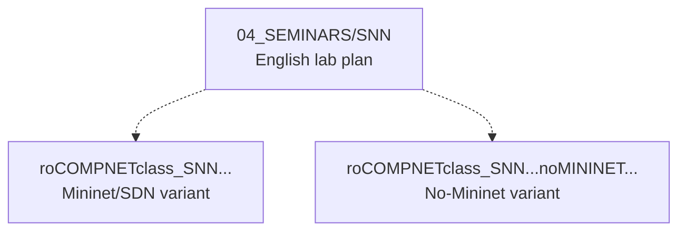

# d)instructor_NOTES4sem — Romanian Instructor Outlines for Seminars

Romanian-language instructor delivery notes aligned to the English seminar materials under `04_SEMINARS/`. For each seminar week S01–S13 the folder provides a teaching outline, prompts and timeboxing notes, usually in two variants: one that assumes Mininet/SDN and one that avoids Mininet.

## File and Folder Index

| Name | Description | Metric |
|---|---|---|
| [`README.md`](README.md) | Orientation for the instructor notes | — |
| [`roCOMPNETclass_S01-instructor-outline-v3.md`](roCOMPNETclass_S01-instructor-outline-v3.md) | Seminar S01: Mininet/SDN variant, v3 | 429 lines |
| [`roCOMPNETclass_S01-instructor-outline-v3__noMININET-SDN_.md`](roCOMPNETclass_S01-instructor-outline-v3__noMININET-SDN_.md) | Seminar S01: No‑Mininet variant, v3 | 534 lines |
| [`roCOMPNETclass_S01-outline-vi1.md`](roCOMPNETclass_S01-outline-vi1.md) | Seminar S01: Mininet/SDN variant, legacy file | 372 lines |
| [`roCOMPNETclass_S02-instructor-outline-v2.md`](roCOMPNETclass_S02-instructor-outline-v2.md) | Seminar S02: Mininet/SDN variant, v2 | 456 lines |
| [`roCOMPNETclass_S02-instructor-outline-v2__noMININET-SDN_.md`](roCOMPNETclass_S02-instructor-outline-v2__noMININET-SDN_.md) | Seminar S02: No‑Mininet variant, v2 | 496 lines |
| [`roCOMPNETclass_S03-instructor-outline-v2.md`](roCOMPNETclass_S03-instructor-outline-v2.md) | Seminar S03: Mininet/SDN variant, v2 | 450 lines |
| [`roCOMPNETclass_S03-instructor-outline-v2__noMININET-SDN_.md`](roCOMPNETclass_S03-instructor-outline-v2__noMININET-SDN_.md) | Seminar S03: No‑Mininet variant, v2 | 538 lines |
| [`roCOMPNETclass_S04-instructor-outline-v2.md`](roCOMPNETclass_S04-instructor-outline-v2.md) | Seminar S04: Mininet/SDN variant, v2 | 538 lines |
| [`roCOMPNETclass_S04-instructor-outline-v2__noMININET-SDN_.md`](roCOMPNETclass_S04-instructor-outline-v2__noMININET-SDN_.md) | Seminar S04: No‑Mininet variant, v2 | 617 lines |
| [`roCOMPNETclass_S05-instructor-outline-v2.md`](roCOMPNETclass_S05-instructor-outline-v2.md) | Seminar S05: Mininet/SDN variant, v2 | 416 lines |
| [`roCOMPNETclass_S05-instructor-outline-v2__noMININET-SDN_.md`](roCOMPNETclass_S05-instructor-outline-v2__noMININET-SDN_.md) | Seminar S05: No‑Mininet variant, v2 | 529 lines |
| [`roCOMPNETclass_S06-instructor-outline-v2.md`](roCOMPNETclass_S06-instructor-outline-v2.md) | Seminar S06: Mininet/SDN variant, v2 | 546 lines |
| [`roCOMPNETclass_S06-instructor-outline-v2__noMININET-SDN_.md`](roCOMPNETclass_S06-instructor-outline-v2__noMININET-SDN_.md) | Seminar S06: No‑Mininet variant, v2 | 623 lines |
| [`roCOMPNETclass_S07-instructor-outline-v2.md`](roCOMPNETclass_S07-instructor-outline-v2.md) | Seminar S07: Mininet/SDN variant, v2 | 462 lines |
| [`roCOMPNETclass_S07-instructor-outline-v2__noMININET-SDN_.md`](roCOMPNETclass_S07-instructor-outline-v2__noMININET-SDN_.md) | Seminar S07: No‑Mininet variant, v2 | 614 lines |
| [`roCOMPNETclass_S08-instructor-outline-v2.md`](roCOMPNETclass_S08-instructor-outline-v2.md) | Seminar S08: Mininet/SDN variant, v2 | 472 lines |
| [`roCOMPNETclass_S08-instructor-outline-v2__noMININET-SDN_.md`](roCOMPNETclass_S08-instructor-outline-v2__noMININET-SDN_.md) | Seminar S08: No‑Mininet variant, v2 | 461 lines |
| [`roCOMPNETclass_S09-instructor-outline-v2.md`](roCOMPNETclass_S09-instructor-outline-v2.md) | Seminar S09: Mininet/SDN variant, v2 | 436 lines |
| [`roCOMPNETclass_S09-instructor-outline-v2__noMININET-SDN_.md`](roCOMPNETclass_S09-instructor-outline-v2__noMININET-SDN_.md) | Seminar S09: No‑Mininet variant, v2 | 408 lines |
| [`roCOMPNETclass_S10-instructor-outline-v2.md`](roCOMPNETclass_S10-instructor-outline-v2.md) | Seminar S10: Mininet/SDN variant, v2 | 467 lines |
| [`roCOMPNETclass_S10-instructor-outline-v2__noMININET-SDN_.md`](roCOMPNETclass_S10-instructor-outline-v2__noMININET-SDN_.md) | Seminar S10: No‑Mininet variant, v2 | 479 lines |
| [`roCOMPNETclass_S11-instructor-outline-v2.md`](roCOMPNETclass_S11-instructor-outline-v2.md) | Seminar S11: Mininet/SDN variant, v2 | 518 lines |
| [`roCOMPNETclass_S11-instructor-outline-v2__noMININET-SDN_.md`](roCOMPNETclass_S11-instructor-outline-v2__noMININET-SDN_.md) | Seminar S11: No‑Mininet variant, v2 | 505 lines |
| [`roCOMPNETclass_S12-instructor-outline-v2.md`](roCOMPNETclass_S12-instructor-outline-v2.md) | Seminar S12: Mininet/SDN variant, v2 | 526 lines |
| [`roCOMPNETclass_S12-instructor-outline-v2__noMININET-SDN_.md`](roCOMPNETclass_S12-instructor-outline-v2__noMININET-SDN_.md) | Seminar S12: No‑Mininet variant, v2 | 560 lines |
| [`roCOMPNETclass_S13-instructor-outline-v2.md`](roCOMPNETclass_S13-instructor-outline-v2.md) | Seminar S13: Mininet/SDN variant, v2 | 380 lines |
| [`roCOMPNETclass_S13-instructor-outline-v2__noMININET-SDN_.md`](roCOMPNETclass_S13-instructor-outline-v2__noMININET-SDN_.md) | Seminar S13: No‑Mininet variant, v2 | 447 lines |

## Visual Overview



## Usage

Recommended instructor workflow:

1. Read the English seminar `README.md` for the week.
2. Use the matching Romanian outline as a delivery script and checklist.
3. If the lab environment does not support Mininet, switch to the `__noMININET-SDN_` variant.

## Design Notes

The outlines are kept in Romanian because their main purpose is instructor delivery within a local teaching context. Separating them from the student-facing English seminar pages avoids accidental distribution of instructor pacing notes and keeps Romanian text out of the default learning path.

## Cross-References and Context

### Prerequisites and Dependencies

| Prerequisite | Path | Why |
|---|---|---|
| English seminar materials | [`../../04_SEMINARS/`](../../04_SEMINARS/) | These notes are a delivery layer on top of the English tasks |
| Portainer guides (selected weeks) | [`../../00_TOOLS/Portainer/`](../../00_TOOLS/Portainer/) | Used for containerised labs where Mininet may not be required |

### Seminar ↔ Quiz ↔ Portainer Mapping

| Seminar | English seminar | RO outline (Mininet/SDN) | RO outline (No-Mininet) | Student quiz | Portainer guide |
|---:|---|---|---|---|---|
| S01 | [`S01`](../../04_SEMINARS/S01/) | [`roCOMPNETclass_S01-instructor-outline-v3.md`](roCOMPNETclass_S01-instructor-outline-v3.md) | [`roCOMPNETclass_S01-instructor-outline-v3__noMININET-SDN_.md`](roCOMPNETclass_S01-instructor-outline-v3__noMININET-SDN_.md) | [`W01`](../c%29studentsQUIZes%28multichoice_only%29/COMPnet_W01_Questions.md) | — |
| S02 | [`S02`](../../04_SEMINARS/S02/) | [`roCOMPNETclass_S02-instructor-outline-v2.md`](roCOMPNETclass_S02-instructor-outline-v2.md) | [`roCOMPNETclass_S02-instructor-outline-v2__noMININET-SDN_.md`](roCOMPNETclass_S02-instructor-outline-v2__noMININET-SDN_.md) | [`W02`](../c%29studentsQUIZes%28multichoice_only%29/COMPnet_W02_Questions.md) | — |
| S03 | [`S03`](../../04_SEMINARS/S03/) | [`roCOMPNETclass_S03-instructor-outline-v2.md`](roCOMPNETclass_S03-instructor-outline-v2.md) | [`roCOMPNETclass_S03-instructor-outline-v2__noMININET-SDN_.md`](roCOMPNETclass_S03-instructor-outline-v2__noMININET-SDN_.md) | [`W03`](../c%29studentsQUIZes%28multichoice_only%29/COMPnet_W03_Questions.md) | — |
| S04 | [`S04`](../../04_SEMINARS/S04/) | [`roCOMPNETclass_S04-instructor-outline-v2.md`](roCOMPNETclass_S04-instructor-outline-v2.md) | [`roCOMPNETclass_S04-instructor-outline-v2__noMININET-SDN_.md`](roCOMPNETclass_S04-instructor-outline-v2__noMININET-SDN_.md) | [`W04`](../c%29studentsQUIZes%28multichoice_only%29/COMPnet_W04_Questions.md) | — |
| S05 | [`S05`](../../04_SEMINARS/S05/) | [`roCOMPNETclass_S05-instructor-outline-v2.md`](roCOMPNETclass_S05-instructor-outline-v2.md) | [`roCOMPNETclass_S05-instructor-outline-v2__noMININET-SDN_.md`](roCOMPNETclass_S05-instructor-outline-v2__noMININET-SDN_.md) | [`W05`](../c%29studentsQUIZes%28multichoice_only%29/COMPnet_W05_Questions.md) | — |
| S06 | [`S06`](../../04_SEMINARS/S06/) | [`roCOMPNETclass_S06-instructor-outline-v2.md`](roCOMPNETclass_S06-instructor-outline-v2.md) | [`roCOMPNETclass_S06-instructor-outline-v2__noMININET-SDN_.md`](roCOMPNETclass_S06-instructor-outline-v2__noMININET-SDN_.md) | [`W06`](../c%29studentsQUIZes%28multichoice_only%29/COMPnet_W06_Questions.md) | — |
| S07 | [`S07`](../../04_SEMINARS/S07/) | [`roCOMPNETclass_S07-instructor-outline-v2.md`](roCOMPNETclass_S07-instructor-outline-v2.md) | [`roCOMPNETclass_S07-instructor-outline-v2__noMININET-SDN_.md`](roCOMPNETclass_S07-instructor-outline-v2__noMININET-SDN_.md) | [`W07`](../c%29studentsQUIZes%28multichoice_only%29/COMPnet_W07_Questions.md) | — |
| S08 | [`S08`](../../04_SEMINARS/S08/) | [`roCOMPNETclass_S08-instructor-outline-v2.md`](roCOMPNETclass_S08-instructor-outline-v2.md) | [`roCOMPNETclass_S08-instructor-outline-v2__noMININET-SDN_.md`](roCOMPNETclass_S08-instructor-outline-v2__noMININET-SDN_.md) | [`W08`](../c%29studentsQUIZes%28multichoice_only%29/COMPnet_W08_Questions.md) | [`SEMINAR08`](../../00_TOOLS/Portainer/SEMINAR08/) |
| S09 | [`S09`](../../04_SEMINARS/S09/) | [`roCOMPNETclass_S09-instructor-outline-v2.md`](roCOMPNETclass_S09-instructor-outline-v2.md) | [`roCOMPNETclass_S09-instructor-outline-v2__noMININET-SDN_.md`](roCOMPNETclass_S09-instructor-outline-v2__noMININET-SDN_.md) | [`W09`](../c%29studentsQUIZes%28multichoice_only%29/COMPnet_W09_Questions.md) | [`SEMINAR09`](../../00_TOOLS/Portainer/SEMINAR09/) |
| S10 | [`S10`](../../04_SEMINARS/S10/) | [`roCOMPNETclass_S10-instructor-outline-v2.md`](roCOMPNETclass_S10-instructor-outline-v2.md) | [`roCOMPNETclass_S10-instructor-outline-v2__noMININET-SDN_.md`](roCOMPNETclass_S10-instructor-outline-v2__noMININET-SDN_.md) | [`W10`](../c%29studentsQUIZes%28multichoice_only%29/COMPnet_W10_Questions.md) | [`SEMINAR10`](../../00_TOOLS/Portainer/SEMINAR10/) |
| S11 | [`S11`](../../04_SEMINARS/S11/) | [`roCOMPNETclass_S11-instructor-outline-v2.md`](roCOMPNETclass_S11-instructor-outline-v2.md) | [`roCOMPNETclass_S11-instructor-outline-v2__noMININET-SDN_.md`](roCOMPNETclass_S11-instructor-outline-v2__noMININET-SDN_.md) | [`W11`](../c%29studentsQUIZes%28multichoice_only%29/COMPnet_W11_Questions.md) | [`SEMINAR11`](../../00_TOOLS/Portainer/SEMINAR11/) |
| S12 | [`S12`](../../04_SEMINARS/S12/) | [`roCOMPNETclass_S12-instructor-outline-v2.md`](roCOMPNETclass_S12-instructor-outline-v2.md) | [`roCOMPNETclass_S12-instructor-outline-v2__noMININET-SDN_.md`](roCOMPNETclass_S12-instructor-outline-v2__noMININET-SDN_.md) | [`W12`](../c%29studentsQUIZes%28multichoice_only%29/COMPnet_W12_Questions.md) | — |
| S13 | [`S13`](../../04_SEMINARS/S13/) | [`roCOMPNETclass_S13-instructor-outline-v2.md`](roCOMPNETclass_S13-instructor-outline-v2.md) | [`roCOMPNETclass_S13-instructor-outline-v2__noMININET-SDN_.md`](roCOMPNETclass_S13-instructor-outline-v2__noMININET-SDN_.md) | [`W13`](../c%29studentsQUIZes%28multichoice_only%29/COMPnet_W13_Questions.md) | [`SEMINAR13`](../../00_TOOLS/Portainer/SEMINAR13/) |

Lecture and project links are provided in each English seminar folder and in `../../03_LECTURES/README.md` and `../../02_PROJECTS/COURSE_SEMINAR_MAPPING.md`.

### Downstream Dependencies

These files are referenced from multiple places in the repository:

- `../../03_LECTURES/CNN/README.md` often links to the corresponding Romanian seminar outline.
- `../../04_SEMINARS/README.md` links to this folder as an instructor companion.

The QA integrity checker explicitly ignores this folder because it is expected to contain Romanian text.

### Suggested Learning Sequence

For a given week: English seminar plan → Romanian outline variant → run the lab → use the matching student quiz as an exit check.

## Selective Clone

Method A — Git sparse-checkout (requires Git ≥ 2.25)

```bash
git clone --filter=blob:none --sparse https://github.com/antonioclim/COMPNET-EN.git
cd COMPNET-EN
git sparse-checkout set "00_APPENDIX/d)instructor_NOTES4sem"
```

Method B — Direct download (no Git required)

```text
https://github.com/antonioclim/COMPNET-EN/tree/main/00_APPENDIX/d)instructor_NOTES4sem
```

## Version and Provenance

| Item | Value |
|---|---|
| Update history | See [`../CHANGELOG.md`](../CHANGELOG.md) |
| Coverage | Seminars S01–S13 (no S14 outline in this folder) |
