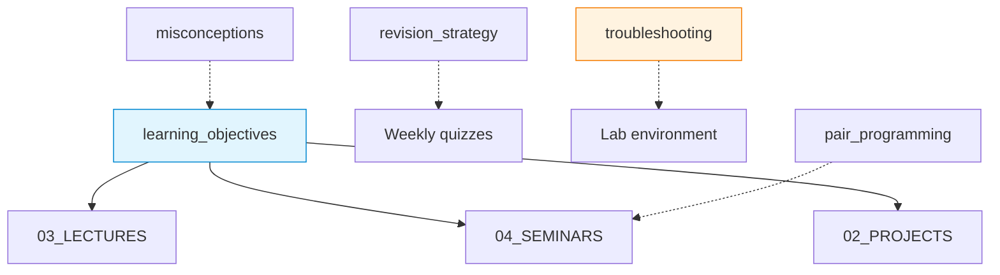

# docs — Pedagogical and Process Notes

Teaching support documents used alongside the COMPNET lectures, seminars and projects: learning objectives, misconceptions, revision strategy, pair programming guidance and practical troubleshooting.

## File and Folder Index

| Name | Description | Metric |
|---|---|---|
| [`README.md`](README.md) | Orientation for the pedagogical documents | — |
| [`ci_setup.md`](ci_setup.md) | Supporting document | 294 lines |
| [`code_tracing.md`](code_tracing.md) | Code tracing templates and exercises for debugging logic | 322 lines |
| [`concept_analogies.md`](concept_analogies.md) | Supporting document | 256 lines |
| [`glossary.md`](glossary.md) | Course glossary (terms and abbreviations) | 159 lines |
| [`learning_objectives.md`](learning_objectives.md) | Learning objectives and alignment notes across the course | 296 lines |
| [`misconceptions.md`](misconceptions.md) | Common misconceptions and how to address them | 297 lines |
| [`pair_programming_guide.md`](pair_programming_guide.md) | Supporting document | 305 lines |
| [`parsons_problems.md`](parsons_problems.md) | Supporting document | 306 lines |
| [`peer_instruction.md`](peer_instruction.md) | Supporting document | 220 lines |
| [`troubleshooting.md`](troubleshooting.md) | Troubleshooting catalogue for tooling and lab environments | 456 lines |

## Visual Overview



## Usage

These documents are read-only guidance. Start with `learning_objectives.md` for alignment, then consult the other files when you need process guidance (revision, submission, troubleshooting).

## Design Notes

The course kit separates pedagogy and process guidance from week-by-week teaching content so that instructors can reuse the documents across cohorts and adjust week content without rewriting the learning scaffolding. Misconceptions and troubleshooting are split out because they are accessed by symptom rather than by week.

## Cross-References and Context

### Prerequisites and Dependencies

| Prerequisite | Path | Why |
|---|---|---|
| Course prerequisites | [`../../00_TOOLS/Prerequisites/`](../../00_TOOLS/Prerequisites/) | Environment readiness and baseline tool expectations |
| Weekly quizzes | [`../c)studentsQUIZes(multichoice_only)/`](../c%29studentsQUIZes%28multichoice_only%29/) | Revision strategy assumes a weekly question bank |

### Lecture ↔ Seminar ↔ Project ↔ Quiz Mapping

| Document | Lecture | Seminar | Project | Quiz |
|---|---|---|---|---|
| `learning_objectives.md` | [`../../03_LECTURES/`](../../03_LECTURES/) | [`../../04_SEMINARS/`](../../04_SEMINARS/) | [`../../02_PROJECTS/`](../../02_PROJECTS/) | [`../c)studentsQUIZes(multichoice_only)/`](../c%29studentsQUIZes%28multichoice_only%29/) |
| `pair_programming.md` | — | [`../../04_SEMINARS/`](../../04_SEMINARS/) (lab delivery method) | — | — |
| `revision_strategy.md` | — | — | — | [`../c)studentsQUIZes(multichoice_only)/`](../c%29studentsQUIZes%28multichoice_only%29/) |
| `troubleshooting.md` | — | Used across labs | Used across projects | — |

### Downstream Dependencies

- `../../00_TOOLS/Prerequisites/Prerequisites_CHECKS.md` links to `misconceptions.md` as supplementary reading.
- Several seminar READMEs link to `troubleshooting.md` for container and tooling issues.

### Suggested Learning Sequence

`learning_objectives.md` → week cycle (`03_LECTURES` → `04_SEMINARS` → projects) → use `revision_strategy.md` with weekly quizzes.

## Selective Clone

Method A — Git sparse-checkout (requires Git ≥ 2.25)

```bash
git clone --filter=blob:none --sparse https://github.com/antonioclim/COMPNET-EN.git
cd COMPNET-EN
git sparse-checkout set 00_APPENDIX/docs
```

Method B — Direct download (no Git required)

```text
https://github.com/antonioclim/COMPNET-EN/tree/main/00_APPENDIX/docs
```

## Version and Provenance

| Item | Value |
|---|---|
| Change log | [`../CHANGELOG.md`](../CHANGELOG.md) |
| Intended audience | Students and instructors |
