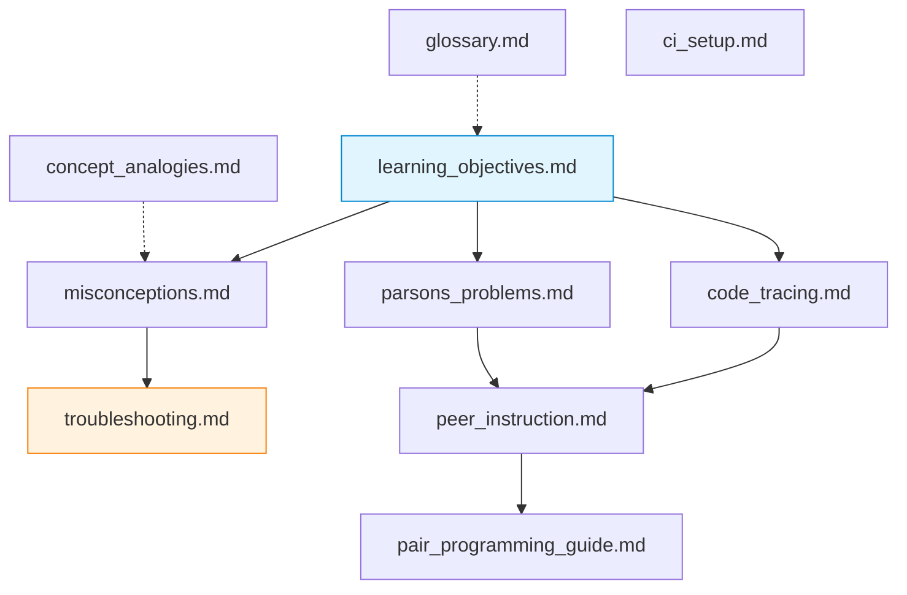

# Pedagogical Documents — Week 0

Ten reference documents supporting the Week 0 prerequisite module. These cover learning objectives, common errors, active-learning techniques and environment troubleshooting. Intended audience: students preparing for Week 1 and instructors designing session plans.

## File Index

| File | Lines | Purpose |
|---|---|---|
| [`learning_objectives.md`](learning_objectives.md) | 296 | LO → Bloom level → artefact mapping for Week 0 |
| [`misconceptions.md`](misconceptions.md) | 297 | 12 common errors with corrections (Docker, sockets, bytes) |
| [`troubleshooting.md`](troubleshooting.md) | 456 | ~25 environment and runtime issues with solutions |
| [`glossary.md`](glossary.md) | 159 | Key terms and definitions for the prerequisite module |
| [`concept_analogies.md`](concept_analogies.md) | 256 | Analogies mapping networking concepts to everyday experience |
| [`code_tracing.md`](code_tracing.md) | 322 | Trace-table exercises for socket and byte-conversion code |
| [`parsons_problems.md`](parsons_problems.md) | 306 | 5 code-ordering exercises with explanations |
| [`peer_instruction.md`](peer_instruction.md) | 220 | Discussion questions for in-class peer-instruction sessions |
| [`pair_programming_guide.md`](pair_programming_guide.md) | 305 | Collaboration protocol for paired lab exercises |
| [`ci_setup.md`](ci_setup.md) | 294 | GitHub Actions CI pipeline documentation |

Total: 2 911 lines across 10 files.

## Visual Overview



## Cross-References

| Document | Related locations | Relationship |
|---|---|---|
| `learning_objectives.md` | [`../formative/quiz.yaml`](../formative/quiz.yaml) | Quiz questions mapped to learning objectives |
| `misconceptions.md` | [`../a)PYTHON_self_study_guide/comparisons/MISCONCEPTIONS_BY_BACKGROUND.md`](../a%29PYTHON_self_study_guide/comparisons/MISCONCEPTIONS_BY_BACKGROUND.md) | Python-specific misconceptions expand on the general set here |
| `troubleshooting.md` | [`../a)PYTHON_self_study_guide/docs/TROUBLESHOOTING.md`](../a%29PYTHON_self_study_guide/docs/TROUBLESHOOTING.md) | Python-specific troubleshooting (16 scenarios) supplements this broader guide |
| `troubleshooting.md` | [`../../00_TOOLS/Prerequisites/`](../../00_TOOLS/Prerequisites/) | Environment verification referenced in troubleshooting steps |
| `parsons_problems.md` | [`../a)PYTHON_self_study_guide/formative/parsons/`](../a%29PYTHON_self_study_guide/formative/parsons/) | Executable Parsons problem YAML counterparts |
| `ci_setup.md` | [`../Makefile`](../Makefile) | Documents the `make ci` target and its pipeline stages |
| `glossary.md` | [`03_LECTURES/C01/`](../../03_LECTURES/C01/) | Terms introduced in the first lecture |

### Downstream Dependencies

The root [`../README.md`](../README.md) links to `learning_objectives.md`, `misconceptions.md`, `troubleshooting.md` and `ci_setup.md`. Removing any of these would break the Week 0 orientation page.

## Selective Clone

**Method A — sparse-checkout (Git 2.25+):**

```bash
git clone --filter=blob:none --sparse https://github.com/antonioclim/COMPNET-EN.git
cd COMPNET-EN
git sparse-checkout set 00_APPENDIX/docs
```

**Method B — browse on GitHub:**

```
https://github.com/antonioclim/COMPNET-EN/tree/main/00_APPENDIX/docs
```
