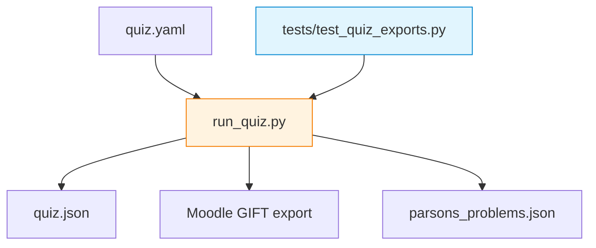

# formative — Week 0 Formative Quiz and Export Tests

Week 0 formative assessment for the course toolchain: an interactive quiz runner driven by a YAML source file, plus export artefacts and tests that verify JSON and Moodle GIFT exports. The goal is to detect environment issues early (Python, dependencies and basic CLI use) before seminar work begins.

## File and Folder Index

| Name | Description | Metric |
|---|---|---|
| [`README.md`](README.md) | Orientation for the Week 0 formative quiz | — |
| [`quiz.yaml`](quiz.yaml) | Quiz source in YAML (Week 0) | 269 lines, 10 questions |
| [`run_quiz.py`](run_quiz.py) | Interactive quiz runner and exporter | 657 lines |
| [`quiz.json`](quiz.json) | Exported quiz artefact (do not edit by hand) | 418 lines |
| [`parsons_problems.json`](parsons_problems.json) | Exported Parsons artefact (do not edit by hand) | 186 lines |
| [`tests/`](tests/) | Pytest suite validating quiz exports | 6 files (recursive) |
| [`__pycache__/`](__pycache__/) | CPython bytecode cache (generated) | 2 files (recursive) |

## Visual Overview



## Usage

```bash
cd 00_APPENDIX/formative

# interactive run
python3 run_quiz.py

# export quiz
python3 run_quiz.py --export json
python3 run_quiz.py --export gift

# run export tests
python3 -m pytest -q
```

If you prefer Make targets:

```bash
cd 00_APPENDIX
python3 -m pip install -r requirements.txt
make quiz
make export-json
make export-moodle
make test-exports
```

## Design Notes

The formative quiz is positioned at Week 0 to shift common environment failures to the start of the course, when remediation time is still available. Export testing is included because instructors often repurpose the same YAML for LMS delivery.

## Cross-References and Context

### Prerequisites and Dependencies

| Prerequisite | Path | Why |
|---|---|---|
| Environment verification | [`../../00_TOOLS/Prerequisites/`](../../00_TOOLS/Prerequisites/) | Confirms Docker, networking tools and the base runtime |
| Week 0 Makefile wrapper | [`../Makefile`](../Makefile) | Provides `make quiz`, export and validation targets |
| Python dependency list | [`../requirements.txt`](../requirements.txt) | Installs `PyYAML`, `pytest`, `ruff` and TUI dependencies |

### Lecture ↔ Seminar ↔ Project ↔ Quiz Mapping

| This folder | Lecture | Seminar | Project | Quiz |
|---|---|---|---|---|
| Week 0 readiness check | — | [`../../04_SEMINARS/S01/`](../../04_SEMINARS/S01/) (first lab assumes tooling works) | [`../../02_PROJECTS/`](../../02_PROJECTS/) (all projects assume the environment) | Week 0 only |

### Downstream Dependencies

- `../Makefile` calls `formative/run_quiz.py` for `make quiz` and export targets.
- The repository CI runs `pytest -q`, which collects `tests/test_quiz_exports.py`.

### Suggested Learning Sequence

`../../00_TOOLS/Prerequisites/` → run this quiz → proceed to `../../04_SEMINARS/S01/`

## Selective Clone

Method A — Git sparse-checkout (requires Git ≥ 2.25)

```bash
git clone --filter=blob:none --sparse https://github.com/antonioclim/COMPNET-EN.git
cd COMPNET-EN
git sparse-checkout set 00_APPENDIX/formative
```

To run the quiz you also need the dependency list:

```bash
git sparse-checkout add 00_APPENDIX/requirements.txt
```

Method B — Direct download (no Git required)

```text
https://github.com/antonioclim/COMPNET-EN/tree/main/00_APPENDIX/formative
```

## Version and Provenance

| Item | Value |
|---|---|
| Quiz runner header | `run_quiz.py` contains the course kit version marker |
| YAML source of truth | `quiz.yaml` |
