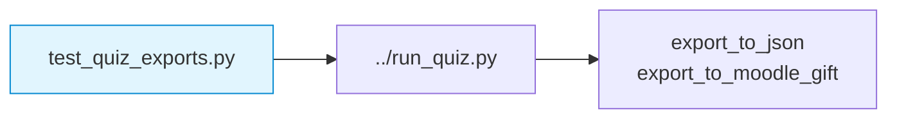

# formative/tests — Export and Validation Tests for the Week 0 Quiz Runner

Pytest suite that validates the Week 0 quiz runner’s export formats and structural validation. The tests help maintainers ensure that changes to `run_quiz.py` do not break JSON or Moodle GIFT export behaviour.

## File and Folder Index

| Name | Description | Metric |
|---|---|---|
| [`README.md`](README.md) | Orientation for the export tests | — |
| [`__init__.py`](__init__.py) | Test package marker (allows imports) | 0 lines |
| [`test_quiz_exports.py`](test_quiz_exports.py) | Tests for JSON export, Moodle GIFT export and validation helpers | 295 lines |
| [`__pycache__/`](__pycache__/) | CPython bytecode cache (generated) | 3 files (recursive) |

## Visual Overview



## Usage

```bash
cd 00_APPENDIX/formative

# run only these tests
python3 -m pytest -q tests/test_quiz_exports.py

# run the whole repository test suite (CI does this)
python3 -m pytest -q
```

## Design Notes

The exports are a common integration point with external LMS platforms, so tests are kept close to the runner to catch regressions early. Using a minimal in-memory quiz fixture keeps the tests independent of the full YAML content.

## Cross-References and Context

### Prerequisites and Dependencies

| Prerequisite | Path | Why |
|---|---|---|
| Quiz runner | [`../run_quiz.py`](../run_quiz.py) | The code under test |
| YAML source | [`../quiz.yaml`](../quiz.yaml) | The real quiz structure that the runner validates |

### Downstream Dependencies

- Repository CI runs `pytest -q`, which collects `test_quiz_exports.py`.

## Selective Clone

Method A — Git sparse-checkout (requires Git ≥ 2.25)

```bash
git clone --filter=blob:none --sparse https://github.com/antonioclim/COMPNET-EN.git
cd COMPNET-EN
git sparse-checkout set 00_APPENDIX/formative/tests
```

To execute the tests, also include the runner and dependencies:

```bash
git sparse-checkout add 00_APPENDIX/formative
```

Method B — Direct download (no Git required)

```text
https://github.com/antonioclim/COMPNET-EN/tree/main/00_APPENDIX/formative/tests
```

## Version and Provenance

| Item | Value |
|---|---|
| Test file version markers | Header comment in `test_quiz_exports.py` |
