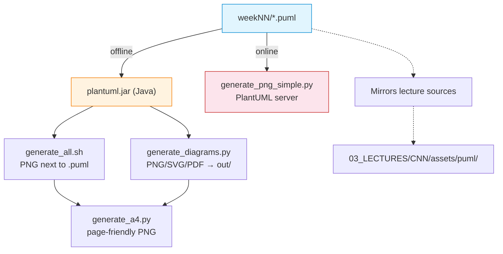

# PlantUML(optional) — Week Mirrors of Lecture Diagrams (Batch Export)

Optional diagram collection used when instructors or students want batch export of PlantUML figures without traversing each lecture’s `assets/puml/` directory. Each `weekNN/` folder mirrors the PlantUML sources used in `03_LECTURES/CNN/assets/puml/` (Weeks 01–13) and can be rendered into PNG (and optionally PDF/SVG) using the scripts in this directory.

## File and Folder Index

| Name | Type | Description | Metric |
|---|---|---|---|
| [`README.md`](README.md) | Markdown | Orientation for the week-mirror diagram bundle (this file) | — |
| [`generate_all.sh`](generate_all.sh) | Bash | Offline renderer that downloads `plantuml.jar` into this directory and generates PNG next to each `.puml` | 234 lines |
| [`generate_diagrams.py`](generate_diagrams.py) | Python | Offline batch renderer supporting PNG/SVG/EPS/PDF/TXT with an explicit output directory | 471 lines |
| [`generate_a4.py`](generate_a4.py) | Python | Post-processes rendered PNG into page-friendly images for handouts | 241 lines |
| [`generate_png_simple.py`](generate_png_simple.py) | Python | Online renderer using the public PlantUML server (no local Java) | 147 lines |
| [`week01/`](week01/) | Subdir | Week 01 mirror | 9×`.puml` |
| [`week02/`](week02/) | Subdir | Week 02 mirror | 8×`.puml` |
| [`week03/`](week03/) | Subdir | Week 03 mirror | 7×`.puml` |
| [`week04/`](week04/) | Subdir | Week 04 mirror | 13×`.puml` |
| [`week05/`](week05/) | Subdir | Week 05 mirror | 10×`.puml` |
| [`week06/`](week06/) | Subdir | Week 06 mirror | 11×`.puml` |
| [`week07/`](week07/) | Subdir | Week 07 mirror | 9×`.puml` |
| [`week08/`](week08/) | Subdir | Week 08 mirror | 12×`.puml` |
| [`week09/`](week09/) | Subdir | Week 09 mirror | 6×`.puml` |
| [`week10/`](week10/) | Subdir | Week 10 mirror | 10×`.puml` |
| [`week11/`](week11/) | Subdir | Week 11 mirror | 7×`.puml` |
| [`week12/`](week12/) | Subdir | Week 12 mirror | 10×`.puml` |
| [`week13/`](week13/) | Subdir | Week 13 mirror | 6×`.puml` |

## Visual Overview



## Usage

### Option 1: Offline rendering (recommended)

From the repository root:

```bash
# Option 1A: use the canonical JAR location used by the whole repository
bash 00_TOOLS/plantuml/get_plantuml_jar.sh

# Render all week folders into PNG next to each .puml
bash "00_TOOLS/PlantUML(optional)/generate_all.sh"
```

### Option 2: Offline rendering into a separate output directory

```bash
cd "00_TOOLS/PlantUML(optional)"
python3 generate_diagrams.py --input-dir . --output-dir ./out --formats png pdf
```

### Option 3: Online rendering (no local Java)

```bash
cd "00_TOOLS/PlantUML(optional)"
python3 generate_png_simple.py
```

## Design Rationale

Lecture folders keep diagrams near the teaching material, while this directory provides a single location for batch export and handout preparation. The week partition mirrors the course delivery structure so instructors can export only the diagrams used in a given week.

## Cross-References and Contextual Connections

### Prerequisites and Dependency Links

| Prerequisite | Path | Why |
|---|---|---|
| Canonical PlantUML renderer | [`../plantuml/`](../plantuml/) | Provides the JAR used across the repository |
| Java (offline modes) | — | Required for `generate_all.sh` and `generate_diagrams.py` when using a local JAR |
| Internet access (online mode) | — | Required by `generate_png_simple.py` |

### Lecture, Seminar, Project and Quiz Mapping

| This folder component | Lecture foundation | Seminar | Project | Quiz |
|---|---|---|---|---|
| `week01/` … `week13/` | Mirrors `03_LECTURES/C01–C13/assets/puml/` | Same-week seminars `04_SEMINARS/S01–S13/` | Not required | Weeks 01–13 (`COMPnet_W01_Questions.md` … `COMPnet_W13_Questions.md`) |

For week-specific lecture, seminar and quiz links, open the README in the relevant `weekNN/` subdirectory.

### Downstream Dependencies

No CI jobs and no course runtime scripts depend on this directory. It exists as an optional mirror and batch-export convenience layer.

### Suggested Learning Sequence

**Suggested sequence:** render diagrams in-place for a lecture (`03_LECTURES/CNN/assets/render.sh`) → if batch export is needed, use this folder’s scripts → optionally post-process with `generate_a4.py` for handouts

## Selective Clone Instructions

**Method A — Git sparse-checkout (requires Git 2.25+)**

```bash
git clone --filter=blob:none --sparse https://github.com/antonioclim/COMPNET-EN.git
cd COMPNET-EN
git sparse-checkout set "00_TOOLS/PlantUML(optional)"
```

To fetch the canonical renderer as well:

```bash
git sparse-checkout add 00_TOOLS/plantuml
```

**Method B — Direct download (no Git required)**

```
https://github.com/antonioclim/COMPNET-EN/tree/main/00_TOOLS/PlantUML(optional)
```

## Version and Provenance

- The week mirrors are kept in sync with the lecture `assets/puml/` sources
- Rendering scripts are maintained to support both offline (local JAR) and online (server-based) export
