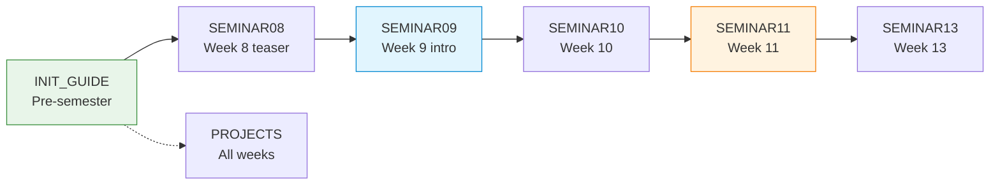

# Portainer — Optional Docker Visibility Layer for COMPNET Seminars

Portainer Community Edition is a browser-based dashboard that surfaces Docker container state, network topology, logs and interactive terminals in a single browser tab. It is entirely optional — every exercise in the course works without it and the CLI remains the primary interface. Think of Portainer as a second monitor on the same information: it does not replace `docker ps` or `docker logs`, but it does make the picture easier to read when three or four containers are running at once.

If you choose to adopt it, the investment is small (one container, ~30 MB RAM, a two-minute introduction at Seminar 09) and the payoff is felt across the remaining five Docker-heavy weeks.

## Why Bother

From Seminar 09 onwards, the exercises shift from single-process Python scripts to multi-container Compose stacks. That shift introduces a new category of problems — orphan containers, silent port conflicts, misidentified networks — that have nothing to do with the topic being taught but eat up lab time nonetheless. Portainer addresses these by giving both instructors and students a fast, visual way to answer "what is actually running right now?"

Beyond housekeeping, Portainer augments three pedagogical and observational objectives that the CLI alone handles clumsily:

1. Simultaneous log observation. Tailing three backend logs in parallel (S11 round-robin) requires three terminal windows and three `docker logs -f` commands. Portainer does this in three browser tabs with a click each.
2. Network topology awareness. Seeing which containers sit on which Docker network — and what their IPs are — takes a single glance in Portainer's Networks view. The CLI equivalent (`docker network inspect`) returns a wall of JSON that students must parse manually.
3. Isolation verification. The distinction between a published port and an exposed-only port is central to S10 (SSH tunnelling) and S13 (pentest lab). In Portainer, a container with no published ports has a visibly empty column — the isolation is obvious without explanation.

## Port Allocation

| Port | Owner | Status |
|-----:|-------|--------|
| 9000 | S10 Part 4 — SSH tunnel (`ssh -L 9000:web:8000`) | Reserved |
| 9090 | C08 / self-study — TCP handshake and socket examples | Reserved |
| 9050 | Portainer UI | Verified free across all 14 weeks |

Port 9050 was checked against every `.md`, `.yml`, `.py`, `.conf` and `.html` file in the repository. Zero conflicts.

## Access Credentials

| Field | Value |
|-------|-------|
| URL | `http://localhost:9050` |
| Username | `stud` |
| Password | `studstudstud` |

Credentials follow the same convention as the MININET-SDN workstation (`stud` / `stud` for SSH; the longer variant for Portainer's 12-character minimum).

## File / Folder Index

| Name | Description | Metric |
|---|---|---|
| [`INIT_GUIDE/`](INIT_GUIDE/README.md) | Step-by-step install (Windows + VM), Compose file and automation scripts | 4 files |
| [`SEMINAR08/`](SEMINAR08/README.md) | 30-second teaser — first Docker container | 1 file |
| [`SEMINAR09/`](SEMINAR09/README.md) | First proper encounter — introduce the dashboard | 2 files |
| [`SEMINAR10/`](SEMINAR10/README.md) | Multi-stack housekeeping (DNS, SSH, port forwarding) | 2 files |
| [`SEMINAR11/`](SEMINAR11/README.md) | Primary observability tool (load balancing) | 2 files |
| [`SEMINAR13/`](SEMINAR13/README.md) | Administrator vs attacker perspective (pentest lab) | 2 files |
| [`PROJECTS/`](PROJECTS/README.md) | Overview map pointing to per-project Portainer guides | 1 file |

## Integration Timeline



| Week | Seminar | Role | Folder |
|:----:|---------|------|--------|
| — | Pre-semester | Install and configure | `INIT_GUIDE/` |
| 8 | S08 Part 4 — Nginx Reverse Proxy | 30-second teaser — first Docker container | `SEMINAR08/` |
| 9 | S09 Part 3 — Multi-client FTP | First proper encounter — introduce the dashboard | `SEMINAR09/` |
| 10 | S10 Parts 2–4 — DNS / SSH / Port Forwarding | Multi-stack housekeeping | `SEMINAR10/` |
| 11 | S11 Parts 1–2 — Load Balancing | Primary observability tool | `SEMINAR11/` |
| 13 | S13 — Penetration Testing Lab | Administrator vs attacker perspective | `SEMINAR13/` |
| 1–14 | All project work (S01–S15) | E2 debugging and multi-container observation | `PROJECTS/` |

Seminars S01–S07 and S12 use no Docker containers in their exercises (pure socket programming, Wireshark, Mininet). Portainer has nothing to show during these sessions. The benefit to students working on those weeks comes exclusively from their project work, where Docker Compose is mandatory — see [`PROJECTS/PROJECTS_PORTAINER_MAP.md`](PROJECTS/PROJECTS_PORTAINER_MAP.md) for a per-project breakdown.

## Guiding Principles

Each seminar folder contains two files: a GUIDE (instructor-facing, with timing and pedagogical notes) and a TASKS sheet (student-facing, with fill-in tables and reflection questions). The design follows four rules:

1. Additive, never mandatory. Every exercise works from the CLI alone. Portainer is a convenience, not a dependency.
2. One-time setup, semester-long benefit. Install once before S09; reuse across all Docker seminars without further configuration.
3. Port 9050 is reserved. No other course artefact may claim this port.
4. Suggested instructor phrasing is provided in English. The GUIDE files include optional phrasing marked with `▸`. Adapt it freely — it is a starting point, not a script.

## Cross-References and Contextual Connections

### Prerequisite

| Prerequisite | Path | Why |
|---|---|---|
| Docker Engine | [`../Prerequisites/Prerequisites.md`](../Prerequisites/Prerequisites.md) | Docker must be running before Portainer can start |

### Seminar ↔ Portainer Mapping

| Portainer folder | Seminar | Lecture |
|---|---|---|
| `SEMINAR08/` | [`04_SEMINARS/S08/`](../../04_SEMINARS/S08/) | [`03_LECTURES/C10/`](../../03_LECTURES/C10/) (HTTP, reverse proxy) |
| `SEMINAR09/` | [`04_SEMINARS/S09/`](../../04_SEMINARS/S09/) | [`03_LECTURES/C11/`](../../03_LECTURES/C11/) (FTP) |
| `SEMINAR10/` | [`04_SEMINARS/S10/`](../../04_SEMINARS/S10/) | [`03_LECTURES/C11/`](../../03_LECTURES/C11/) (DNS, SSH) |
| `SEMINAR11/` | [`04_SEMINARS/S11/`](../../04_SEMINARS/S11/) | [`03_LECTURES/C12/`](../../03_LECTURES/C12/) (E-mail, load balancing) |
| `SEMINAR13/` | [`04_SEMINARS/S13/`](../../04_SEMINARS/S13/) | [`03_LECTURES/C13/`](../../03_LECTURES/C13/) (IoT, security) |

### Project Guides

Per-project Portainer guides live at [`02_PROJECTS/01_network_applications/assets/PORTAINER/`](../../02_PROJECTS/01_network_applications/assets/PORTAINER/) with one subfolder per seminar project (S01–S15).

### Downstream Dependencies

No other repository components reference this directory directly. The Portainer guides are self-contained and purely additive.

## Selective Clone Instructions

**Method A — Git sparse-checkout (Git 2.25+)**

```bash
git clone --filter=blob:none --sparse https://github.com/antonioclim/COMPNET-EN.git
cd COMPNET-EN
git sparse-checkout set 00_TOOLS/Portainer
```

**Method B — Direct download (no Git required)**

```
https://github.com/antonioclim/COMPNET-EN/tree/main/00_TOOLS/Portainer
```
