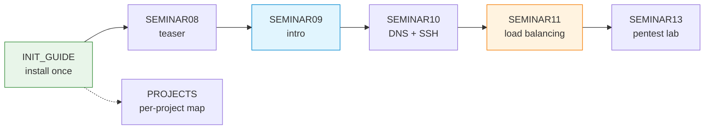

# Portainer — Optional Docker Dashboard Support for Seminars and Projects

Portainer Community Edition is a browser-based dashboard for inspecting Docker containers, networks, volumes and logs. Within COMPNET-EN it is an optional visibility layer: every activity remains runnable from the CLI, but Portainer can reduce time lost to Docker housekeeping when multiple Compose stacks are running.

## File and Folder Index

| Name | Type | Description | Metric |
|---|---|---|---|
| [`README.md`](README.md) | Markdown | Orientation for Portainer support materials (this file) | — |
| [`INIT_GUIDE/`](INIT_GUIDE/) | Subdir | One-time installation on port 9050 (Compose, Bash and PowerShell helpers) | 5 files |
| [`PROJECTS/`](PROJECTS/) | Subdir | Map from each seminar-linked project to its Portainer walkthrough | 2 files |
| [`SEMINAR08/`](SEMINAR08/) | Subdir | Week 08 teaser: first Docker container, first Portainer visit | 2 files |
| [`SEMINAR09/`](SEMINAR09/) | Subdir | Week 09 introduction: Docker networks, container logs and basic checks | 3 files |
| [`SEMINAR10/`](SEMINAR10/) | Subdir | Week 10 multi-stack debugging: DNS, SSH and SSH tunnelling | 3 files |
| [`SEMINAR11/`](SEMINAR11/) | Subdir | Week 11 observability focus: load balancing stacks and parallel logs | 3 files |
| [`SEMINAR13/`](SEMINAR13/) | Subdir | Week 13 attacker vs administrator view: pentest lab containers | 3 files |

## Visual Overview



## Usage

1. Install Portainer once using [`INIT_GUIDE/`](INIT_GUIDE/).
2. Open the dashboard at `http://localhost:9050` and sign in with `stud` / `studstudstud`.
3. During Docker-based weeks, follow the relevant seminar guide (`SEMINAR08/`, `SEMINAR09/`, `SEMINAR10/`, `SEMINAR11/`, `SEMINAR13/`).
4. During project work, use the mapping in [`PROJECTS/PROJECTS_PORTAINER_MAP.md`](PROJECTS/PROJECTS_PORTAINER_MAP.md).

## Port and Credential Conventions

### Port Allocation

| Port | Owner in this repository | Rationale |
|---:|---|---|
| 9000 | S10 SSH tunnel demo (`ssh -L 9000:web:8000`) | Must remain free for the port-forwarding exercise |
| 9090 | TCP handshake and socket examples | Used by lecture and self-study material |
| 9050 | Portainer UI | Reserved for Portainer, only one Compose file binds it (`INIT_GUIDE/docker-compose-portainer.yml`) |

### Access Credentials

| Field | Value |
|---|---|
| URL | `http://localhost:9050` |
| Username | `stud` |
| Password | `studstudstud` |

## Design Rationale

Portainer is treated as a secondary view on Docker state rather than a required dependency. The seminar guides focus on the minimum subset of the UI that supports learning goals (what is running, how containers connect, what logs say) while keeping all core tasks executable from the terminal.

## Cross-References and Contextual Connections

### Prerequisites and Dependency Links

| Prerequisite | Path | Why |
|---|---|---|
| Docker Engine and Compose | [`../Prerequisites/`](../Prerequisites/) | Portainer itself runs as a container and needs a working Docker runtime |
| One-time Portainer install | [`INIT_GUIDE/`](INIT_GUIDE/) | Provides the `portainer` container and reserves host port 9050 |
| Week 10 tunnel port | [`../../04_SEMINARS/S10/`](../../04_SEMINARS/S10/) | Uses local port 9000, motivating the Portainer port choice |

### Lecture, Seminar, Project and Quiz Mapping

| Portainer material | Lecture foundation | Seminar | Project links | Quiz |
|---|---|---|---|---|
| `INIT_GUIDE/` | — | Supports all Docker-heavy weeks from [`S08`](../../04_SEMINARS/S08/) onward | Supports all projects that ship a `docker-compose.yml` | — |
| `SEMINAR08/` | [`C08`](../../03_LECTURES/C08/) and [`C10`](../../03_LECTURES/C10/) | [`S08`](../../04_SEMINARS/S08/) | [`S03`](../../02_PROJECTS/01_network_applications/S03_http11_socket_server_no_framework_static_files.md), [`S04`](../../02_PROJECTS/01_network_applications/S04_forward_http_proxy_with_filtering_and_traffic_logging.md), [`S05`](../../02_PROJECTS/01_network_applications/S05_application_level_http_load_balancer_health_checks_and_two_algorithms.md) | Week 08 ([`COMPnet_W08_Questions.md`](../../00_APPENDIX/c%29studentsQUIZes%28multichoice_only%29/COMPnet_W08_Questions.md)) |
| `SEMINAR09/` | [`C09`](../../03_LECTURES/C09/) and [`C11`](../../03_LECTURES/C11/) | [`S09`](../../04_SEMINARS/S09/) | [`S02`](../../02_PROJECTS/01_network_applications/S02_file_transfer_server_control_and_data_channels_ftp_passive.md), [`S10`](../../02_PROJECTS/01_network_applications/S10_network_file_synchronisation_manifest_hashes_and_conflict_resolution.md) | Week 09 ([`COMPnet_W09_Questions.md`](../../00_APPENDIX/c%29studentsQUIZes%28multichoice_only%29/COMPnet_W09_Questions.md)) |
| `SEMINAR10/` | [`C10`](../../03_LECTURES/C10/) and [`C11`](../../03_LECTURES/C11/) | [`S10`](../../04_SEMINARS/S10/) | [`S07`](../../02_PROJECTS/01_network_applications/S07_udp_dns_resolver_local_zone_forwarding_and_ttl_cache.md), [`S12`](../../02_PROJECTS/01_network_applications/S12_client_server_messaging_tls_channel_and_minimal_authentication.md) | Week 10 ([`COMPnet_W10_Questions.md`](../../00_APPENDIX/c%29studentsQUIZes%28multichoice_only%29/COMPnet_W10_Questions.md)) |
| `SEMINAR11/` | [`C10`](../../03_LECTURES/C10/) and [`C11`](../../03_LECTURES/C11/) | [`S11`](../../04_SEMINARS/S11/) | [`S05`](../../02_PROJECTS/01_network_applications/S05_application_level_http_load_balancer_health_checks_and_two_algorithms.md), [`S11`](../../02_PROJECTS/01_network_applications/S11_rest_microservices_service_registry_api_gateway_dynamic_routing.md) | Week 11 ([`COMPnet_W11_Questions.md`](../../00_APPENDIX/c%29studentsQUIZes%28multichoice_only%29/COMPnet_W11_Questions.md)) |
| `SEMINAR13/` | [`C13`](../../03_LECTURES/C13/) | [`S13`](../../04_SEMINARS/S13/) | [`A05`](../../02_PROJECTS/02_administration_security/A05_laboratory_port_scanning_tcp_connect_scan_and_minimal_service_fingerprinting.md), [`A10`](../../02_PROJECTS/02_administration_security/A10_network_hardening_containerised_services_segmentation_egress_filtering_docker_user.md) | Week 13 ([`COMPnet_W13_Questions.md`](../../00_APPENDIX/c%29studentsQUIZes%28multichoice_only%29/COMPnet_W13_Questions.md)) |
| `PROJECTS/` | — | — | Points to [`../../02_PROJECTS/01_network_applications/assets/PORTAINER/`](../../02_PROJECTS/01_network_applications/assets/PORTAINER/) | — |

### Downstream Dependencies

| Dependent | Path | Relationship |
|---|---|---|
| Seminar READMEs | `04_SEMINARS/S08–S11/` and `04_SEMINARS/S13/` | Each seminar links to its matching Portainer guide |
| Project Portainer guides | `02_PROJECTS/01_network_applications/assets/PORTAINER/` | Reuses the same dashboard URL and assumes Portainer is installed |
| Lecture overviews | `03_LECTURES/C10/`, `03_LECTURES/C11/`, `03_LECTURES/C13/` | Reference Portainer as an optional aid for Docker observations |

### Suggested Learning Sequence

**Suggested sequence:** [`../Prerequisites/`](../Prerequisites/) → [`INIT_GUIDE/`](INIT_GUIDE/) → `SEMINAR08/` (first exposure) → `SEMINAR09/` (intro) → later seminar guides as Docker stacks grow → `PROJECTS/` (during project work)

## Selective Clone Instructions

**Method A — Git sparse-checkout (requires Git 2.25+)**

```bash
git clone --filter=blob:none --sparse https://github.com/antonioclim/COMPNET-EN.git
cd COMPNET-EN
git sparse-checkout set 00_TOOLS/Portainer
```

If you intend to run the Docker scenarios, add the prerequisites bundle:

```bash
git sparse-checkout add 00_TOOLS/Prerequisites
```

**Method B — Direct download (no Git required)**

```
https://github.com/antonioclim/COMPNET-EN/tree/main/00_TOOLS/Portainer
```

## Version and Provenance

- Portainer image pin and install procedure are defined in [`INIT_GUIDE/PORTAINER_SETUP.md`](INIT_GUIDE/PORTAINER_SETUP.md)
- Seminar-specific material aligns with the Week 08–13 Docker scenarios and is maintained alongside the seminar content
