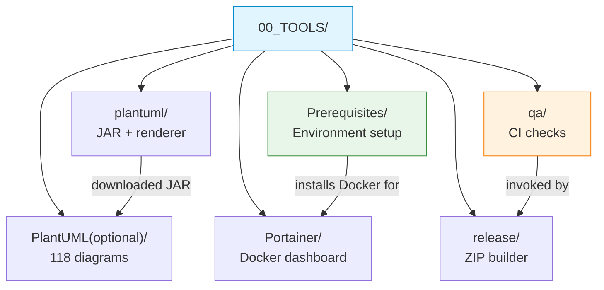

# 00_TOOLS — Build, QA and Classroom Support Utilities

Repository infrastructure that students, instructors and the CI pipeline depend on throughout the semester. The folder groups five concerns: environment setup, diagram generation, Docker observability, automated quality assurance and release packaging.

## File / Folder Index

| Name | Description | Metric |
|---|---|---|
| [`PlantUML(optional)/`](<PlantUML(optional)/README.md>) | 118 `.puml` diagram sources (weeks 1–13) and four generation scripts | 118 diagrams, 4 scripts |
| [`plantuml/`](plantuml/README.md) | Central JAR provisioning (`get_plantuml_jar.sh`) and rendering helper (`render_puml.sh`) used by every `assets/render.sh` across the repository | 2 shell scripts |
| [`Portainer/`](Portainer/README.md) | Optional Docker dashboard guides — init, seminar-specific tasks and project mapping | 15 files across 7 subdirectories |
| [`Prerequisites/`](Prerequisites/README.md) | Student-facing environment setup guide, self-assessment checks and automated verification script | 2 Markdown, 1 Bash, 1 PNG |
| [`qa/`](qa/README.md) | Automated quality-assurance scripts invoked by CI and locally | 3 Python, 2 Bash, 1 manifest |
| [`release/`](release/README.md) | ZIP archive builder for distributable course kit | 1 Bash script |

## Visual Overview



## Prettier Formatting (Root-Level Concern)

The repository ships a Prettier configuration (`.prettierrc`, `.prettierignore`) and a `package.json` at the root so that Markdown and HTML files can be formatted deterministically.

**With npm:**

```bash
npm install          # one-time — fetches prettier
npm run format:check # dry-run: exits non-zero if any file would change
npm run format:write # rewrite files in place
```

**Without network access:**

A zero-dependency Node.js script (`format-offline.js`) replicates the same rules. No `npm install` required.

```bash
node format-offline.js --check
node format-offline.js --write
```

Prettier targets every `*.md` and `*.html` file except: `roCOMPNETclass_*` (Romanian instructor notes), `00_APPENDIX/c)studentsQUIZes(multichoice_only)/` (bilingual quizzes) and binary/Python/PlantUML/shell files. The formatting pass normalises LF line endings, strips trailing whitespace, collapses excessive blank lines and ensures a single trailing newline. Prose wrapping is set to `preserve` so paragraph reflows do not occur.

## Cross-References and Contextual Connections

### Downstream Dependencies

Every lecture, seminar and project `assets/render.sh` wrapper calls `00_TOOLS/plantuml/render_puml.sh`. The CI pipeline (`.github/workflows/ci.yml`) invokes all four `qa/` scripts. The root `README.md` links to `Prerequisites/Prerequisites.md` and `Prerequisites/verify_lab_environment.sh`. The release script depends on `qa/` for pre-packaging checks.

| Dependent | Path | What it uses |
|---|---|---|
| CI pipeline | `.github/workflows/ci.yml` | `qa/check_executability.sh`, `qa/check_markdown_links.py`, `qa/check_integrity.py`, `qa/check_fig_targets.py` |
| All `render.sh` wrappers | `03_LECTURES/C*/assets/render.sh`, `04_SEMINARS/S*/assets/render.sh`, `02_PROJECTS/*/assets/render.sh` | `plantuml/render_puml.sh` |
| Root README | `README.md` | `Prerequisites/Prerequisites.md`, `Prerequisites/verify_lab_environment.sh` |
| Release script | `release/create_release_zip.sh` | `qa/check_executability.sh`, `qa/executable_manifest.txt` |

### Suggested Learning Sequence

**Suggested sequence:** `Prerequisites/` (week 0) → `Portainer/INIT_GUIDE/` (pre-semester) → `plantuml/` (first diagram render) → `qa/` (contributor onboarding) → `release/` (kit distribution)

## Selective Clone Instructions

**Method A — Git sparse-checkout (Git 2.25+)**

```bash
git clone --filter=blob:none --sparse https://github.com/antonioclim/COMPNET-EN.git
cd COMPNET-EN
git sparse-checkout set 00_TOOLS
```

**Method B — Direct download (no Git required)**

Browse the folder at:

```
https://github.com/antonioclim/COMPNET-EN/tree/main/00_TOOLS
```

Or use a tool such as `download-directory.github.io` to fetch a single folder as a ZIP.

## Version

Last significant update: February 2026 (v13 documentation enrichment pass).
