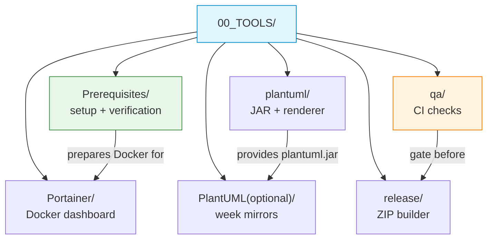

# 00_TOOLS — Build, QA and Classroom Support Utilities

Shared infrastructure for COMPNET-EN: environment setup, diagram rendering, Docker observability, repository QA checks and release packaging. Students rely on it for Week 0 setup and Docker-based seminars, instructors use it for repeatable classroom demonstrations and maintainers use it to validate and package the repository.

## File and Folder Index

| Name | Type | Description | Metric |
|---|---|---|---|
| [`README.md`](README.md) | Markdown | Orientation for the tools layer (this file) | — |
| [`Prerequisites/`](Prerequisites/) | Subdir | Week 0 environment setup guide, self-assessment checks and a verification script | 5 files (3×`.md`, 1×`.sh`, 1×`.png`) |
| [`Portainer/`](Portainer/) | Subdir | Portainer installation guide plus seminar and project walkthroughs | 22 files across 7 subdirectories |
| [`plantuml/`](plantuml/) | Subdir | Downloads `plantuml.jar` (kept out of Git) and renders `assets/puml/*.puml` into PNG | 2 scripts (+ downloaded JAR) |
| [`PlantUML(optional)/`](<PlantUML(optional)/README.md>) | Subdir | Optional batch diagram collection mirroring lecture `assets/puml/` for Weeks 1–13 | 136 files: 118×`.puml`, 14×README, 4 scripts |
| [`qa/`](qa/) | Subdir | Local and CI checks: executability, Markdown link integrity, text hygiene and figure target validation | 7 files (3×`.py`, 2×`.sh`, 1×manifest, 1×README) |
| [`release/`](release/) | Subdir | Maintainer script for building a distributable course-kit ZIP | 2 files (1×`.sh`, 1×README) |

## Visual Overview



## Usage

Typical entry points, run from the repository root:

```bash
# Week 0 environment verification
bash 00_TOOLS/Prerequisites/verify_lab_environment.sh

# Download PlantUML JAR (kept out of Git) for offline diagram rendering
bash 00_TOOLS/plantuml/get_plantuml_jar.sh

# Render diagrams for a lecture/seminar/project (example)
bash 03_LECTURES/C01/assets/render.sh

# Run the same checks as CI
bash 00_TOOLS/qa/check_executability.sh
python 00_TOOLS/qa/check_markdown_links.py
python 00_TOOLS/qa/check_integrity.py
python 00_TOOLS/qa/check_fig_targets.py --puml-only

# Build a distributable ZIP (maintainers)
bash 00_TOOLS/release/create_release_zip.sh
```

## Design Rationale

All course code and documentation is intentionally supported by a small set of shared scripts rather than per-folder copies. Centralising diagram rendering, environment checks and QA reduces drift between weeks and keeps CI behaviour identical to local checks.

## Cross-References and Contextual Connections

### Prerequisites and Dependency Links

| Prerequisite | Path | Why |
|---|---|---|
| Week 0 environment setup | [`Prerequisites/`](Prerequisites/) | Docker, Wireshark and Python tooling required across lectures, seminars and projects |
| Portainer installed (optional) | [`Portainer/INIT_GUIDE/`](Portainer/INIT_GUIDE/) | GUI support for Docker scenarios in seminars and project work |
| PlantUML renderer | [`plantuml/`](plantuml/) | Enables offline rendering of `assets/puml/` diagrams throughout the repository |

### Lecture, Seminar, Project and Quiz Connections

| Tool component | Lecture foundation | Seminar usage | Project usage | Quiz weeks |
|---|---|---|---|---|
| `Prerequisites/` | Environment assumptions appear in [`03_LECTURES/README.md`](../03_LECTURES/README.md) and lecture prerequisites such as [`03_LECTURES/C10/README.md`](../03_LECTURES/C10/README.md) | Required for all seminars, Docker required from [`04_SEMINARS/S08/`](../04_SEMINARS/S08/) onward | Required for project tooling and validation, see [`02_PROJECTS/README.md`](../02_PROJECTS/README.md) | Not assessed directly; assumed from Week 01 onward |
| `Portainer/` | Docker-heavy lectures reference Portainer guides, e.g. [`03_LECTURES/C11/README.md`](../03_LECTURES/C11/README.md) | Guides for [`S08`](../04_SEMINARS/S08/), [`S09`](../04_SEMINARS/S09/), [`S10`](../04_SEMINARS/S10/), [`S11`](../04_SEMINARS/S11/) and [`S13`](../04_SEMINARS/S13/) | Project map links Portainer walkthroughs per project, see [`02_PROJECTS/01_network_applications/assets/PORTAINER/`](../02_PROJECTS/01_network_applications/assets/PORTAINER/) | Weeks 08, 09, 10, 11 and 13 |
| `plantuml/` | Diagrams support all lecture slide decks via per-lecture `assets/render.sh` | Same renderer used in every seminar `assets/render.sh` | Same renderer used in project `assets/render.sh` wrappers | — |
| `PlantUML(optional)/` | Mirrors lecture diagram sources (`03_LECTURES/C01–C13/assets/puml/`) for batch export | Week directories link to same-week seminars (`04_SEMINARS/S01–S13/`) | Not required; intended for slide or handout generation | Weeks 01–13 |
| `qa/` | — | — | — | — |
| `release/` | — | — | — | — |

### Downstream Dependencies

| Dependent | Path | What it uses |
|---|---|---|
| CI pipeline | [`.github/workflows/ci.yml`](../.github/workflows/ci.yml) | `qa/check_executability.sh`, `qa/check_markdown_links.py`, `qa/check_integrity.py`, `qa/check_fig_targets.py` |
| Diagram render wrappers | `03_LECTURES/C*/assets/render.sh`, `04_SEMINARS/S*/assets/render.sh`, `02_PROJECTS/*/assets/render.sh` | `plantuml/render_puml.sh` and `00_TOOLS/plantuml.jar` |
| Appendix Makefile | [`00_APPENDIX/Makefile`](../00_APPENDIX/Makefile) | Calls `Prerequisites/verify_lab_environment.sh` |
| Root README | [`README.md`](../README.md) | Links to `Prerequisites/Prerequisites.md` and `Prerequisites/verify_lab_environment.sh` |
| Release builder | [`release/create_release_zip.sh`](release/create_release_zip.sh) | Executes the `qa/` checks before packaging |

### Suggested Learning Sequence

**Suggested sequence:** [`Prerequisites/`](Prerequisites/) → [`../00_APPENDIX/`](../00_APPENDIX/) (Week 0 orientation) → [`Portainer/INIT_GUIDE/`](Portainer/INIT_GUIDE/) (optional) → first seminar render (`04_SEMINARS/S01/assets/render.sh`) → `qa/` (contributors) → `release/` (maintainers)

## Selective Clone Instructions

**Method A — Git sparse-checkout (requires Git 2.25+)**

```bash
git clone --filter=blob:none --sparse https://github.com/antonioclim/COMPNET-EN.git
cd COMPNET-EN
git sparse-checkout set 00_TOOLS
```

To add the seminars or lectures later:

```bash
git sparse-checkout add 04_SEMINARS 03_LECTURES
```

**Method B — Direct download (no Git required)**

```
https://github.com/antonioclim/COMPNET-EN/tree/main/00_TOOLS
```

## Version and Provenance

Last significant update: February 2026 (documentation enrichment pass).
