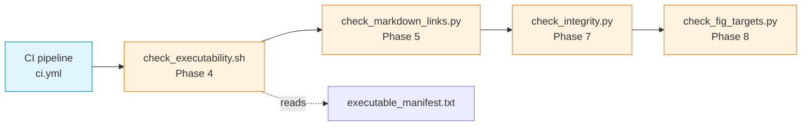

# qa — Automated Quality Assurance

Four automated checks that guard repository integrity across CI and local development. The CI pipeline (`.github/workflows/ci.yml`) runs all four in sequence; contributors can invoke them locally before pushing.

## File Index

| File | Description | Lines |
|---|---|---|
| [`check_executability.sh`](check_executability.sh) | Verifies that file permission bits match `executable_manifest.txt` | 51 |
| [`check_markdown_links.py`](check_markdown_links.py) | Validates that every relative link in `*.md` files resolves to an existing file or directory | 406 |
| [`check_integrity.py`](check_integrity.py) | Detects corrupted UTF-8 tokens (mojibake) and Romanian-language leakage outside permitted zones | 344 |
| [`check_fig_targets.py`](check_fig_targets.py) | Confirms that every `[FIG]` marker in lecture Markdown points to an existing `.puml` source | 175 |
| [`apply_permissions.sh`](apply_permissions.sh) | Applies `chmod +x` to every path listed in the manifest — a repair tool, not a check | 68 |
| [`executable_manifest.txt`](executable_manifest.txt) | Authoritative list of files that must carry the executable bit | 86 entries |

## Visual Overview



## Usage

All scripts run from the repository root. Python scripts require Python 3.10+ with no third-party dependencies.

```bash
# Phase 4 — executability
bash 00_TOOLS/qa/check_executability.sh

# Phase 5 — Markdown link validation
python 00_TOOLS/qa/check_markdown_links.py

# Phase 7 — integrity (mojibake + Romanian leakage)
python 00_TOOLS/qa/check_integrity.py

# Phase 8 — figure targets (PlantUML source only)
python 00_TOOLS/qa/check_fig_targets.py --puml-only

# Phase 8 — figure targets (require rendered PNGs too)
python 00_TOOLS/qa/check_fig_targets.py --require-png
```

Exit codes: `0` = clean, `1` = violations found, `2` = runtime error.

### Repairing Permissions

If `check_executability.sh` reports mismatches, apply the manifest:

```bash
bash 00_TOOLS/qa/apply_permissions.sh
```

### Extending `check_integrity.py`

All configuration lives as plain Python sets at the top of the script:

| Collection | Purpose | How to extend |
|---|---|---|
| `CORRUPTED_TOKENS` | Mojibake byte strings | Reproduce the encoding round-trip and add the garbled result |
| `RO_FUNCTION_WORDS` | Romanian function words (three or more characters) | Add unambiguous words with no English homograph |
| `RO_PROPER_NOUN_PATTERNS` | Allowlisted proper nouns (regex) | Add patterns for institutional names or encoding examples |
| `SELF_EXEMPT_BASENAMES` | Files entirely skipped | Add filenames that contain token definitions by necessity |

Inline suppression markers can be appended to any line: `qa:allow-corrupt` (corrupted-token check) or `qa:allow-ro` (Romanian-leakage check). Lines where corrupted tokens appear exclusively inside inline code spans are automatically exempted as encoding-pedagogy examples.

## Cross-References and Contextual Connections

### Downstream Dependencies

| Dependent | Path | What it invokes |
|---|---|---|
| CI pipeline | [`.github/workflows/ci.yml`](../../.github/workflows/ci.yml) | All four checks in sequence |
| Release script | [`../release/create_release_zip.sh`](../release/create_release_zip.sh) | `check_executability.sh` and `executable_manifest.txt` |

### Related Materials

| Aspect | Link |
|---|---|
| PlantUML sources checked by `check_fig_targets.py` | [`03_LECTURES/C*/assets/puml/`](../../03_LECTURES/) |
| Batch diagram collection | [`../PlantUML(optional)/`](<../PlantUML(optional)/README.md>) |

### Suggested Learning Sequence

**Suggested sequence:** (contributor onboarding) clone repository → run all four checks locally → consult this README for interpretation → fix any violations → push

## Selective Clone Instructions

**Method A — Git sparse-checkout (Git 2.25+)**

```bash
git clone --filter=blob:none --sparse https://github.com/antonioclim/COMPNET-EN.git
cd COMPNET-EN
git sparse-checkout set 00_TOOLS/qa
```

**Method B — Direct download (no Git required)**

```
https://github.com/antonioclim/COMPNET-EN/tree/main/00_TOOLS/qa
```
