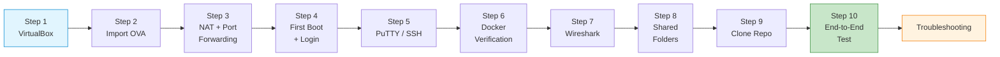

# Mininet-SDN — Setup Guide

The VirtualBox-based lab environment for the Computer Networks course. This directory contains a complete, step-by-step installation and configuration guide that takes a student from a bare Windows 10/11 machine to a fully operational Ubuntu 24.04 virtual workstation equipped with Docker Engine, Mininet, Open vSwitch, Wireshark, Scapy, Python 3.12 and all ancillary tools required by the course seminars and projects. An alternative WSL2-based path exists in [`00_TOOLS/Prerequisites/`](../00_TOOLS/Prerequisites/); this guide covers the VirtualBox/OVA route.

## File Index

| File | Description | Size |
|---|---|---|
| [`SETUP-GUIDE-COMPNET-EN.md`](SETUP-GUIDE-COMPNET-EN.md) | Full guide in Markdown — 16 sections covering VirtualBox installation, OVA import, NAT port forwarding, SSH via PuTTY, Docker verification, Wireshark setup, shared folders, repository cloning, end-to-end testing, troubleshooting and a Linux host appendix | 965 lines |
| [`SETUP-GUIDE-COMPNET-EN.html`](SETUP-GUIDE-COMPNET-EN.html) | Styled HTML rendering of the same guide, using IBM Plex Sans / JetBrains Mono webfonts — suitable for offline reading or printing | 1 767 lines (79 KB) |

## Working Architecture

The guide produces the following environment. The ASCII diagram below is reproduced from the Markdown guide for quick orientation:

```
┌──────────────────────────────────────────────────────────────┐
│  HOST (Windows 10/11)                                        │
│                                                              │
│  ┌─────────────┐  ┌────────────┐  ┌────────────────────┐    │
│  │  PuTTY      │  │ Wireshark  │  │  Shared Folder     │    │
│  │  (SSH)      │  │ (capture)  │  │  C:\SHARED         │    │
│  └──────┬──────┘  └──────┬─────┘  └─────────┬──────────┘    │
│         │ port 2222      │                   │ vboxsf        │
│  ═══════╪════════════════╪═══════════════════╪═══════════    │
│         │       VirtualBox NAT               │               │
│  ┌──────┴────────────────┴───────────────────┴──────────┐    │
│  │  VM: MININET-SDN (Ubuntu 24.04)                      │    │
│  │                                                      │    │
│  │  user: stud / pass: stud                             │    │
│  │  enp0s3: 10.0.2.15 (NAT)   docker0: 172.17.0.1      │    │
│  │                                                      │    │
│  │  ┌────────────────────────────────────────────┐      │    │
│  │  │  Docker Engine 28.x + Compose v2           │      │    │
│  │  │  ┌──────┐ ┌──────┐ ┌──────┐               │      │    │
│  │  │  │ web1 │ │ web2 │ │ dns  │  ...scenarios │      │    │
│  │  │  └──────┘ └──────┘ └──────┘               │      │    │
│  │  └────────────────────────────────────────────┘      │    │
│  │                                                      │    │
│  │  Mininet 2.3 │ OVS 3.3 │ Python 3.12 (venv compnet) │    │
│  └──────────────────────────────────────────────────────┘    │
└──────────────────────────────────────────────────────────────┘
```

## Guide Structure

The Markdown guide follows a linear 10-step installation sequence, plus troubleshooting and a Linux appendix:



## VM Credentials and Port Forwarding

| Field | Value |
|---|---|
| Username | `stud` |
| Password | `stud` |
| Hostname | `mininet-vm` |
| Guest IP (NAT) | `10.0.2.15` |
| SSH from host | `127.0.0.1:2222` → guest port `22` |
| HTTP test (optional) | `127.0.0.1:8080` → guest port `8080` |
| Docker API (optional) | `127.0.0.1:2375` → guest port `2375` |

## Pedagogical Context

The guide assumes zero prior virtualisation experience and deliberately leads students through every click and command so that the working environment itself becomes a first contact with networking concepts — NAT, port forwarding, SSH tunnelling, DNS resolution and Docker networking all appear before the first seminar session begins. The VirtualBox/OVA path was chosen to provide a controlled, reproducible image; the WSL2 alternative in `00_TOOLS/Prerequisites/` trades reproducibility for lighter resource usage and tighter Windows integration.

## Cross-References

### Prerequisites

No prior course material is required. The guide is self-contained and targets a clean Windows installation. Students who prefer the WSL2 path should consult `00_TOOLS/Prerequisites/Prerequisites.md` instead.

### Relationship to the Rest of the Repository

| Relationship | Path | Detail |
|---|---|---|
| Alternative setup path (WSL2) | [`../00_TOOLS/Prerequisites/`](../00_TOOLS/Prerequisites/) | Produces an equivalent Docker + Wireshark environment without VirtualBox |
| Portainer web UI | [`../00_TOOLS/Portainer/`](../00_TOOLS/Portainer/) | Portainer runs on top of the Docker Engine configured by this guide; shares the `stud`/`stud` credential convention |
| First seminar | [`../04_SEMINARS/S01/`](../04_SEMINARS/S01/) | S01 is the first session that exercises the installed tools (Wireshark, netcat, ping) |
| All Docker-based seminars | [`../04_SEMINARS/S03/`](../04_SEMINARS/S03/) through [`../04_SEMINARS/S12/`](../04_SEMINARS/S12/) | Every seminar from S03 onward runs `docker compose` scenarios inside the environment this guide creates |
| SDN firewall project | [`../02_PROJECTS/02_administration_security/`](../02_PROJECTS/02_administration_security/) | Project A01 (OpenFlow firewall) directly references the Mininet-SDN workstation |
| Instructor notes (VM variant) | [`../00_APPENDIX/d)instructor_NOTES4sem/`](../00_APPENDIX/d%29instructor_NOTES4sem/) | Seminar outlines that assume the VM environment; 13 companion `__noMININET-SDN_` variants exist for the WSL2 path |

### Downstream Dependencies

The root [`README.md`](../README.md) and [`CHANGELOG.md`](../CHANGELOG.md) reference this directory (currently under the older name `01_GHID_MININET-SDN` — these links are stale and should be updated to `01_GUIDE_MININET-SDN`). No CI pipeline or Makefile target references files in this folder directly.

### Suggested Learning Sequence

```
01_GUIDE_MININET-SDN/ (this folder — Week 0)
  → 00_TOOLS/Portainer/ (optional, same week)
  → 04_SEMINARS/S01/ (Week 1 — first hands-on session)
  → 03_LECTURES/C01/ (Week 1 — theoretical foundations)
```

## Known Issues

The root `README.md` (lines 63, 192, 473) and `CHANGELOG.md` (lines 34, 56, 344) still reference this folder under its former Romanian name `01_GHID_MININET-SDN`. These should be updated to `01_GUIDE_MININET-SDN` to match the current filesystem.

## Selective Clone

To download only this folder without cloning the full repository:

**Method A — Git sparse-checkout (requires Git 2.25+)**

```bash
git clone --filter=blob:none --sparse https://github.com/antonioclim/COMPNET-EN.git
cd COMPNET-EN
git sparse-checkout set 01_GUIDE_MININET-SDN
```

**Method B — Direct download (no Git required)**

Browse to the folder on GitHub:

```
https://github.com/antonioclim/COMPNET-EN/tree/main/01_GUIDE_MININET-SDN
```

To download just this directory, use a tool such as [download-directory.github.io](https://download-directory.github.io) or [gitzip](https://kinolien.github.io/gitzip/). The GitHub "Download ZIP" button downloads the entire repository.

## Provenance

| Field | Value |
|---|---|
| Author | ing. dr. Antonio Clim — ASE Bucharest, CSIE |
| Last updated | February 2026 |
| Generation | Manual authorship (guide content); README enriched by documentation pass v1.0 |
