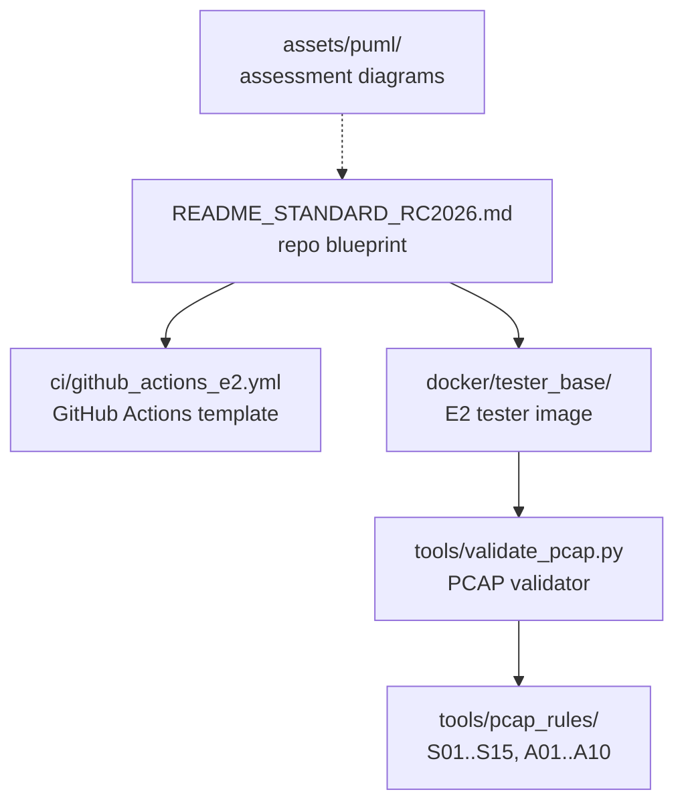

# 00_common — shared assessment infrastructure for RC2026 projects

Standards, templates and validation tooling that student project repositories are expected to copy verbatim. The directory defines the fixed filenames, E2 automation pattern and deterministic PCAP acceptance rules used during marking.

## File and folder index

| Name | Description | Metric |
|---|---|---|
| [`assets/`](assets/) | Shared figures and rendering helpers for the parent group | 11 files (6 .puml, 3 .md) |
| [`ci/`](ci/) | CI templates for the E2 automation stage | 2 files (1 .md, 1 .yml) |
| [`docker/`](docker/) | Docker build and runtime artefacts for the tester container | 4 files (2 .md, 1 .sh) |
| [`tools/`](tools/) | PCAP validation tooling and rule sets | 28 files (25 .json, 2 .md) |
| `README.md` | Directory orientation and cross-reference map | 102 lines |
| [`README_STANDARD_RC2026.md`](README_STANDARD_RC2026.md) | RC2026 — Standardisation, automation and common criteria (for all projects) | 71 lines |

## Visual overview



## Usage

This directory is a reference source. Typical use is copying a subset into a student repository:

```bash
# PCAP validator and one rule set
cp 02_PROJECTS/00_common/tools/validate_pcap.py  <student-repo>/tools/
cp 02_PROJECTS/00_common/tools/pcap_rules/S01.json <student-repo>/tools/pcap_rules/

# E2 automation template (rename as needed)
mkdir -p <student-repo>/.github/workflows
cp 02_PROJECTS/00_common/ci/github_actions_e2.yml <student-repo>/.github/workflows/e2.yml

# tester image template
mkdir -p <student-repo>/docker
cp -r 02_PROJECTS/00_common/docker/tester_base <student-repo>/docker/
```

## Design and teaching intent

Centralising acceptance criteria keeps assessment repeatable: rules change in one place and student repositories remain structurally uniform. The validator separates tshark logic from per-project expectations so instructors can refine thresholds without touching student code.

## Cross-references and contextual connections


### Prerequisites and dependencies

| Prerequisite | Path | Why |
|---|---|---|
| Environment and tooling | [`00_TOOLS/Prerequisites/`](../../00_TOOLS/Prerequisites) | Docker, tcpdump and tshark are required for the E2 pattern described here |
| PlantUML renderer | [`00_TOOLS/plantuml/`](../../00_TOOLS/plantuml) | `assets/render.sh` delegates diagram rendering to the central scripts |

### Lecture ↔ seminar ↔ project ↔ quiz mapping

| This folder item | Lecture | Seminar | Project | Quiz |
|---|---|---|---|---|
| [`tools/validate_pcap.py`](tools/validate_pcap.py) | [C03](../../03_LECTURES/C03) and [C08](../../03_LECTURES/C08) | [S14](../../04_SEMINARS/S14) | All briefs under [`01_network_applications/`](../01_network_applications) and [`02_administration_security/`](../02_administration_security) | [W03](../../00_APPENDIX/c%29studentsQUIZes%28multichoice_only%29/COMPnet_W03_Questions.md), [W08](../../00_APPENDIX/c%29studentsQUIZes%28multichoice_only%29/COMPnet_W08_Questions.md) |
| [`ci/github_actions_e2.yml`](ci/github_actions_e2.yml) | — | [S14](../../04_SEMINARS/S14) | All projects (copied into student repos) | — |

### Downstream dependencies

Student repositories are expected to copy files from this folder; the course repository does not execute them in place.
`00_TOOLS/qa/check_executability.sh` includes the shell scripts here in its manifest, so file modes must remain consistent with CI expectations.

### Suggested learning sequence

Suggested sequence: read `README_STANDARD_RC2026.md` → pick a brief in `01_network_applications/` or `02_administration_security/` → set up the student repository skeleton → implement E1 then E2 automation.


## Selective clone

### Method A — Git sparse-checkout (Git ≥ 2.25)

```bash
git clone --filter=blob:none --sparse https://github.com/antonioclim/COMPNET-EN.git
cd COMPNET-EN
git sparse-checkout set 02_PROJECTS/00_common
```

To add another path later:

```bash
git sparse-checkout add <ANOTHER_PATH>
```

### Method B — Direct download (no Git required)

```text
https://github.com/antonioclim/COMPNET-EN/tree/main/02_PROJECTS/00_common
```

GitHub can only download the full repository as a ZIP. For a single folder, use a browser-side downloader such as download-directory.github.io or gitzip.

## Version and provenance

RC2026 assessment infrastructure snapshot (February 2026).
