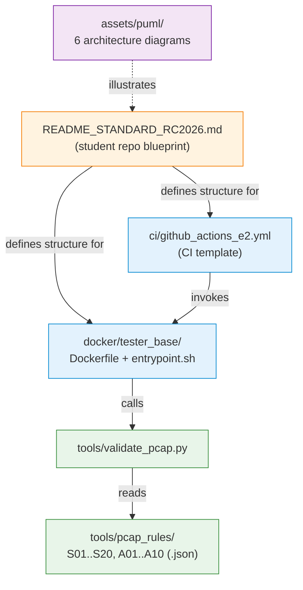

# 00_common — Shared Assessment Infrastructure

Common templates, tooling and CI configuration that enforce reproducibility and consistency across all 30 RC2026 projects. Student repositories are expected to mirror the structure defined here; the automatic E2 pipeline depends on standard file names and directory conventions.

## File/Folder Index

| Name | Description | Metric |
|---|---|---|
| [`README_STANDARD_RC2026.md`](README_STANDARD_RC2026.md) | Minimum student-repository structure, PCAP validation protocol and E3 evidence requirements | 71 lines |
| [`assets/`](assets/) | PlantUML source diagrams and the rendering scaffold for the shared assessment architecture | 11 files total (6 `.puml` sources plus render and support files) |
| [`ci/`](ci/) | GitHub Actions workflow template for E2 automation | 2 files (workflow template plus local index) |
| [`docker/`](docker/) | Base tester container: Dockerfile, entrypoint and local documentation | 4 files |
| [`tools/`](tools/) | PCAP validation script, rule sets and local documentation | 33 files (1 Python script + 30 JSON rule files + 2 docs) |

## Visual Overview



## Usage

The contents of this directory are not executed in place. Students copy the relevant files into their own repositories:

```bash
# copy PCAP validation tooling into the student project
cp tools/validate_pcap.py  <student-repo>/tools/
cp tools/pcap_rules/S01.json <student-repo>/tools/pcap_rules/

# copy CI template
cp ci/github_actions_e2.yml <student-repo>/.github/workflows/e2.yml

# copy tester Dockerfile
cp -r docker/tester_base/ <student-repo>/docker/tester_base/
```

To render PlantUML diagrams (requires `plantuml.jar` — see [`../../00_TOOLS/plantuml/`](../../00_TOOLS/plantuml/)):

```bash
bash assets/render.sh
```

Rendered PNGs appear in `assets/images/`.

## Design Rationale

Centralising assessment tooling in a single directory ensures that rule updates propagate to all projects without per-brief edits. The separation of JSON rule files from the validation engine allows instructors to modify acceptance criteria independently of the tshark-parsing logic.

## Cross-References

| Related area | Path | Relationship |
|---|---|---|
| Network-application project briefs | [`../01_network_applications/`](../01_network_applications/) | Each S-project references rules from `tools/pcap_rules/S{NN}.json` |
| Administration/security project briefs | [`../02_administration_security/`](../02_administration_security/) | Each A-project references rules from `tools/pcap_rules/A{NN}.json` |
| Course–seminar mapping | [`../COURSE_SEMINAR_MAPPING.md`](../COURSE_SEMINAR_MAPPING.md) | Aligns project codes to lectures and seminars |
| Portainer project map | [`../../00_TOOLS/Portainer/PROJECTS/PROJECTS_PORTAINER_MAP.md`](../../00_TOOLS/Portainer/PROJECTS/PROJECTS_PORTAINER_MAP.md) | References the `tester` container pattern defined here |
| PlantUML central renderer | [`../../00_TOOLS/plantuml/`](../../00_TOOLS/plantuml/) | `assets/render.sh` delegates to the central `render_puml.sh` |
| Environment prerequisites | [`../../00_TOOLS/Prerequisites/`](../../00_TOOLS/Prerequisites/) | Docker and tshark must be installed before validation works |

### Downstream Dependencies

Every student repository built to the RC2026 standard copies files from this directory. The GitHub Actions template in `ci/` and the Dockerfile in `docker/tester_base/` reference `tools/validate_pcap.py` by relative path within the student repository (not from this location). No CI or Makefile within the course repository itself invokes files from `00_common/` directly.

### Suggested Learning Sequence

```
00_TOOLS/Prerequisites/ → this folder (read README_STANDARD_RC2026.md) → project brief selection → student repo initialisation
```

## Selective Clone

**Method A — Git sparse-checkout (requires Git ≥ 2.25)**

```bash
git clone --filter=blob:none --sparse https://github.com/antonioclim/COMPNET-EN.git
cd COMPNET-EN
git sparse-checkout set 02_PROJECTS/00_common
```

**Method B — Direct download (no Git required)**

Browse: <https://github.com/antonioclim/COMPNET-EN/tree/main/02_PROJECTS/00_common>
