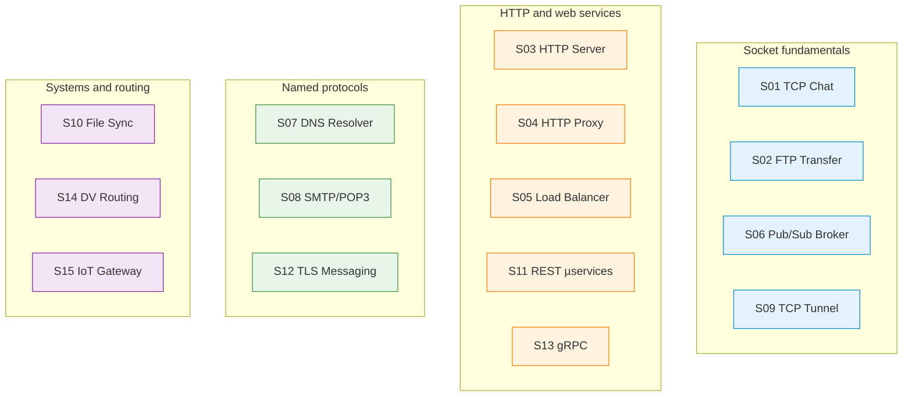

# Group 1 — Network Applications (S01–S15)

Fifteen projects targeting application-layer protocol design, service implementation and reproducible network experimentation. Each brief follows the RC2026 E1/E2/E3 assessment structure and mandates a Flex component in E3: at least one interoperable subsystem implemented in a language other than Python (C, C++, Java, Go, Rust, JavaScript/Node.js or similar).

## Project Index

| Code | Title | Lines | Difficulty | Primary protocols |
|---|---|---|---|---|
| [S01](S01_multi_client_tcp_chat_text_protocol_and_presence.md) | Multi-client TCP chat with a text protocol and presence | 217 | ★★★★☆ | TCP custom text |
| [S02](S02_file_transfer_server_control_and_data_channels_ftp_passive.md) | File transfer server — control and data channels (FTP passive) | 214 | ★★★★☆ | TCP (FTP-style) |
| [S03](S03_http11_socket_server_no_framework_static_files.md) | HTTP/1.1 socket server (no framework) for static files | 215 | ★★★★☆ | HTTP/1.1 raw |
| [S04](S04_forward_http_proxy_with_filtering_and_traffic_logging.md) | Forward HTTP proxy with filtering and traffic logging | 213 | ★★★★☆ | HTTP proxy |
| [S05](S05_application_level_http_load_balancer_health_checks_and_two_algorithms.md) | Application-level HTTP load balancer with health checks | 214 | ★★★★☆ | HTTP |
| [S06](S06_tcp_pub_sub_broker_topics_and_deterministic_routing.md) | TCP pub/sub broker with topics and deterministic routing | 212 | ★★★★★ | TCP custom |
| [S07](S07_udp_dns_resolver_local_zone_forwarding_and_ttl_cache.md) | DNS resolver over UDP — local zone, forwarding, TTL cache | 211 | ★★★★★ | UDP/DNS |
| [S08](S08_minimal_email_system_smtp_delivery_and_pop3_retrieval.md) | Minimal email system — SMTP delivery and POP3 retrieval | 215 | ★★★★★ | SMTP, POP3 |
| [S09](S09_tcp_tunnel_single_port_session_multiplexing_and_demultiplexing.md) | TCP tunnel — single-port session multiplexing | 214 | ★★★★★ | TCP tunnel |
| [S10](S10_network_file_synchronisation_manifest_hashes_and_conflict_resolution.md) | Network file synchronisation — manifest, hashes, conflicts | 212 | ★★★★☆ | TCP/HTTP |
| [S11](S11_rest_microservices_service_registry_api_gateway_dynamic_routing.md) | REST microservices — service registry and API gateway | 217 | ★★★★☆ | HTTP/REST |
| [S12](S12_client_server_messaging_tls_channel_and_minimal_authentication.md) | Client–server messaging — TLS channel and authentication | 212 | ★★★★☆ | TLS/TCP |
| [S13](S13_grpc_rpc_service_proto_definition_unary_and_streaming_methods.md) | gRPC RPC service — .proto, unary and streaming methods | 211 | ★★★★☆ | gRPC/HTTP2 |
| [S14](S14_didactic_distance_vector_routing_in_mininet_convergence_and_anti_loop.md) | Didactic distance-vector routing in Mininet | 190 | ★★★★★ | UDP (routing) |
| [S15](S15_iot_gateway_udp_telemetry_ingestion_http_api_query_and_streaming.md) | IoT gateway — UDP telemetry ingestion and HTTP API | 211 | ★★★★☆ | UDP, HTTP |

## E1/E2/E3 Summary

| Phase | Weight | Key deliverable | Automation |
|---|---|---|---|
| E1 | 25 % | Specification + Phase 0 Wireshark observations | — |
| E2 | 35 % | `make e2` → `artifacts/pcap/traffic_e2.pcap` + `validate_pcap.py` | PCAP rules in `../00_common/tools/pcap_rules/S{NN}.json` |
| E3 | 40 % | Final implementation + demo + Flex component (non-Python) | MANIFEST.txt completeness |

## Visual Overview — Thematic Clusters



## Lecture ↔ Seminar ↔ Project Cross-Reference

Data sourced from [`../COURSE_SEMINAR_MAPPING.md`](../COURSE_SEMINAR_MAPPING.md). Lecture directories resolve to [`../../03_LECTURES/C{NN}/`](../../03_LECTURES/), seminar directories to [`../../04_SEMINARS/S{NN}/`](../../04_SEMINARS/).

| Project | Lectures | Seminars | Quiz weeks |
|---|---|---|---|
| S01 | [C03](../../03_LECTURES/C03/), [C08](../../03_LECTURES/C08/), [C09](../../03_LECTURES/C09/) | [S03](../../04_SEMINARS/S03/), [S04](../../04_SEMINARS/S04/), [S02](../../04_SEMINARS/S02/) | W03, W08, W09 |
| S02 | [C03](../../03_LECTURES/C03/), [C08](../../03_LECTURES/C08/), [C11](../../03_LECTURES/C11/) | [S09](../../04_SEMINARS/S09/), [S04](../../04_SEMINARS/S04/), [S02](../../04_SEMINARS/S02/) | W03, W08, W11 |
| S03 | [C03](../../03_LECTURES/C03/), [C08](../../03_LECTURES/C08/), [C10](../../03_LECTURES/C10/) | [S08](../../04_SEMINARS/S08/), [S04](../../04_SEMINARS/S04/), [S02](../../04_SEMINARS/S02/) | W03, W08, W10 |
| S04 | [C03](../../03_LECTURES/C03/), [C10](../../03_LECTURES/C10/), [C08](../../03_LECTURES/C08/) | [S11](../../04_SEMINARS/S11/), [S08](../../04_SEMINARS/S08/), [S04](../../04_SEMINARS/S04/) | W03, W10, W08 |
| S05 | [C03](../../03_LECTURES/C03/), [C10](../../03_LECTURES/C10/), [C08](../../03_LECTURES/C08/) | [S11](../../04_SEMINARS/S11/), [S08](../../04_SEMINARS/S08/), [S04](../../04_SEMINARS/S04/) | W03, W10, W08 |
| S06 | [C03](../../03_LECTURES/C03/), [C08](../../03_LECTURES/C08/), [C13](../../03_LECTURES/C13/) | [S03](../../04_SEMINARS/S03/), [S04](../../04_SEMINARS/S04/), [S02](../../04_SEMINARS/S02/) | W03, W08, W13 |
| S07 | [C03](../../03_LECTURES/C03/), [C11](../../03_LECTURES/C11/), [C08](../../03_LECTURES/C08/) | [S10](../../04_SEMINARS/S10/), [S07](../../04_SEMINARS/S07/), [S04](../../04_SEMINARS/S04/) | W03, W11, W08 |
| S08 | [C03](../../03_LECTURES/C03/), [C08](../../03_LECTURES/C08/), [C12](../../03_LECTURES/C12/) | [S04](../../04_SEMINARS/S04/), [S02](../../04_SEMINARS/S02/), [S07](../../04_SEMINARS/S07/) | W03, W08, W12 |
| S09 | [C03](../../03_LECTURES/C03/), [C08](../../03_LECTURES/C08/), [C09](../../03_LECTURES/C09/) | [S04](../../04_SEMINARS/S04/), [S07](../../04_SEMINARS/S07/), [S02](../../04_SEMINARS/S02/) | W03, W08, W09 |
| S10 | [C03](../../03_LECTURES/C03/), [C08](../../03_LECTURES/C08/), [C11](../../03_LECTURES/C11/) | [S09](../../04_SEMINARS/S09/), [S04](../../04_SEMINARS/S04/), [S07](../../04_SEMINARS/S07/) | W03, W08, W11 |
| S11 | [C03](../../03_LECTURES/C03/), [C10](../../03_LECTURES/C10/), [C08](../../03_LECTURES/C08/) | [S11](../../04_SEMINARS/S11/), [S08](../../04_SEMINARS/S08/), [S07](../../04_SEMINARS/S07/) | W03, W10, W08 |
| S12 | [C03](../../03_LECTURES/C03/), [C08](../../03_LECTURES/C08/), [C13](../../03_LECTURES/C13/) | [S02](../../04_SEMINARS/S02/), [S07](../../04_SEMINARS/S07/), [S04](../../04_SEMINARS/S04/) | W03, W08, W13 |
| S13 | [C03](../../03_LECTURES/C03/), [C10](../../03_LECTURES/C10/), [C09](../../03_LECTURES/C09/) | [S12](../../04_SEMINARS/S12/), [S07](../../04_SEMINARS/S07/), [S04](../../04_SEMINARS/S04/) | W03, W10, W09 |
| S14 | [C05](../../03_LECTURES/C05/), [C06](../../03_LECTURES/C06/), [C07](../../03_LECTURES/C07/) | [S06](../../04_SEMINARS/S06/), [S05](../../04_SEMINARS/S05/), [S07](../../04_SEMINARS/S07/) | W05, W06, W07 |
| S15 | [C03](../../03_LECTURES/C03/), [C10](../../03_LECTURES/C10/), [C13](../../03_LECTURES/C13/) | [S07](../../04_SEMINARS/S07/), [S08](../../04_SEMINARS/S08/), [S02](../../04_SEMINARS/S02/) | W03, W10, W13 |

## Supporting Assets

| Directory | Contents | Count |
|---|---|---|
| [`assets/PORTAINER/`](assets/PORTAINER/) | Per-project Portainer debugging guides (S01–S15) | 15 Markdown files |
| [`assets/puml/`](assets/puml/) | PlantUML architecture, message-flow and state diagrams per project | 45 `.puml` files (3 per project) |
| [`assets/images/`](assets/images/) | Rendered diagram output (populated by `assets/render.sh`) | `.gitkeep` placeholder |

## Prerequisites

| Prerequisite | Path | Reason |
|---|---|---|
| Environment setup | [`../../00_TOOLS/Prerequisites/`](../../00_TOOLS/Prerequisites/) | Docker, WSL2, Wireshark and tshark must be configured |
| Common assessment standard | [`../00_common/README_STANDARD_RC2026.md`](../00_common/README_STANDARD_RC2026.md) | Defines the student-repository structure assumed by all briefs |
| Python socket fluency | [`../../00_APPENDIX/a)PYTHON_self_study_guide/`](../../00_APPENDIX/a%29PYTHON_self_study_guide/) | Socket programming skills expected from seminar exercises |

## Notes

The Flex component is mandatory for every S-project in E3. Specifications should remain stable after E1 submission to preserve deterministic automated testing. Keep E2 artefacts reproducible: identical input must yield identical PCAP validation results.

## Selective Clone

**Method A — Git sparse-checkout (requires Git ≥ 2.25)**

```bash
git clone --filter=blob:none --sparse https://github.com/antonioclim/COMPNET-EN.git
cd COMPNET-EN
git sparse-checkout set 02_PROJECTS/01_network_applications
```

To include the shared assessment tools as well:

```bash
git sparse-checkout add 02_PROJECTS/00_common
```

**Method B — Direct download (no Git required)**

Browse: <https://github.com/antonioclim/COMPNET-EN/tree/main/02_PROJECTS/01_network_applications>
