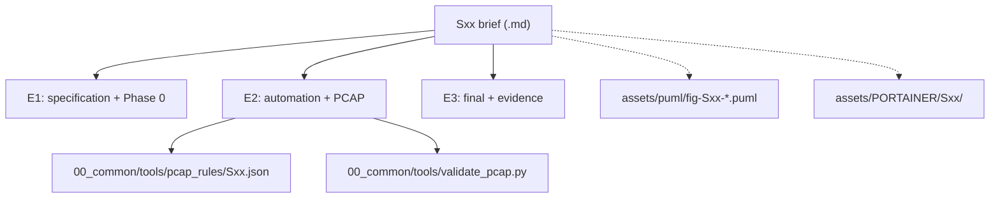

# 01_network_applications — project briefs S01–S15 (application protocols and services)

Fifteen project briefs for designing and implementing application-layer network systems, from custom text protocols to DNS, SMTP/POP3, proxies, load balancers and a didactic routing simulation. Each brief follows the RC2026 E1/E2/E3 assessment model and references the shared E2 PCAP validation tooling.

## File and folder index

| Name | Description | Metric |
|---|---|---|
| [`assets/`](assets/) | Shared figures and rendering helpers for the parent group | 81 files (45 .puml, 34 .md) |
| `README.md` | Directory orientation and cross-reference map | 138 lines |
| [`S01_multi_client_tcp_chat_text_protocol_and_presence.md`](S01_multi_client_tcp_chat_text_protocol_and_presence.md) | S01 — Multi-client TCP chat with a text protocol and presence | 217 lines |
| [`S02_file_transfer_server_control_and_data_channels_ftp_passive.md`](S02_file_transfer_server_control_and_data_channels_ftp_passive.md) | S02 — File transfer server with a control channel and a data channel (passive FTP style) | 214 lines |
| [`S03_http11_socket_server_no_framework_static_files.md`](S03_http11_socket_server_no_framework_static_files.md) | S03 — HTTP/1.1 server on raw sockets (no framework) for static files | 215 lines |
| [`S04_forward_http_proxy_with_filtering_and_traffic_logging.md`](S04_forward_http_proxy_with_filtering_and_traffic_logging.md) | S04 — Forward HTTP proxy with filtering and traffic logging | 213 lines |
| [`S05_application_level_http_load_balancer_health_checks_and_two_algorithms.md`](S05_application_level_http_load_balancer_health_checks_and_two_algorithms.md) | S05 — Application-layer HTTP load balancer with health checks and two algorithms | 214 lines |
| [`S06_tcp_pub_sub_broker_topics_and_deterministic_routing.md`](S06_tcp_pub_sub_broker_topics_and_deterministic_routing.md) | S06 — TCP Pub/Sub broker with topics and deterministic routing | 212 lines |
| [`S07_udp_dns_resolver_local_zone_forwarding_and_ttl_cache.md`](S07_udp_dns_resolver_local_zone_forwarding_and_ttl_cache.md) | S07 — DNS resolver over UDP with a local zone, forwarding and TTL cache | 211 lines |
| [`S08_minimal_email_system_smtp_delivery_and_pop3_retrieval.md`](S08_minimal_email_system_smtp_delivery_and_pop3_retrieval.md) | S08 — Minimal email system: SMTP server for delivery and POP3 server for reading | 215 lines |
| [`S09_tcp_tunnel_single_port_session_multiplexing_and_demultiplexing.md`](S09_tcp_tunnel_single_port_session_multiplexing_and_demultiplexing.md) | S09 — TCP tunnel on a single port with session multiplexing and demultiplexing | 214 lines |
| [`S10_network_file_synchronisation_manifest_hashes_and_conflict_resolution.md`](S10_network_file_synchronisation_manifest_hashes_and_conflict_resolution.md) | S10 — Network file synchronisation with manifest, hashes and conflict resolution | 212 lines |
| [`S11_rest_microservices_service_registry_api_gateway_dynamic_routing.md`](S11_rest_microservices_service_registry_api_gateway_dynamic_routing.md) | S11 — REST microservices with a service registry and an API gateway with dynamic routing | 217 lines |
| [`S12_client_server_messaging_tls_channel_and_minimal_authentication.md`](S12_client_server_messaging_tls_channel_and_minimal_authentication.md) | S12 — Client–server messaging with a TLS channel and minimal authentication | 212 lines |
| [`S13_grpc_rpc_service_proto_definition_unary_and_streaming_methods.md`](S13_grpc_rpc_service_proto_definition_unary_and_streaming_methods.md) | S13 — gRPC-based RPC service: .proto definition, unary and streaming methods | 211 lines |
| [`S14_didactic_distance_vector_routing_in_mininet_convergence_and_anti_loop.md`](S14_didactic_distance_vector_routing_in_mininet_convergence_and_anti_loop.md) | S14 — Didactic distance-vector routing in Mininet with convergence and anti-loop | 190 lines |
| [`S15_iot_gateway_udp_telemetry_ingestion_http_api_query_and_streaming.md`](S15_iot_gateway_udp_telemetry_ingestion_http_api_query_and_streaming.md) | S15 — IoT gateway: UDP telemetry ingestion and an HTTP API for querying and streaming | 211 lines |

## Visual overview



## Usage

Pick a brief, then use its metadata block to locate the required lecture and seminar prerequisites:

```bash
# list available briefs
ls S*.md

# open one brief (example: DNS resolver)
sed -n '1,80p' S07_udp_dns_resolver_local_zone_forwarding_and_ttl_cache.md
```

When you move to implementation, start from the shared standard in `../00_common/README_STANDARD_RC2026.md`.

## Design and teaching intent

The set progresses from protocol framing and parsing to multi-service orchestration and controlled experiments. Each brief forces explicit choices about message formats, state and observability, then asks for evidence via tests and captured traffic.

## Cross-references and contextual connections


### Prerequisites and dependencies

| Prerequisite | Path | Why |
|---|---|---|
| RC2026 standard | [`00_common/README_STANDARD_RC2026.md`](../00_common/README_STANDARD_RC2026.md) | Fixed directory layout and E2 artefact paths assumed by the briefs |
| Environment and tooling | [`00_TOOLS/Prerequisites/`](../../00_TOOLS/Prerequisites) | Docker, tcpdump and tshark are needed for E2 evidence |
| Python socket practice | [`00_APPENDIX/a)PYTHON_self_study_guide/`](../../00_APPENDIX/a%29PYTHON_self_study_guide) | Most briefs assume low-level socket programming and parsing without frameworks |
| Portainer setup (optional) | [`00_TOOLS/Portainer/INIT_GUIDE/`](../../00_TOOLS/Portainer/INIT_GUIDE) | Container debugging for multi-service stacks and gateways |

### Lecture ↔ seminar ↔ project ↔ quiz mapping

| This item | Lectures | Seminars | Quiz weeks | Portainer |
|---|---|---|---|---|
| [S01](S01_multi_client_tcp_chat_text_protocol_and_presence.md) | [C03](../../03_LECTURES/C03), [C08](../../03_LECTURES/C08), [C09](../../03_LECTURES/C09) | [S03](../../04_SEMINARS/S03), [S04](../../04_SEMINARS/S04), [S02](../../04_SEMINARS/S02) | [W03](../../00_APPENDIX/c%29studentsQUIZes%28multichoice_only%29/COMPnet_W03_Questions.md), [W08](../../00_APPENDIX/c%29studentsQUIZes%28multichoice_only%29/COMPnet_W08_Questions.md), [W09](../../00_APPENDIX/c%29studentsQUIZes%28multichoice_only%29/COMPnet_W09_Questions.md) | [Guide](assets/PORTAINER/S01/PORTAINER_GUIDE_S01.md) |
| [S02](S02_file_transfer_server_control_and_data_channels_ftp_passive.md) | [C03](../../03_LECTURES/C03), [C08](../../03_LECTURES/C08), [C11](../../03_LECTURES/C11) | [S09](../../04_SEMINARS/S09), [S04](../../04_SEMINARS/S04), [S02](../../04_SEMINARS/S02) | [W03](../../00_APPENDIX/c%29studentsQUIZes%28multichoice_only%29/COMPnet_W03_Questions.md), [W08](../../00_APPENDIX/c%29studentsQUIZes%28multichoice_only%29/COMPnet_W08_Questions.md), [W11](../../00_APPENDIX/c%29studentsQUIZes%28multichoice_only%29/COMPnet_W11_Questions.md) | [Guide](assets/PORTAINER/S02/PORTAINER_GUIDE_S02.md) |
| [S03](S03_http11_socket_server_no_framework_static_files.md) | [C03](../../03_LECTURES/C03), [C08](../../03_LECTURES/C08), [C10](../../03_LECTURES/C10) | [S08](../../04_SEMINARS/S08), [S04](../../04_SEMINARS/S04), [S02](../../04_SEMINARS/S02) | [W03](../../00_APPENDIX/c%29studentsQUIZes%28multichoice_only%29/COMPnet_W03_Questions.md), [W08](../../00_APPENDIX/c%29studentsQUIZes%28multichoice_only%29/COMPnet_W08_Questions.md), [W10](../../00_APPENDIX/c%29studentsQUIZes%28multichoice_only%29/COMPnet_W10_Questions.md) | [Guide](assets/PORTAINER/S03/PORTAINER_GUIDE_S03.md) |
| [S04](S04_forward_http_proxy_with_filtering_and_traffic_logging.md) | [C03](../../03_LECTURES/C03), [C10](../../03_LECTURES/C10), [C08](../../03_LECTURES/C08) | [S11](../../04_SEMINARS/S11), [S08](../../04_SEMINARS/S08), [S04](../../04_SEMINARS/S04) | [W03](../../00_APPENDIX/c%29studentsQUIZes%28multichoice_only%29/COMPnet_W03_Questions.md), [W10](../../00_APPENDIX/c%29studentsQUIZes%28multichoice_only%29/COMPnet_W10_Questions.md), [W08](../../00_APPENDIX/c%29studentsQUIZes%28multichoice_only%29/COMPnet_W08_Questions.md) | [Guide](assets/PORTAINER/S04/PORTAINER_GUIDE_S04.md) |
| [S05](S05_application_level_http_load_balancer_health_checks_and_two_algorithms.md) | [C03](../../03_LECTURES/C03), [C10](../../03_LECTURES/C10), [C08](../../03_LECTURES/C08) | [S11](../../04_SEMINARS/S11), [S08](../../04_SEMINARS/S08), [S04](../../04_SEMINARS/S04) | [W03](../../00_APPENDIX/c%29studentsQUIZes%28multichoice_only%29/COMPnet_W03_Questions.md), [W10](../../00_APPENDIX/c%29studentsQUIZes%28multichoice_only%29/COMPnet_W10_Questions.md), [W08](../../00_APPENDIX/c%29studentsQUIZes%28multichoice_only%29/COMPnet_W08_Questions.md) | [Guide](assets/PORTAINER/S05/PORTAINER_GUIDE_S05.md) |
| [S06](S06_tcp_pub_sub_broker_topics_and_deterministic_routing.md) | [C03](../../03_LECTURES/C03), [C08](../../03_LECTURES/C08), [C13](../../03_LECTURES/C13) | [S03](../../04_SEMINARS/S03), [S04](../../04_SEMINARS/S04), [S02](../../04_SEMINARS/S02) | [W03](../../00_APPENDIX/c%29studentsQUIZes%28multichoice_only%29/COMPnet_W03_Questions.md), [W08](../../00_APPENDIX/c%29studentsQUIZes%28multichoice_only%29/COMPnet_W08_Questions.md), [W13](../../00_APPENDIX/c%29studentsQUIZes%28multichoice_only%29/COMPnet_W13_Questions.md) | [Guide](assets/PORTAINER/S06/PORTAINER_GUIDE_S06.md) |
| [S07](S07_udp_dns_resolver_local_zone_forwarding_and_ttl_cache.md) | [C03](../../03_LECTURES/C03), [C11](../../03_LECTURES/C11), [C08](../../03_LECTURES/C08) | [S10](../../04_SEMINARS/S10), [S07](../../04_SEMINARS/S07), [S04](../../04_SEMINARS/S04) | [W03](../../00_APPENDIX/c%29studentsQUIZes%28multichoice_only%29/COMPnet_W03_Questions.md), [W11](../../00_APPENDIX/c%29studentsQUIZes%28multichoice_only%29/COMPnet_W11_Questions.md), [W08](../../00_APPENDIX/c%29studentsQUIZes%28multichoice_only%29/COMPnet_W08_Questions.md) | [Guide](assets/PORTAINER/S07/PORTAINER_GUIDE_S07.md) |
| [S08](S08_minimal_email_system_smtp_delivery_and_pop3_retrieval.md) | [C03](../../03_LECTURES/C03), [C08](../../03_LECTURES/C08), [C12](../../03_LECTURES/C12) | [S04](../../04_SEMINARS/S04), [S02](../../04_SEMINARS/S02), [S07](../../04_SEMINARS/S07) | [W03](../../00_APPENDIX/c%29studentsQUIZes%28multichoice_only%29/COMPnet_W03_Questions.md), [W08](../../00_APPENDIX/c%29studentsQUIZes%28multichoice_only%29/COMPnet_W08_Questions.md), [W12](../../00_APPENDIX/c%29studentsQUIZes%28multichoice_only%29/COMPnet_W12_Questions.md) | [Guide](assets/PORTAINER/S08/PORTAINER_GUIDE_S08.md) |
| [S09](S09_tcp_tunnel_single_port_session_multiplexing_and_demultiplexing.md) | [C03](../../03_LECTURES/C03), [C08](../../03_LECTURES/C08), [C09](../../03_LECTURES/C09) | [S04](../../04_SEMINARS/S04), [S07](../../04_SEMINARS/S07), [S02](../../04_SEMINARS/S02) | [W03](../../00_APPENDIX/c%29studentsQUIZes%28multichoice_only%29/COMPnet_W03_Questions.md), [W08](../../00_APPENDIX/c%29studentsQUIZes%28multichoice_only%29/COMPnet_W08_Questions.md), [W09](../../00_APPENDIX/c%29studentsQUIZes%28multichoice_only%29/COMPnet_W09_Questions.md) | [Guide](assets/PORTAINER/S09/PORTAINER_GUIDE_S09.md) |
| [S10](S10_network_file_synchronisation_manifest_hashes_and_conflict_resolution.md) | [C03](../../03_LECTURES/C03), [C08](../../03_LECTURES/C08), [C11](../../03_LECTURES/C11) | [S09](../../04_SEMINARS/S09), [S04](../../04_SEMINARS/S04), [S07](../../04_SEMINARS/S07) | [W03](../../00_APPENDIX/c%29studentsQUIZes%28multichoice_only%29/COMPnet_W03_Questions.md), [W08](../../00_APPENDIX/c%29studentsQUIZes%28multichoice_only%29/COMPnet_W08_Questions.md), [W11](../../00_APPENDIX/c%29studentsQUIZes%28multichoice_only%29/COMPnet_W11_Questions.md) | [Guide](assets/PORTAINER/S10/PORTAINER_GUIDE_S10.md) |
| [S11](S11_rest_microservices_service_registry_api_gateway_dynamic_routing.md) | [C03](../../03_LECTURES/C03), [C10](../../03_LECTURES/C10), [C08](../../03_LECTURES/C08) | [S11](../../04_SEMINARS/S11), [S08](../../04_SEMINARS/S08), [S07](../../04_SEMINARS/S07) | [W03](../../00_APPENDIX/c%29studentsQUIZes%28multichoice_only%29/COMPnet_W03_Questions.md), [W10](../../00_APPENDIX/c%29studentsQUIZes%28multichoice_only%29/COMPnet_W10_Questions.md), [W08](../../00_APPENDIX/c%29studentsQUIZes%28multichoice_only%29/COMPnet_W08_Questions.md) | [Guide](assets/PORTAINER/S11/PORTAINER_GUIDE_S11.md) |
| [S12](S12_client_server_messaging_tls_channel_and_minimal_authentication.md) | [C03](../../03_LECTURES/C03), [C08](../../03_LECTURES/C08), [C13](../../03_LECTURES/C13) | [S02](../../04_SEMINARS/S02), [S07](../../04_SEMINARS/S07), [S04](../../04_SEMINARS/S04) | [W03](../../00_APPENDIX/c%29studentsQUIZes%28multichoice_only%29/COMPnet_W03_Questions.md), [W08](../../00_APPENDIX/c%29studentsQUIZes%28multichoice_only%29/COMPnet_W08_Questions.md), [W13](../../00_APPENDIX/c%29studentsQUIZes%28multichoice_only%29/COMPnet_W13_Questions.md) | [Guide](assets/PORTAINER/S12/PORTAINER_GUIDE_S12.md) |
| [S13](S13_grpc_rpc_service_proto_definition_unary_and_streaming_methods.md) | [C03](../../03_LECTURES/C03), [C10](../../03_LECTURES/C10), [C09](../../03_LECTURES/C09) | [S12](../../04_SEMINARS/S12), [S07](../../04_SEMINARS/S07), [S04](../../04_SEMINARS/S04) | [W03](../../00_APPENDIX/c%29studentsQUIZes%28multichoice_only%29/COMPnet_W03_Questions.md), [W10](../../00_APPENDIX/c%29studentsQUIZes%28multichoice_only%29/COMPnet_W10_Questions.md), [W09](../../00_APPENDIX/c%29studentsQUIZes%28multichoice_only%29/COMPnet_W09_Questions.md) | [Guide](assets/PORTAINER/S13/PORTAINER_GUIDE_S13.md) |
| [S14](S14_didactic_distance_vector_routing_in_mininet_convergence_and_anti_loop.md) | [C05](../../03_LECTURES/C05), [C06](../../03_LECTURES/C06), [C07](../../03_LECTURES/C07) | [S06](../../04_SEMINARS/S06), [S05](../../04_SEMINARS/S05), [S07](../../04_SEMINARS/S07) | [W05](../../00_APPENDIX/c%29studentsQUIZes%28multichoice_only%29/COMPnet_W05_Questions.md), [W06](../../00_APPENDIX/c%29studentsQUIZes%28multichoice_only%29/COMPnet_W06_Questions.md), [W07](../../00_APPENDIX/c%29studentsQUIZes%28multichoice_only%29/COMPnet_W07_Questions.md) | [Guide](assets/PORTAINER/S14/PORTAINER_GUIDE_S14.md) |
| [S15](S15_iot_gateway_udp_telemetry_ingestion_http_api_query_and_streaming.md) | [C03](../../03_LECTURES/C03), [C10](../../03_LECTURES/C10), [C13](../../03_LECTURES/C13) | [S07](../../04_SEMINARS/S07), [S08](../../04_SEMINARS/S08), [S02](../../04_SEMINARS/S02) | [W03](../../00_APPENDIX/c%29studentsQUIZes%28multichoice_only%29/COMPnet_W03_Questions.md), [W10](../../00_APPENDIX/c%29studentsQUIZes%28multichoice_only%29/COMPnet_W10_Questions.md), [W13](../../00_APPENDIX/c%29studentsQUIZes%28multichoice_only%29/COMPnet_W13_Questions.md) | [Guide](assets/PORTAINER/S15/PORTAINER_GUIDE_S15.md) |

### Portainer support guides

| Tool guide (00_TOOLS) | When it helps |
|---|---|
| [S08](../../00_TOOLS/Portainer/SEMINAR08) | Projects whose primary workflow matches seminar S08 |
| [S09](../../00_TOOLS/Portainer/SEMINAR09) | Projects whose primary workflow matches seminar S09 |
| [S10](../../00_TOOLS/Portainer/SEMINAR10) | Projects whose primary workflow matches seminar S10 |
| [S11](../../00_TOOLS/Portainer/SEMINAR11) | Projects whose primary workflow matches seminar S11 |
| [S13](../../00_TOOLS/Portainer/SEMINAR13) | Projects whose primary workflow matches seminar S13 |

### Instructor notes (Romanian) for referenced seminars

| Seminar | English seminar folder | Instructor notes (Romanian) |
|---|---|---|
| `S02` | [S02](../../04_SEMINARS/S02) | [roCOMPNETclass_S02-instructor-outline-v2.md](../../00_APPENDIX/d%29instructor_NOTES4sem/roCOMPNETclass_S02-instructor-outline-v2.md), [roCOMPNETclass_S02-instructor-outline-v2__noMININET-SDN_.md](../../00_APPENDIX/d%29instructor_NOTES4sem/roCOMPNETclass_S02-instructor-outline-v2__noMININET-SDN_.md) |
| `S03` | [S03](../../04_SEMINARS/S03) | [roCOMPNETclass_S03-instructor-outline-v2.md](../../00_APPENDIX/d%29instructor_NOTES4sem/roCOMPNETclass_S03-instructor-outline-v2.md), [roCOMPNETclass_S03-instructor-outline-v2__noMININET-SDN_.md](../../00_APPENDIX/d%29instructor_NOTES4sem/roCOMPNETclass_S03-instructor-outline-v2__noMININET-SDN_.md) |
| `S04` | [S04](../../04_SEMINARS/S04) | [roCOMPNETclass_S04-instructor-outline-v2.md](../../00_APPENDIX/d%29instructor_NOTES4sem/roCOMPNETclass_S04-instructor-outline-v2.md), [roCOMPNETclass_S04-instructor-outline-v2__noMININET-SDN_.md](../../00_APPENDIX/d%29instructor_NOTES4sem/roCOMPNETclass_S04-instructor-outline-v2__noMININET-SDN_.md) |
| `S05` | [S05](../../04_SEMINARS/S05) | [roCOMPNETclass_S05-instructor-outline-v2.md](../../00_APPENDIX/d%29instructor_NOTES4sem/roCOMPNETclass_S05-instructor-outline-v2.md), [roCOMPNETclass_S05-instructor-outline-v2__noMININET-SDN_.md](../../00_APPENDIX/d%29instructor_NOTES4sem/roCOMPNETclass_S05-instructor-outline-v2__noMININET-SDN_.md) |
| `S06` | [S06](../../04_SEMINARS/S06) | [roCOMPNETclass_S06-instructor-outline-v2.md](../../00_APPENDIX/d%29instructor_NOTES4sem/roCOMPNETclass_S06-instructor-outline-v2.md), [roCOMPNETclass_S06-instructor-outline-v2__noMININET-SDN_.md](../../00_APPENDIX/d%29instructor_NOTES4sem/roCOMPNETclass_S06-instructor-outline-v2__noMININET-SDN_.md) |
| `S07` | [S07](../../04_SEMINARS/S07) | [roCOMPNETclass_S07-instructor-outline-v2.md](../../00_APPENDIX/d%29instructor_NOTES4sem/roCOMPNETclass_S07-instructor-outline-v2.md), [roCOMPNETclass_S07-instructor-outline-v2__noMININET-SDN_.md](../../00_APPENDIX/d%29instructor_NOTES4sem/roCOMPNETclass_S07-instructor-outline-v2__noMININET-SDN_.md) |
| `S08` | [S08](../../04_SEMINARS/S08) | [roCOMPNETclass_S08-instructor-outline-v2.md](../../00_APPENDIX/d%29instructor_NOTES4sem/roCOMPNETclass_S08-instructor-outline-v2.md), [roCOMPNETclass_S08-instructor-outline-v2__noMININET-SDN_.md](../../00_APPENDIX/d%29instructor_NOTES4sem/roCOMPNETclass_S08-instructor-outline-v2__noMININET-SDN_.md) |
| `S09` | [S09](../../04_SEMINARS/S09) | [roCOMPNETclass_S09-instructor-outline-v2.md](../../00_APPENDIX/d%29instructor_NOTES4sem/roCOMPNETclass_S09-instructor-outline-v2.md), [roCOMPNETclass_S09-instructor-outline-v2__noMININET-SDN_.md](../../00_APPENDIX/d%29instructor_NOTES4sem/roCOMPNETclass_S09-instructor-outline-v2__noMININET-SDN_.md) |
| `S10` | [S10](../../04_SEMINARS/S10) | [roCOMPNETclass_S10-instructor-outline-v2.md](../../00_APPENDIX/d%29instructor_NOTES4sem/roCOMPNETclass_S10-instructor-outline-v2.md), [roCOMPNETclass_S10-instructor-outline-v2__noMININET-SDN_.md](../../00_APPENDIX/d%29instructor_NOTES4sem/roCOMPNETclass_S10-instructor-outline-v2__noMININET-SDN_.md) |
| `S11` | [S11](../../04_SEMINARS/S11) | [roCOMPNETclass_S11-instructor-outline-v2.md](../../00_APPENDIX/d%29instructor_NOTES4sem/roCOMPNETclass_S11-instructor-outline-v2.md), [roCOMPNETclass_S11-instructor-outline-v2__noMININET-SDN_.md](../../00_APPENDIX/d%29instructor_NOTES4sem/roCOMPNETclass_S11-instructor-outline-v2__noMININET-SDN_.md) |
| `S12` | [S12](../../04_SEMINARS/S12) | [roCOMPNETclass_S12-instructor-outline-v2.md](../../00_APPENDIX/d%29instructor_NOTES4sem/roCOMPNETclass_S12-instructor-outline-v2.md), [roCOMPNETclass_S12-instructor-outline-v2__noMININET-SDN_.md](../../00_APPENDIX/d%29instructor_NOTES4sem/roCOMPNETclass_S12-instructor-outline-v2__noMININET-SDN_.md) |

### Downstream dependencies

The Portainer project index at [`00_TOOLS/Portainer/PROJECTS/PROJECTS_PORTAINER_MAP.md`](../../00_TOOLS/Portainer/PROJECTS/PROJECTS_PORTAINER_MAP.md) links into `assets/PORTAINER/Sxx/`.
Lecture READMEs link directly to these briefs, for example [`03_LECTURES/C03/README.md`](../../03_LECTURES/C03/README.md).
Each brief references a PCAP rule file under `../00_common/tools/pcap_rules/` by name.

### Suggested learning sequence

Suggested sequence: complete the matching seminar(s) → read the brief → draft E1 spec → implement a minimal end-to-end path → containerise E2 and validate the PCAP → finalise E3 evidence.


## Selective clone

### Method A — Git sparse-checkout (Git ≥ 2.25)

```bash
git clone --filter=blob:none --sparse https://github.com/antonioclim/COMPNET-EN.git
cd COMPNET-EN
git sparse-checkout set 02_PROJECTS/01_network_applications
```

To add another path later:

```bash
git sparse-checkout add <ANOTHER_PATH>
```

### Method B — Direct download (no Git required)

```text
https://github.com/antonioclim/COMPNET-EN/tree/main/02_PROJECTS/01_network_applications
```

GitHub can only download the full repository as a ZIP. For a single folder, use a browser-side downloader such as download-directory.github.io or gitzip.

## Version and provenance

Group 1 briefs snapshot (February 2026).
