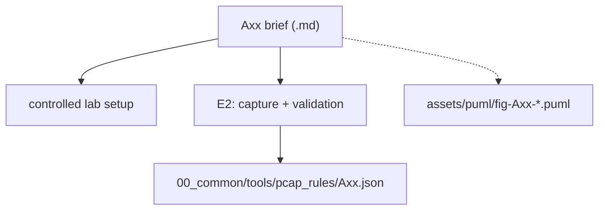

# 02_administration_security — project briefs A01–A10 (SDN, analysis and controlled security labs)

Ten administration and security briefs, centred on SDN controllers, PCAP analysis and controlled offensive techniques used for defensive measurement. These briefs are designed for supervised laboratory environments and keep evidence generation deterministic through E2 capture and validation.

## File and folder index

| Name | Description | Metric |
|---|---|---|
| [`assets/`](assets/) | Shared figures and rendering helpers for the parent group | 35 files (30 .puml, 3 .md) |
| [`A01_sdn_firewall_filtering_policies_via_openflow_rules.md`](A01_sdn_firewall_filtering_policies_via_openflow_rules.md) | A01 — SDN firewall: filtering policies implemented via OpenFlow rules | 188 lines |
| [`A02_ids_simple_rules_scan_detection_tcp_anomalies_and_payload_patterns.md`](A02_ids_simple_rules_scan_detection_tcp_anomalies_and_payload_patterns.md) | A02 — IDS with simple rules: scan detection, TCP anomalies and payload patterns | 187 lines |
| [`A03_pcap_report_generator_flow_statistics_top_talkers_and_tcp_indicators.md`](A03_pcap_report_generator_flow_statistics_top_talkers_and_tcp_indicators.md) | A03 — PCAP report generator: flow statistics, top talkers and TCP indicators | 187 lines |
| [`A04_arp_spoofing_detection_and_mitigation_alerts_evidence_and_controlled_blocking.md`](A04_arp_spoofing_detection_and_mitigation_alerts_evidence_and_controlled_blocking.md) | A04 — ARP spoofing detection and mitigation: alerts, evidence and controlled blocking | 188 lines |
| [`A05_laboratory_port_scanning_tcp_connect_scan_and_minimal_service_fingerprinting.md`](A05_laboratory_port_scanning_tcp_connect_scan_and_minimal_service_fingerprinting.md) | A05 — Laboratory port scanning: TCP connect scan and minimal service fingerprinting | 189 lines |
| [`A06_nat_and_dhcp_laboratory_dynamic_allocation_iptables_masquerade_and_pcap_verification.md`](A06_nat_and_dhcp_laboratory_dynamic_allocation_iptables_masquerade_and_pcap_verification.md) | A06 — NAT and DHCP laboratory: dynamic allocation, iptables MASQUERADE and verification via PCAP | 190 lines |
| [`A07_sdn_learning_switch_controller_flow_installation_and_ageing.md`](A07_sdn_learning_switch_controller_flow_installation_and_ageing.md) | A07 — SDN learning-switch controller with flow installation and ageing | 187 lines |
| [`A08_mininet_encapsulation_and_tunnelling_vxlan_between_two_sites.md`](A08_mininet_encapsulation_and_tunnelling_vxlan_between_two_sites.md) | A08 — Encapsulation and tunnelling in Mininet: VXLAN between two sites | 184 lines |
| [`A09_sdn_ips_dynamic_blocking_via_openflow_triggered_by_ids_detection.md`](A09_sdn_ips_dynamic_blocking_via_openflow_triggered_by_ids_detection.md) | A09 — SDN IPS: dynamic blocking via OpenFlow triggered by IDS detection | 190 lines |
| [`A10_network_hardening_containerised_services_segmentation_egress_filtering_docker_user.md`](A10_network_hardening_containerised_services_segmentation_egress_filtering_docker_user.md) | A10 — Network hardening for containerised services: segmentation and egress filtering with DOCKER-USER | 187 lines |
| `README.md` | Directory orientation and cross-reference map | 119 lines |

## Visual overview



## Usage

Open a brief and read the safety constraints and lab boundary conditions before writing any code or scripts:

```bash
# list available briefs
ls A*.md

# open one brief (example: ARP spoofing detection)
sed -n '1,90p' A04_arp_spoofing_detection_and_mitigation_alerts_evidence_and_controlled_blocking.md
```

## Design and teaching intent

Projects treat security actions as stimuli for measurement: the goal is detection, mitigation and auditable evidence, not exploit development. The SDN tasks pair controller logic with packet-level traces to connect policy decisions to observable traffic.

## Cross-references and contextual connections


### Prerequisites and dependencies

| Prerequisite | Path | Why |
|---|---|---|
| RC2026 standard | [`00_common/README_STANDARD_RC2026.md`](../00_common/README_STANDARD_RC2026.md) | Fixed artefact layout and E2 validation pattern |
| Environment and tooling | [`00_TOOLS/Prerequisites/`](../../00_TOOLS/Prerequisites) | Mininet, tshark and container tooling are assumed where relevant |
| Seminar labs | [S06](../../04_SEMINARS/S06) and [S13](../../04_SEMINARS/S13) | SDN and security laboratory practice used by many briefs |

### Lecture ↔ seminar ↔ project ↔ quiz mapping

| This item | Lectures | Seminars | Quiz weeks |
|---|---|---|---|
| [A01](A01_sdn_firewall_filtering_policies_via_openflow_rules.md) | [C13](../../03_LECTURES/C13), [C04](../../03_LECTURES/C04), [C05](../../03_LECTURES/C05) | [S06](../../04_SEMINARS/S06), [S07](../../04_SEMINARS/S07), [S13](../../04_SEMINARS/S13) | [W13](../../00_APPENDIX/c%29studentsQUIZes%28multichoice_only%29/COMPnet_W13_Questions.md), [W04](../../00_APPENDIX/c%29studentsQUIZes%28multichoice_only%29/COMPnet_W04_Questions.md), [W05](../../00_APPENDIX/c%29studentsQUIZes%28multichoice_only%29/COMPnet_W05_Questions.md) |
| [A02](A02_ids_simple_rules_scan_detection_tcp_anomalies_and_payload_patterns.md) | [C13](../../03_LECTURES/C13), [C08](../../03_LECTURES/C08), [C03](../../03_LECTURES/C03) | [S07](../../04_SEMINARS/S07), [S13](../../04_SEMINARS/S13), [S04](../../04_SEMINARS/S04) | [W13](../../00_APPENDIX/c%29studentsQUIZes%28multichoice_only%29/COMPnet_W13_Questions.md), [W08](../../00_APPENDIX/c%29studentsQUIZes%28multichoice_only%29/COMPnet_W08_Questions.md), [W03](../../00_APPENDIX/c%29studentsQUIZes%28multichoice_only%29/COMPnet_W03_Questions.md) |
| [A03](A03_pcap_report_generator_flow_statistics_top_talkers_and_tcp_indicators.md) | [C03](../../03_LECTURES/C03), [C08](../../03_LECTURES/C08), [C13](../../03_LECTURES/C13) | [S07](../../04_SEMINARS/S07), [S01](../../04_SEMINARS/S01), [S02](../../04_SEMINARS/S02) | [W03](../../00_APPENDIX/c%29studentsQUIZes%28multichoice_only%29/COMPnet_W03_Questions.md), [W08](../../00_APPENDIX/c%29studentsQUIZes%28multichoice_only%29/COMPnet_W08_Questions.md), [W13](../../00_APPENDIX/c%29studentsQUIZes%28multichoice_only%29/COMPnet_W13_Questions.md) |
| [A04](A04_arp_spoofing_detection_and_mitigation_alerts_evidence_and_controlled_blocking.md) | [C04](../../03_LECTURES/C04), [C05](../../03_LECTURES/C05), [C13](../../03_LECTURES/C13) | [S07](../../04_SEMINARS/S07), [S06](../../04_SEMINARS/S06), [S05](../../04_SEMINARS/S05) | [W04](../../00_APPENDIX/c%29studentsQUIZes%28multichoice_only%29/COMPnet_W04_Questions.md), [W05](../../00_APPENDIX/c%29studentsQUIZes%28multichoice_only%29/COMPnet_W05_Questions.md), [W13](../../00_APPENDIX/c%29studentsQUIZes%28multichoice_only%29/COMPnet_W13_Questions.md) |
| [A05](A05_laboratory_port_scanning_tcp_connect_scan_and_minimal_service_fingerprinting.md) | [C13](../../03_LECTURES/C13), [C08](../../03_LECTURES/C08), [C03](../../03_LECTURES/C03) | [S13](../../04_SEMINARS/S13), [S07](../../04_SEMINARS/S07), [S02](../../04_SEMINARS/S02) | [W13](../../00_APPENDIX/c%29studentsQUIZes%28multichoice_only%29/COMPnet_W13_Questions.md), [W08](../../00_APPENDIX/c%29studentsQUIZes%28multichoice_only%29/COMPnet_W08_Questions.md), [W03](../../00_APPENDIX/c%29studentsQUIZes%28multichoice_only%29/COMPnet_W03_Questions.md) |
| [A06](A06_nat_and_dhcp_laboratory_dynamic_allocation_iptables_masquerade_and_pcap_verification.md) | [C06](../../03_LECTURES/C06), [C05](../../03_LECTURES/C05), [C03](../../03_LECTURES/C03) | [S05](../../04_SEMINARS/S05), [S06](../../04_SEMINARS/S06), [S07](../../04_SEMINARS/S07) | [W06](../../00_APPENDIX/c%29studentsQUIZes%28multichoice_only%29/COMPnet_W06_Questions.md), [W05](../../00_APPENDIX/c%29studentsQUIZes%28multichoice_only%29/COMPnet_W05_Questions.md), [W03](../../00_APPENDIX/c%29studentsQUIZes%28multichoice_only%29/COMPnet_W03_Questions.md) |
| [A07](A07_sdn_learning_switch_controller_flow_installation_and_ageing.md) | [C04](../../03_LECTURES/C04), [C03](../../03_LECTURES/C03), [C13](../../03_LECTURES/C13) | [S06](../../04_SEMINARS/S06), [S07](../../04_SEMINARS/S07), [S01](../../04_SEMINARS/S01) | [W04](../../00_APPENDIX/c%29studentsQUIZes%28multichoice_only%29/COMPnet_W04_Questions.md), [W03](../../00_APPENDIX/c%29studentsQUIZes%28multichoice_only%29/COMPnet_W03_Questions.md), [W13](../../00_APPENDIX/c%29studentsQUIZes%28multichoice_only%29/COMPnet_W13_Questions.md) |
| [A08](A08_mininet_encapsulation_and_tunnelling_vxlan_between_two_sites.md) | [C04](../../03_LECTURES/C04), [C05](../../03_LECTURES/C05), [C06](../../03_LECTURES/C06) | [S06](../../04_SEMINARS/S06), [S05](../../04_SEMINARS/S05), [S07](../../04_SEMINARS/S07) | [W04](../../00_APPENDIX/c%29studentsQUIZes%28multichoice_only%29/COMPnet_W04_Questions.md), [W05](../../00_APPENDIX/c%29studentsQUIZes%28multichoice_only%29/COMPnet_W05_Questions.md), [W06](../../00_APPENDIX/c%29studentsQUIZes%28multichoice_only%29/COMPnet_W06_Questions.md) |
| [A09](A09_sdn_ips_dynamic_blocking_via_openflow_triggered_by_ids_detection.md) | [C13](../../03_LECTURES/C13), [C04](../../03_LECTURES/C04), [C08](../../03_LECTURES/C08) | [S07](../../04_SEMINARS/S07), [S06](../../04_SEMINARS/S06), [S13](../../04_SEMINARS/S13) | [W13](../../00_APPENDIX/c%29studentsQUIZes%28multichoice_only%29/COMPnet_W13_Questions.md), [W04](../../00_APPENDIX/c%29studentsQUIZes%28multichoice_only%29/COMPnet_W04_Questions.md), [W08](../../00_APPENDIX/c%29studentsQUIZes%28multichoice_only%29/COMPnet_W08_Questions.md) |
| [A10](A10_network_hardening_containerised_services_segmentation_egress_filtering_docker_user.md) | [C13](../../03_LECTURES/C13), [C05](../../03_LECTURES/C05), [C06](../../03_LECTURES/C06) | [S11](../../04_SEMINARS/S11), [S07](../../04_SEMINARS/S07), [S05](../../04_SEMINARS/S05) | [W13](../../00_APPENDIX/c%29studentsQUIZes%28multichoice_only%29/COMPnet_W13_Questions.md), [W05](../../00_APPENDIX/c%29studentsQUIZes%28multichoice_only%29/COMPnet_W05_Questions.md), [W06](../../00_APPENDIX/c%29studentsQUIZes%28multichoice_only%29/COMPnet_W06_Questions.md) |

### Instructor notes (Romanian) for referenced seminars

| Seminar | English seminar folder | Instructor notes (Romanian) |
|---|---|---|
| `S01` | [S01](../../04_SEMINARS/S01) | [roCOMPNETclass_S01-instructor-outline-v3.md](../../00_APPENDIX/d%29instructor_NOTES4sem/roCOMPNETclass_S01-instructor-outline-v3.md), [roCOMPNETclass_S01-instructor-outline-v3__noMININET-SDN_.md](../../00_APPENDIX/d%29instructor_NOTES4sem/roCOMPNETclass_S01-instructor-outline-v3__noMININET-SDN_.md), [roCOMPNETclass_S01-outline-vi1.md](../../00_APPENDIX/d%29instructor_NOTES4sem/roCOMPNETclass_S01-outline-vi1.md) |
| `S02` | [S02](../../04_SEMINARS/S02) | [roCOMPNETclass_S02-instructor-outline-v2.md](../../00_APPENDIX/d%29instructor_NOTES4sem/roCOMPNETclass_S02-instructor-outline-v2.md), [roCOMPNETclass_S02-instructor-outline-v2__noMININET-SDN_.md](../../00_APPENDIX/d%29instructor_NOTES4sem/roCOMPNETclass_S02-instructor-outline-v2__noMININET-SDN_.md) |
| `S04` | [S04](../../04_SEMINARS/S04) | [roCOMPNETclass_S04-instructor-outline-v2.md](../../00_APPENDIX/d%29instructor_NOTES4sem/roCOMPNETclass_S04-instructor-outline-v2.md), [roCOMPNETclass_S04-instructor-outline-v2__noMININET-SDN_.md](../../00_APPENDIX/d%29instructor_NOTES4sem/roCOMPNETclass_S04-instructor-outline-v2__noMININET-SDN_.md) |
| `S05` | [S05](../../04_SEMINARS/S05) | [roCOMPNETclass_S05-instructor-outline-v2.md](../../00_APPENDIX/d%29instructor_NOTES4sem/roCOMPNETclass_S05-instructor-outline-v2.md), [roCOMPNETclass_S05-instructor-outline-v2__noMININET-SDN_.md](../../00_APPENDIX/d%29instructor_NOTES4sem/roCOMPNETclass_S05-instructor-outline-v2__noMININET-SDN_.md) |
| `S06` | [S06](../../04_SEMINARS/S06) | [roCOMPNETclass_S06-instructor-outline-v2.md](../../00_APPENDIX/d%29instructor_NOTES4sem/roCOMPNETclass_S06-instructor-outline-v2.md), [roCOMPNETclass_S06-instructor-outline-v2__noMININET-SDN_.md](../../00_APPENDIX/d%29instructor_NOTES4sem/roCOMPNETclass_S06-instructor-outline-v2__noMININET-SDN_.md) |
| `S07` | [S07](../../04_SEMINARS/S07) | [roCOMPNETclass_S07-instructor-outline-v2.md](../../00_APPENDIX/d%29instructor_NOTES4sem/roCOMPNETclass_S07-instructor-outline-v2.md), [roCOMPNETclass_S07-instructor-outline-v2__noMININET-SDN_.md](../../00_APPENDIX/d%29instructor_NOTES4sem/roCOMPNETclass_S07-instructor-outline-v2__noMININET-SDN_.md) |
| `S11` | [S11](../../04_SEMINARS/S11) | [roCOMPNETclass_S11-instructor-outline-v2.md](../../00_APPENDIX/d%29instructor_NOTES4sem/roCOMPNETclass_S11-instructor-outline-v2.md), [roCOMPNETclass_S11-instructor-outline-v2__noMININET-SDN_.md](../../00_APPENDIX/d%29instructor_NOTES4sem/roCOMPNETclass_S11-instructor-outline-v2__noMININET-SDN_.md) |
| `S13` | [S13](../../04_SEMINARS/S13) | [roCOMPNETclass_S13-instructor-outline-v2.md](../../00_APPENDIX/d%29instructor_NOTES4sem/roCOMPNETclass_S13-instructor-outline-v2.md), [roCOMPNETclass_S13-instructor-outline-v2__noMININET-SDN_.md](../../00_APPENDIX/d%29instructor_NOTES4sem/roCOMPNETclass_S13-instructor-outline-v2__noMININET-SDN_.md) |

### Downstream dependencies

Lecture READMEs and the course mapping table point to these briefs by file path.
Each brief references a PCAP rule file under `../00_common/tools/pcap_rules/` by name.

### Suggested learning sequence

Suggested sequence: complete the SDN and security seminars first, then execute the brief inside a controlled lab, producing E2 PCAP evidence early to avoid late-stage surprises.


## Selective clone

### Method A — Git sparse-checkout (Git ≥ 2.25)

```bash
git clone --filter=blob:none --sparse https://github.com/antonioclim/COMPNET-EN.git
cd COMPNET-EN
git sparse-checkout set 02_PROJECTS/02_administration_security
```

To add another path later:

```bash
git sparse-checkout add <ANOTHER_PATH>
```

### Method B — Direct download (no Git required)

```text
https://github.com/antonioclim/COMPNET-EN/tree/main/02_PROJECTS/02_administration_security
```

GitHub can only download the full repository as a ZIP. For a single folder, use a browser-side downloader such as download-directory.github.io or gitzip.

## Version and provenance

Group 2 briefs snapshot (February 2026).
