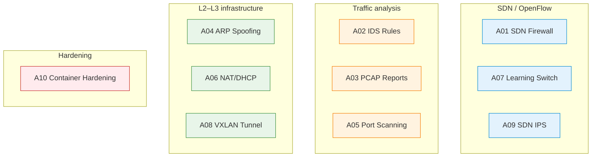

# Group 2 — Administration and Security (A01–A10)

Ten projects focused on network administration, software-defined networking (SDN) and security in controlled laboratory environments. All exercises run within Mininet, Docker or Open vSwitch topologies — never on production networks. Each brief follows the RC2026 E1/E2/E3 assessment structure; unlike Group 1, there is no Flex (multi-language interoperability) requirement. Bash automation and Python scripting are the expected implementation languages.

## Project Index

| Code | Title | Lines | Difficulty | Key technologies |
|---|---|---|---|---|
| [A01](A01_sdn_firewall_filtering_policies_via_openflow_rules.md) | SDN firewall — filtering policies via OpenFlow rules | 188 | ★★★★☆ | OVS, OpenFlow, Ryu/POX |
| [A02](A02_ids_simple_rules_scan_detection_tcp_anomalies_and_payload_patterns.md) | IDS — scan detection, TCP anomalies and payload patterns | 187 | ★★★★☆ | Scapy, tshark, pcap |
| [A03](A03_pcap_report_generator_flow_statistics_top_talkers_and_tcp_indicators.md) | PCAP report generator — flow statistics and top talkers | 187 | ★★★★☆ | tshark, Python analysis |
| [A04](A04_arp_spoofing_detection_and_mitigation_alerts_evidence_and_controlled_blocking.md) | ARP spoofing detection and mitigation | 188 | ★★★★☆ | ARP, Scapy, OVS |
| [A05](A05_laboratory_port_scanning_tcp_connect_scan_and_minimal_service_fingerprinting.md) | Laboratory port scanning — TCP connect and fingerprinting | 189 | ★★★★☆ | TCP, socket, nmap-style |
| [A06](A06_nat_and_dhcp_laboratory_dynamic_allocation_iptables_masquerade_and_pcap_verification.md) | NAT and DHCP laboratory — iptables MASQUERADE and PCAP | 190 | ★★★★☆ | iptables, DHCP, NAT |
| [A07](A07_sdn_learning_switch_controller_flow_installation_and_ageing.md) | SDN learning-switch controller — flow installation and ageing | 187 | ★★★★☆ | OVS, OpenFlow, MAC table |
| [A08](A08_mininet_encapsulation_and_tunnelling_vxlan_between_two_sites.md) | Encapsulation and tunnelling — VXLAN between two sites | 184 | ★★★★★ | VXLAN, Mininet, OVS |
| [A09](A09_sdn_ips_dynamic_blocking_via_openflow_triggered_by_ids_detection.md) | SDN IPS — dynamic blocking via OpenFlow triggered by IDS | 190 | ★★★★★ | OpenFlow, IDS integration |
| [A10](A10_network_hardening_containerised_services_segmentation_egress_filtering_docker_user.md) | Network hardening — segmentation and egress filtering (DOCKER-USER) | 187 | ★★★★☆ | Docker, iptables, DOCKER-USER |

## E1/E2/E3 Summary

| Phase | Weight | Key deliverable | Automation |
|---|---|---|---|
| E1 | 25 % | Specification + Phase 0 Wireshark observations | — |
| E2 | 35 % | `make e2` → `artifacts/pcap/traffic_e2.pcap` + `validate_pcap.py` | PCAP rules in `../00_common/tools/pcap_rules/A{NN}.json` |
| E3 | 40 % | Final implementation + demo + documentation evidence | MANIFEST.txt completeness |

> No Flex component is required for A-projects. Bash scripts must be deterministic and idempotent.

## Visual Overview — Thematic Clusters



## Lecture ↔ Seminar ↔ Project Cross-Reference

Data sourced from [`../COURSE_SEMINAR_MAPPING.md`](../COURSE_SEMINAR_MAPPING.md). Lecture directories resolve to [`../../03_LECTURES/C{NN}/`](../../03_LECTURES/), seminar directories to [`../../04_SEMINARS/S{NN}/`](../../04_SEMINARS/).

| Project | Lectures | Seminars | Quiz weeks |
|---|---|---|---|
| A01 | [C13](../../03_LECTURES/C13/), [C04](../../03_LECTURES/C04/), [C05](../../03_LECTURES/C05/) | [S06](../../04_SEMINARS/S06/), [S07](../../04_SEMINARS/S07/), [S13](../../04_SEMINARS/S13/) | W13, W04, W05 |
| A02 | [C13](../../03_LECTURES/C13/), [C08](../../03_LECTURES/C08/), [C03](../../03_LECTURES/C03/) | [S07](../../04_SEMINARS/S07/), [S13](../../04_SEMINARS/S13/), [S04](../../04_SEMINARS/S04/) | W13, W08, W03 |
| A03 | [C03](../../03_LECTURES/C03/), [C08](../../03_LECTURES/C08/), [C13](../../03_LECTURES/C13/) | [S07](../../04_SEMINARS/S07/), [S01](../../04_SEMINARS/S01/), [S02](../../04_SEMINARS/S02/) | W03, W08, W13 |
| A04 | [C04](../../03_LECTURES/C04/), [C05](../../03_LECTURES/C05/), [C13](../../03_LECTURES/C13/) | [S07](../../04_SEMINARS/S07/), [S06](../../04_SEMINARS/S06/), [S05](../../04_SEMINARS/S05/) | W04, W05, W13 |
| A05 | [C13](../../03_LECTURES/C13/), [C08](../../03_LECTURES/C08/), [C03](../../03_LECTURES/C03/) | [S13](../../04_SEMINARS/S13/), [S07](../../04_SEMINARS/S07/), [S02](../../04_SEMINARS/S02/) | W13, W08, W03 |
| A06 | [C06](../../03_LECTURES/C06/), [C05](../../03_LECTURES/C05/), [C03](../../03_LECTURES/C03/) | [S05](../../04_SEMINARS/S05/), [S06](../../04_SEMINARS/S06/), [S07](../../04_SEMINARS/S07/) | W06, W05, W03 |
| A07 | [C04](../../03_LECTURES/C04/), [C03](../../03_LECTURES/C03/), [C13](../../03_LECTURES/C13/) | [S06](../../04_SEMINARS/S06/), [S07](../../04_SEMINARS/S07/), [S01](../../04_SEMINARS/S01/) | W04, W03, W13 |
| A08 | [C04](../../03_LECTURES/C04/), [C05](../../03_LECTURES/C05/), [C06](../../03_LECTURES/C06/) | [S06](../../04_SEMINARS/S06/), [S05](../../04_SEMINARS/S05/), [S07](../../04_SEMINARS/S07/) | W04, W05, W06 |
| A09 | [C13](../../03_LECTURES/C13/), [C04](../../03_LECTURES/C04/), [C08](../../03_LECTURES/C08/) | [S07](../../04_SEMINARS/S07/), [S06](../../04_SEMINARS/S06/), [S13](../../04_SEMINARS/S13/) | W13, W04, W08 |
| A10 | [C13](../../03_LECTURES/C13/), [C05](../../03_LECTURES/C05/), [C06](../../03_LECTURES/C06/) | [S11](../../04_SEMINARS/S11/), [S07](../../04_SEMINARS/S07/), [S05](../../04_SEMINARS/S05/) | W13, W05, W06 |

## Supporting Assets

| Directory | Contents | Count |
|---|---|---|
| [`assets/puml/`](assets/puml/) | PlantUML architecture, demo-scenario and message-flow diagrams per project | 30 `.puml` files (3 per project) |
| [`assets/images/`](assets/images/) | Rendered diagram output (populated by `assets/render.sh`) | `.gitkeep` placeholder |

## Prerequisites

| Prerequisite | Path | Reason |
|---|---|---|
| Environment setup | [`../../00_TOOLS/Prerequisites/`](../../00_TOOLS/Prerequisites/) | Docker, WSL2, Wireshark, Mininet and Open vSwitch must be configured |
| Common assessment standard | [`../00_common/README_STANDARD_RC2026.md`](../00_common/README_STANDARD_RC2026.md) | Student-repository structure assumed by all briefs |
| Mininet/SDN guide | [`../../01_GUIDE_MININET-SDN/`](../../01_GUIDE_MININET-SDN/) | SDN topology setup referenced by A01, A07, A08, A09 |

## Notes

All activities in this group are laboratory-only exercises executed within isolated virtual topologies. Students must not apply these tools or scripts to real networks. Bash scripts should be deterministic and idempotent — a second execution must produce the same result without side effects.

## Selective Clone

**Method A — Git sparse-checkout (requires Git ≥ 2.25)**

```bash
git clone --filter=blob:none --sparse https://github.com/antonioclim/COMPNET-EN.git
cd COMPNET-EN
git sparse-checkout set 02_PROJECTS/02_administration_security
```

To include the shared assessment tools:

```bash
git sparse-checkout add 02_PROJECTS/00_common
```

**Method B — Direct download (no Git required)**

Browse: <https://github.com/antonioclim/COMPNET-EN/tree/main/02_PROJECTS/02_administration_security>
