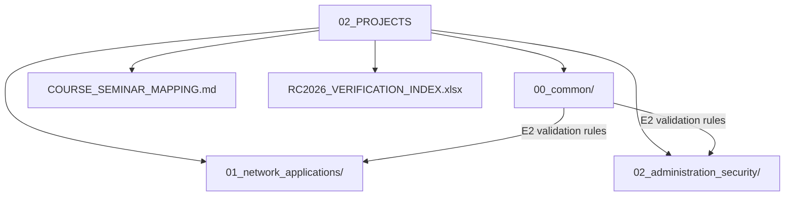

# 02_PROJECTS — RC2026 project briefs and assessment tooling

Project specifications and shared assessment artefacts for the RC2026 Computer Networks laboratory. Students select one brief from this catalogue and implement it in their own repository, while instructors rely on the common tooling and verification index for repeatable marking across cohorts.

## File and folder index

| Name | Description | Metric |
|---|---|---|
| [`00_common/`](00_common/) | Shared assessment infrastructure (templates, CI, tester container and validation tooling) | 47 files (25 .json, 10 .md) |
| [`01_network_applications/`](01_network_applications/) | Group 1 project briefs (S01–S15): application protocols and services | 97 files (50 .md, 45 .puml) |
| [`02_administration_security/`](02_administration_security/) | Group 2 project briefs (A01–A10): SDN, analysis and controlled security labs | 46 files (30 .puml, 14 .md) |
| [`COURSE_SEMINAR_MAPPING.md`](COURSE_SEMINAR_MAPPING.md) | Project ↔ course/seminar mapping (RC2026) | 31 lines |
| [`RC2026_VERIFICATION_INDEX.xlsx`](RC2026_VERIFICATION_INDEX.xlsx) | Instructor verification index (spreadsheet checklist) | 140 KB |
| `README.md` | Directory orientation and cross-reference map | 102 lines |

## Visual overview



## Usage

Typical workflow for a student team:

```bash
# 1) choose a brief and read its E1/E2/E3 gates
ls 01_network_applications/S*.md 02_administration_security/A*.md

# 2) consult the standard structure and tooling expectations
sed -n '1,120p' 00_common/README_STANDARD_RC2026.md

# 3) use the mapping table to locate the relevant lecture and seminar material
sed -n '1,120p' COURSE_SEMINAR_MAPPING.md
```

## Design and teaching intent

The catalogue keeps assessment mechanics separate from subject matter: briefs describe network behaviour and evidence gates, while `00_common/` concentrates the E2 automation and PCAP acceptance rules so criteria can be updated without rewriting each brief.

## Cross-references and contextual connections


### Prerequisites and dependencies

| Prerequisite | Path | Why |
|---|---|---|
| Environment and tooling | [`00_TOOLS/Prerequisites/`](../00_TOOLS/Prerequisites) | Docker, Wireshark/tshark and base shell tools are assumed for E2 evidence |
| Python sockets primer | [`00_APPENDIX/a)PYTHON_self_study_guide/`](../00_APPENDIX/a%29PYTHON_self_study_guide) | S-projects assume socket programming, parsing and basic concurrency |
| Lecture notes | [`03_LECTURES/`](../03_LECTURES) | Protocol theory and layer models used by the briefs |
| Seminar exercises | [`04_SEMINARS/`](../04_SEMINARS) | Worked examples and laboratory skills that precede project work |
| Portainer setup (optional) | [`00_TOOLS/Portainer/INIT_GUIDE/`](../00_TOOLS/Portainer/INIT_GUIDE) | Container inspection during debugging, especially for multi-service projects |

### Lecture ↔ seminar ↔ project ↔ quiz mapping (group view)

| This area | Lectures | Seminars | Quiz weeks | Portainer |
|---|---|---|---|---|
| [`01_network_applications/`](01_network_applications) | [C03](../03_LECTURES/C03), [C08](../03_LECTURES/C08), [C09](../03_LECTURES/C09), [C11](../03_LECTURES/C11), [C10](../03_LECTURES/C10), [C13](../03_LECTURES/C13), [C12](../03_LECTURES/C12), [C05](../03_LECTURES/C05), [C06](../03_LECTURES/C06), [C07](../03_LECTURES/C07) | [S02](../04_SEMINARS/S02), [S03](../04_SEMINARS/S03), [S04](../04_SEMINARS/S04), [S05](../04_SEMINARS/S05), [S06](../04_SEMINARS/S06), [S07](../04_SEMINARS/S07), [S08](../04_SEMINARS/S08), [S09](../04_SEMINARS/S09), [S10](../04_SEMINARS/S10), [S11](../04_SEMINARS/S11), [S12](../04_SEMINARS/S12) | [W03](../00_APPENDIX/c%29studentsQUIZes%28multichoice_only%29/COMPnet_W03_Questions.md), [W08](../00_APPENDIX/c%29studentsQUIZes%28multichoice_only%29/COMPnet_W08_Questions.md), [W09](../00_APPENDIX/c%29studentsQUIZes%28multichoice_only%29/COMPnet_W09_Questions.md), [W11](../00_APPENDIX/c%29studentsQUIZes%28multichoice_only%29/COMPnet_W11_Questions.md), [W10](../00_APPENDIX/c%29studentsQUIZes%28multichoice_only%29/COMPnet_W10_Questions.md), [W13](../00_APPENDIX/c%29studentsQUIZes%28multichoice_only%29/COMPnet_W13_Questions.md), [W12](../00_APPENDIX/c%29studentsQUIZes%28multichoice_only%29/COMPnet_W12_Questions.md), [W05](../00_APPENDIX/c%29studentsQUIZes%28multichoice_only%29/COMPnet_W05_Questions.md), [W06](../00_APPENDIX/c%29studentsQUIZes%28multichoice_only%29/COMPnet_W06_Questions.md), [W07](../00_APPENDIX/c%29studentsQUIZes%28multichoice_only%29/COMPnet_W07_Questions.md) | [`00_TOOLS/Portainer/`](../00_TOOLS/Portainer) and [`assets/PORTAINER/`](01_network_applications/assets/PORTAINER) |
| [`02_administration_security/`](02_administration_security) | [C13](../03_LECTURES/C13), [C04](../03_LECTURES/C04), [C05](../03_LECTURES/C05), [C08](../03_LECTURES/C08), [C03](../03_LECTURES/C03), [C06](../03_LECTURES/C06) | [S01](../04_SEMINARS/S01), [S02](../04_SEMINARS/S02), [S04](../04_SEMINARS/S04), [S05](../04_SEMINARS/S05), [S06](../04_SEMINARS/S06), [S07](../04_SEMINARS/S07), [S11](../04_SEMINARS/S11), [S13](../04_SEMINARS/S13) | [W13](../00_APPENDIX/c%29studentsQUIZes%28multichoice_only%29/COMPnet_W13_Questions.md), [W04](../00_APPENDIX/c%29studentsQUIZes%28multichoice_only%29/COMPnet_W04_Questions.md), [W05](../00_APPENDIX/c%29studentsQUIZes%28multichoice_only%29/COMPnet_W05_Questions.md), [W08](../00_APPENDIX/c%29studentsQUIZes%28multichoice_only%29/COMPnet_W08_Questions.md), [W03](../00_APPENDIX/c%29studentsQUIZes%28multichoice_only%29/COMPnet_W03_Questions.md), [W06](../00_APPENDIX/c%29studentsQUIZes%28multichoice_only%29/COMPnet_W06_Questions.md) | [`00_TOOLS/Portainer/`](../00_TOOLS/Portainer) (selected labs) |
| [`00_common/`](00_common) | [C03](../03_LECTURES/C03), [C08](../03_LECTURES/C08), [C13](../03_LECTURES/C13) | [S14](../04_SEMINARS/S14) | [W03](../00_APPENDIX/c%29studentsQUIZes%28multichoice_only%29/COMPnet_W03_Questions.md), [W08](../00_APPENDIX/c%29studentsQUIZes%28multichoice_only%29/COMPnet_W08_Questions.md), [W13](../00_APPENDIX/c%29studentsQUIZes%28multichoice_only%29/COMPnet_W13_Questions.md) | — |

Per-project mappings are in the group READMEs and in [`COURSE_SEMINAR_MAPPING.md`](COURSE_SEMINAR_MAPPING.md).

### Downstream dependencies

[CI workflow](../.github/workflows/ci.yml) runs repository-wide checks that include Markdown link and lexical integrity validation.
Several lecture READMEs link directly to project briefs in this folder, for example [`03_LECTURES/C03/README.md`](../03_LECTURES/C03/README.md).
[`00_TOOLS/Portainer/PROJECTS/PROJECTS_PORTAINER_MAP.md`](../00_TOOLS/Portainer/PROJECTS/PROJECTS_PORTAINER_MAP.md) indexes the per-project Portainer guides under `01_network_applications/assets/PORTAINER/`.

### Suggested learning sequence

Suggested sequence: `00_TOOLS/Prerequisites/` → `04_SEMINARS/S01–S04/` → `03_LECTURES/C01–C03/` → choose a project here → iterate with the matching lecture week and seminar.


## Selective clone

### Method A — Git sparse-checkout (Git ≥ 2.25)

```bash
git clone --filter=blob:none --sparse https://github.com/antonioclim/COMPNET-EN.git
cd COMPNET-EN
git sparse-checkout set 02_PROJECTS
```

To add another path later:

```bash
git sparse-checkout add <ANOTHER_PATH>
```

### Method B — Direct download (no Git required)

```text
https://github.com/antonioclim/COMPNET-EN/tree/main/02_PROJECTS
```

GitHub can only download the full repository as a ZIP. For a single folder, use a browser-side downloader such as download-directory.github.io or gitzip.

## Version and provenance

RC2026 catalogue snapshot shipped with the course kit (February 2026).
