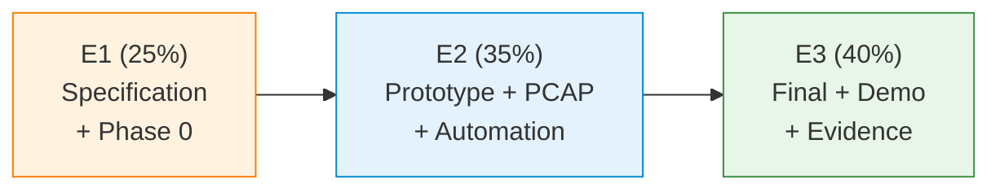

# RC2026 — Project Catalogue (Computer Networks)

Twenty-five laboratory projects constitute the practical assessment backbone of RC2026. Each project requires students to specify, implement and verify a network system — progressing from protocol observation (E1) through automated capture validation (E2) to a final demonstration with evidence (E3). Projects are split into two groups that differ in scope, tooling expectations and the presence of a mandatory multi-language interoperability component.

## Catalogue Structure

| Directory | Contents | Count | Purpose |
|---|---|---|---|
| [`00_common/`](00_common/) | Shared standards, tooling and CI templates | 38 files | Assessment infrastructure reused by every project |
| [`01_network_applications/`](01_network_applications/) | Application-layer project briefs S01–S15 | 78 files (15 specs, 15 Portainer guides, 45 PlantUML, 3 support) | Group 1 — protocol design and service implementation |
| [`02_administration_security/`](02_administration_security/) | Administration and security briefs A01–A10 | 43 files (10 specs, 30 PlantUML, 3 support) | Group 2 — SDN, PCAP analysis and controlled security labs |
| [`COURSE_SEMINAR_MAPPING.md`](COURSE_SEMINAR_MAPPING.md) | Full project ↔ lecture ↔ seminar alignment table | 31 lines | Curriculum traceability |
| [`RC2026_VERIFICATION_INDEX.xlsx`](RC2026_VERIFICATION_INDEX.xlsx) | Per-ID checklist for assessment (M01, NF01 …) | 140 KB | Instructor grading instrument |

## Assessment Model



| Phase | Weight | Deliverable | Automation gate |
|---|---|---|---|
| E1 | 25 % | `docs/E1_specification.md` + `docs/E1_phase0_observations.md` | — |
| E2 | 35 % | Reproducible run via `make e2`; capture `artifacts/pcap/traffic_e2.pcap` | `python tools/validate_pcap.py --project <CODE> --pcap artifacts/pcap/traffic_e2.pcap` |
| E3 | 40 % | Final documentation, demo and evidence table (`docs/E3_final_documentation.md`) | MANIFEST.txt completeness |

Group 1 (S-projects) adds a mandatory Flex component in E3: the team must implement one interoperable subsystem in a language other than Python (C, C++, Java, Go, Rust, JavaScript/Node.js or similar). Group 2 (A-projects) does not require Flex; Bash scripting and Python are sufficient.

## Deterministic PCAP Validation (E2)

Every project must produce a packet capture during its automated E2 run. Validation rules are project-specific JSON files stored in [`00_common/tools/pcap_rules/`](00_common/tools/pcap_rules/). The validator [`00_common/tools/validate_pcap.py`](00_common/tools/validate_pcap.py) applies `tshark` display filters and checks packet-count thresholds.

```bash
# from the student repository root
python tools/validate_pcap.py --project S01 --pcap artifacts/pcap/traffic_e2.pcap
```

Rules files follow the naming convention `<CODE>.json` (e.g. `S01.json`, `A07.json`). Each rule specifies a `tshark` filter, a numeric condition and a human-readable description.

## Project ↔ Lecture ↔ Seminar Mapping (excerpt)

The full mapping lives in [`COURSE_SEMINAR_MAPPING.md`](COURSE_SEMINAR_MAPPING.md). The table below shows the primary lecture for each project (first listed in the competency field):

| Code | Primary lecture | Primary seminar | Difficulty |
|---|---|---|---|
| S01–S05 | C03 (Application layer) | S03, S09, S08, S11 | ★★★★☆ |
| S06–S09 | C03 + C08 (Transport) | S03, S10, S04 | ★★★★★ |
| S10–S13 | C03 + C10 (HTTP/REST) | S09, S11, S12 | ★★★★☆ |
| S14 | C05 (Network layer) | S06 | ★★★★★ |
| S15 | C03 + C10 (IoT/HTTP) | S07 | ★★★★☆ |
| A01–A10 | C13 (Security), C04–C06 | S06, S07, S13 | ★★★★☆ to ★★★★★ |

## Cross-References

| Related area | Path | Relationship |
|---|---|---|
| Lecture slides and notes | [`../03_LECTURES/`](../03_LECTURES/) | Theoretical foundation for every project (see mapping) |
| Seminar exercises | [`../04_SEMINARS/`](../04_SEMINARS/) | Practical skill-building sessions that precede project work |
| Quiz bank | [`../00_APPENDIX/c)studentsQUIZes(multichoice_only)/`](../00_APPENDIX/c%29studentsQUIZes%28multichoice_only%29/) | Formative self-assessment aligned to lecture weeks |
| Environment setup | [`../00_TOOLS/Prerequisites/`](../00_TOOLS/Prerequisites/) | Docker, WSL2 and Wireshark configuration required before E2 |
| Portainer overview | [`../00_TOOLS/Portainer/`](../00_TOOLS/Portainer/) | Container dashboard used during project debugging |
| Portainer project map | [`../00_TOOLS/Portainer/PROJECTS/PROJECTS_PORTAINER_MAP.md`](../00_TOOLS/Portainer/PROJECTS/PROJECTS_PORTAINER_MAP.md) | Per-project container architecture and benefit tier |
| Instructor notes (Romanian) | [`../00_APPENDIX/d)instructor_NOTES4sem/`](../00_APPENDIX/d%29instructor_NOTES4sem/) | Seminar delivery guides that reference project exercises |
| PlantUML renderer | [`../00_TOOLS/plantuml/`](../00_TOOLS/plantuml/) | Central rendering script invoked by `assets/render.sh` in each group |
| QA checks | [`../00_TOOLS/qa/`](../00_TOOLS/qa/) | `check_markdown_links.py` and `check_integrity.py` validate this folder |

### Downstream Dependencies

The root [`README.md`](../README.md) references `02_PROJECTS/` in the repository structure table. The Portainer project map (`00_TOOLS/Portainer/PROJECTS/`) links back to project briefs and Portainer guides within this folder. CI templates in `00_common/ci/` are designed to be copied into student repositories, not invoked from this location.

### Suggested Learning Sequence

```
00_TOOLS/Prerequisites/ → 00_APPENDIX/ (Week 0) → 04_SEMINARS/S01–S02/ → 03_LECTURES/C01–C03/ → 02_PROJECTS/ (project selection and E1)
```

## Selective Clone

**Method A — Git sparse-checkout (requires Git ≥ 2.25)**

```bash
git clone --filter=blob:none --sparse https://github.com/antonioclim/COMPNET-EN.git
cd COMPNET-EN
git sparse-checkout set 02_PROJECTS
```

**Method B — Direct download (no Git required)**

Browse: <https://github.com/antonioclim/COMPNET-EN/tree/main/02_PROJECTS>

For a single-folder zip download, use a tool such as `download-directory.github.io` or `gitzip`.

## Provenance

RC2026 project catalogue — version 13, February 2026. Author: ing. dr. Antonio Clim, ASE Bucharest (CSIE).
