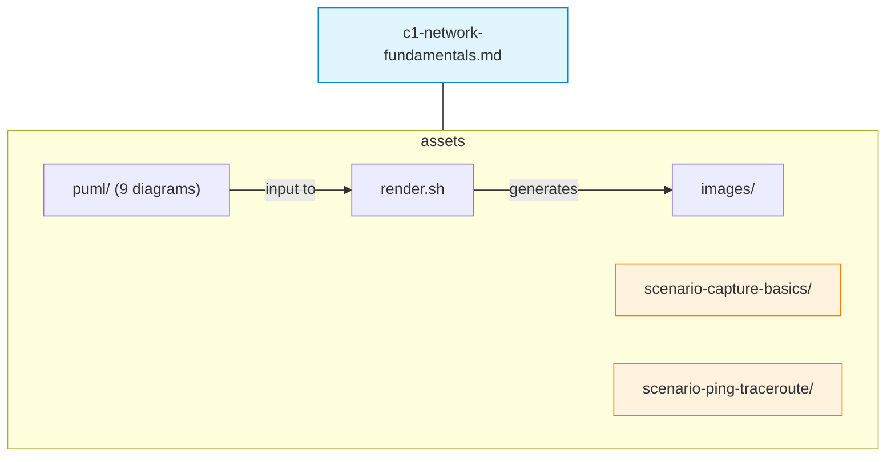

# C01 — Network Fundamentals: Concepts, Components and Classifications

Week 1 of the Computer Networks course introduces the core vocabulary and structural concepts students will rely on throughout the remaining thirteen lectures. The material covers what constitutes a computer network, how networks are classified by size and topology, the role of transmission media and networking devices, the notion of a protocol stack and the principle of encapsulation. Two executable scenarios allow students to observe real traffic before any formal layered model has been introduced — establishing an empirical anchor for the theory that follows.

## File and Folder Index

| Name | Description | Metric |
|------|-------------|--------|
| [`c1-network-fundamentals.md`](c1-network-fundamentals.md) | Slide-by-slide lecture content | 206 lines |
| [`assets/puml/`](assets/puml/) | PlantUML diagram sources | 9 files |
| [`assets/images/`](assets/images/) | Rendered PNG output directory | .gitkeep |
| [`assets/render.sh`](assets/render.sh) | Diagram rendering script (delegates to `00_TOOLS/plantuml/`) | — |
| [`assets/scenario-capture-basics/`](assets/scenario-capture-basics/) | Mini traffic analysis: ping, DNS and local HTTP | 3 files |
| [`assets/scenario-ping-traceroute/`](assets/scenario-ping-traceroute/) | Ping and traceroute observation exercise | README only |

## Visual Overview



## PlantUML Diagrams

| Source file | Subject |
|-------------|---------|
| `fig-circuit-vs-packet.puml` | Circuit-switched vs. packet-switched networks |
| `fig-client-server-p2p.puml` | Client-server and peer-to-peer models |
| `fig-devices.puml` | Networking devices overview |
| `fig-encapsulation.puml` | Protocol data unit encapsulation |
| `fig-hub-switch-router.puml` | Hub, switch and router comparison |
| `fig-lan-wan-internet.puml` | LAN, WAN and Internet scope |
| `fig-media.puml` | Transmission media types |
| `fig-network-vs-system.puml` | Network vs. distributed system |
| `fig-topologies.puml` | Physical and logical topologies |

## Usage

Render all diagrams:

```bash
cd assets && bash render.sh
```

Run the capture-basics scenario (requires Python 3.10+ and tcpdump or Wireshark):

```bash
cd assets/scenario-capture-basics
python3 start-http-server.py          # terminal 1
sudo tcpdump -i any -n '(icmp or udp port 53 or tcp port 8000)'  # terminal 2
python3 dns-query.py                   # terminal 3
```

## Pedagogical Context

The lecture deliberately avoids formal layered models at this stage. Students first see real packets (ICMP, DNS, HTTP) as opaque observations, building curiosity that the OSI and TCP/IP models in C02 will then structure and explain. This inductive ordering — observation before theory — mirrors the constructivist principle of experiential grounding.

## Cross-References

### Prerequisites

No prerequisites. This is the entry point for the course.

### Lecture ↔ Seminar ↔ Project ↔ Quiz

| Content | Seminar | Project | Quiz |
|---------|---------|---------|------|
| Traffic capture, Wireshark, netcat | [`../04_SEMINARS/S01/`](../../04_SEMINARS/S01/) | — | [W01](../../00_APPENDIX/c%29studentsQUIZes%28multichoice_only%29/COMPnet_W01_Questions.md) |

The practical counterpart is Seminar S01, which extends the observation exercises to full Wireshark dissection and netcat-based debugging.

### Instructor Notes

Romanian instructor outlines: [`roCOMPNETclass_S01-instructor-outline-v3.md`](../../00_APPENDIX/d%29instructor_NOTES4sem/roCOMPNETclass_S01-instructor-outline-v3.md)

### Downstream Dependencies

Seminars S01–S14 assume familiarity with the vocabulary established here (protocol, encapsulation, topology, LAN/WAN). The root `03_LECTURES/README.md` indexes this directory.

### Suggested Sequence

`00_TOOLS/Prerequisites/` → this folder → [`04_SEMINARS/S01/`](../../04_SEMINARS/S01/) → [`C02/`](../C02/)

## Selective Clone

**Method A — Git sparse-checkout (Git 2.25+)**

```bash
git clone --filter=blob:none --sparse https://github.com/antonioclim/COMPNET-EN.git
cd COMPNET-EN
git sparse-checkout set 03_LECTURES/C01
```

**Method B — Direct download**

Browse at: `https://github.com/antonioclim/COMPNET-EN/tree/main/03_LECTURES/C01`
## Provenance

Course kit version: v13 (February 2026). Author: ing. dr. Antonio Clim — ASE Bucharest, CSIE.
