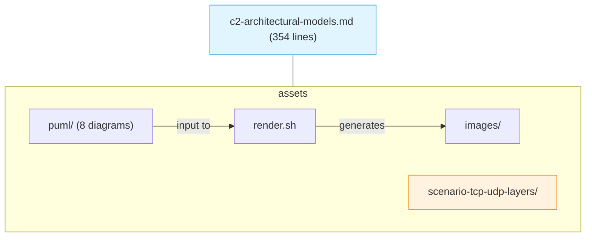

# C02 — Architectural Models: OSI and TCP/IP

Week 2 formalises the layered architecture that underpins all subsequent lectures. The material covers the seven-layer OSI reference model, the four-layer TCP/IP model, the mapping between the two, the concept of protocol data units at each layer and the encapsulation/de-encapsulation process. A single executable scenario lets students observe TCP and UDP traffic flowing through real sockets, giving empirical substance to the layer boundaries discussed in the slides.

## File and Folder Index

| Name | Description | Metric |
|------|-------------|--------|
| [`c2-architectural-models.md`](c2-architectural-models.md) | Slide-by-slide lecture content | 354 lines |
| [`assets/puml/`](assets/puml/) | PlantUML diagram sources | 8 files |
| [`assets/images/`](assets/images/) | Rendered PNG output directory | .gitkeep |
| [`assets/render.sh`](assets/render.sh) | Diagram rendering script | — |
| [`assets/scenario-tcp-udp-layers/`](assets/scenario-tcp-udp-layers/) | TCP/UDP socket demo with four Python scripts | 5 files |

## Visual Overview



## PlantUML Diagrams

| Source file | Subject |
|-------------|---------|
| `fig-osi-communication.puml` | Peer-to-peer communication across OSI layers |
| `fig-osi-encapsulation.puml` | PDU encapsulation at each layer |
| `fig-osi-implementation.puml` | Implementation mapping of OSI to real systems |
| `fig-osi-layers.puml` | The seven OSI layers |
| `fig-osi-protocol-mapping.puml` | Protocols mapped to their OSI layer |
| `fig-osi-vs-tcpip.puml` | OSI and TCP/IP side-by-side comparison |
| `fig-tcp-vs-udp-layers.puml` | TCP vs. UDP at the transport layer |
| `fig-tcpip-layers.puml` | The four TCP/IP layers |

## Usage

Run the TCP/UDP layers scenario (requires Python 3.10+):

```bash
cd assets/scenario-tcp-udp-layers

# TCP demo — start server, then client
python3 tcp-server.py &
python3 tcp-client.py

# UDP demo — start server, then client
python3 udp-server.py &
python3 udp-client.py
```

Each pair demonstrates how data traverses the transport layer with different guarantees.

## Pedagogical Context

The OSI model is presented as a conceptual tool, not an implementation blueprint. Pairing it immediately with the TCP/IP model (which maps to actual protocol stacks) grounds abstraction in practice and prepares students for the layer-by-layer treatment in C04–C12.

## Cross-References

### Prerequisites

| Prerequisite | Path | Why |
|---|---|---|
| Network fundamentals | [`../C01/`](../C01/) | Vocabulary: protocol, encapsulation, topology |

### Lecture ↔ Seminar ↔ Project ↔ Quiz

| Content | Seminar | Project | Quiz |
|---------|---------|---------|------|
| OSI/TCP-IP models, layer identification | [`../04_SEMINARS/S01/`](../../04_SEMINARS/S01/) — traffic analysis | — | [W02](../../00_APPENDIX/c%29studentsQUIZes%28multichoice_only%29/COMPnet_W02_Questions.md) |
| TCP/UDP socket observation | [`../04_SEMINARS/S02/`](../../04_SEMINARS/S02/) — socket programming | — | — |

### Instructor Notes

Romanian outlines: [`roCOMPNETclass_S02-instructor-outline-v2.md`](../../00_APPENDIX/d%29instructor_NOTES4sem/roCOMPNETclass_S02-instructor-outline-v2.md)

### Downstream Dependencies

Every subsequent lecture (C03–C14) assumes the layered model vocabulary established here. The scenario scripts serve as a foundation for the socket programming exercises in S02.

### Suggested Sequence

[`C01/`](../C01/) → this folder → [`04_SEMINARS/S01/`](../../04_SEMINARS/S01/) → [`C03/`](../C03/)

## Selective Clone

**Method A — Git sparse-checkout (Git 2.25+)**

```bash
git clone --filter=blob:none --sparse https://github.com/antonioclim/COMPNET-EN.git
cd COMPNET-EN
git sparse-checkout set 03_LECTURES/C02
```

**Method B — Direct download**

Browse at: `https://github.com/antonioclim/COMPNET-EN/tree/main/03_LECTURES/C02`
## Provenance

Course kit version: v13 (February 2026). Author: ing. dr. Antonio Clim — ASE Bucharest, CSIE.
