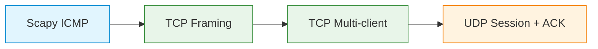

# C03 — Introduction to Network Application Programming

Week 3 shifts from observation to construction. Students learn to write TCP and UDP clients and servers using Python sockets, handle multiple concurrent connections, implement application-level framing over a byte-stream transport and build reliability atop unreliable datagrams. Four executable scenarios demonstrate progressively complex patterns: raw ICMP with Scapy, TCP message framing, multi-client TCP concurrency and UDP session management with application-level acknowledgements.

## File and Folder Index

| Name | Description | Metric |
|------|-------------|--------|
| [`c3-intro-network-programming.md`](c3-intro-network-programming.md) | Slide-by-slide lecture content | 155 lines |
| [`assets/puml/`](assets/puml/) | PlantUML diagram sources | 7 files |
| [`assets/images/`](assets/images/) | Rendered PNG output | .gitkeep |
| [`assets/render.sh`](assets/render.sh) | Diagram rendering script | — |
| [`assets/scenario-scapy-icmp/`](assets/scenario-scapy-icmp/) | ICMP ping with Scapy | 2 files |
| [`assets/scenario-tcp-framing/`](assets/scenario-tcp-framing/) | TCP message framing (length-prefix) | 3 files |
| [`assets/scenario-tcp-multiclient/`](assets/scenario-tcp-multiclient/) | Multi-client TCP server | 3 files |
| [`assets/scenario-udp-session-ack/`](assets/scenario-udp-session-ack/) | UDP with session IDs and ACKs | 3 files |

## Visual Overview



The four scenarios form a progression: from raw packet crafting (L3) through reliable byte-stream framing (L4/TCP) to application-level reliability over datagrams (L4/UDP).

## PlantUML Diagrams

| Source file | Subject |
|-------------|---------|
| `fig-app-over-http.puml` | Application logic layered over HTTP |
| `fig-raw-layering.puml` | Raw socket access across layers |
| `fig-tcp-concurrency.puml` | Multi-client TCP server model |
| `fig-tcp-framing-strategies.puml` | Framing strategies: delimiter vs. length-prefix |
| `fig-tcp-server-flow.puml` | TCP server accept/handle loop |
| `fig-udp-server-flow.puml` | UDP server recvfrom loop |
| `fig-udp-session-ack-flow.puml` | UDP session with application-level ACK |

## Usage

Each scenario has its own README with full instructions. Example for TCP framing:

```bash
cd assets/scenario-tcp-framing
python3 server.py &
python3 client.py
```

The Scapy scenario requires root privileges:

```bash
cd assets/scenario-scapy-icmp
sudo python3 icmp-ping.py
```

## Pedagogical Context

Placing network programming before the physical/data-link layer lectures (C04) ensures that students can generate and capture traffic during every subsequent seminar. The four-scenario progression embodies a scaffolded approach: each scenario adds one layer of complexity (raw access → framing → concurrency → application reliability), enabling students to isolate and understand each concern independently.

## Cross-References

### Prerequisites

| Prerequisite | Path | Why |
|---|---|---|
| Layered models | [`../C02/`](../C02/) | Understanding of transport vs. application layer boundaries |
| Python basics | [`../../00_APPENDIX/a)PYTHON_self_study_guide/`](../../00_APPENDIX/a%29PYTHON_self_study_guide/) | Socket API calls require Python fluency |

### Lecture ↔ Seminar ↔ Project ↔ Quiz

| Content | Seminar | Project | Quiz |
|---------|---------|---------|------|
| TCP/UDP sockets | [`S02`](../../04_SEMINARS/S02/) — socket programming | [S01](../../02_PROJECTS/01_network_applications/S01_multi_client_tcp_chat_text_protocol_and_presence.md) — multi-client TCP chat | [W03](../../00_APPENDIX/c%29studentsQUIZes%28multichoice_only%29/COMPnet_W03_Questions.md) |
| Broadcast/multicast, TCP tunnel | [`S03`](../../04_SEMINARS/S03/) | [S06](../../02_PROJECTS/01_network_applications/S06_tcp_pub_sub_broker_topics_and_deterministic_routing.md) — pub-sub broker | — |
| Custom text/binary protocols | [`S04`](../../04_SEMINARS/S04/) | — | — |

### Instructor Notes

Romanian outlines: [`roCOMPNETclass_S03-instructor-outline-v2.md`](../../00_APPENDIX/d%29instructor_NOTES4sem/roCOMPNETclass_S03-instructor-outline-v2.md)

### Downstream Dependencies

The socket programming patterns introduced here recur in every later scenario that involves Python client-server code (C08 TCP handshake, C10 HTTP from scratch, C11 FTP/DNS and C12 email scripts).

### Suggested Sequence

[`C02/`](../C02/) → `00_APPENDIX/a)PYTHON_self_study_guide/` → this folder → [`04_SEMINARS/S02/`](../../04_SEMINARS/S02/) → [`C04/`](../C04/)

## Selective Clone

**Method A — Git sparse-checkout (Git 2.25+)**

```bash
git clone --filter=blob:none --sparse https://github.com/antonioclim/COMPNET-EN.git
cd COMPNET-EN
git sparse-checkout set 03_LECTURES/C03
```

**Method B — Direct download**

Browse at: `https://github.com/antonioclim/COMPNET-EN/tree/main/03_LECTURES/C03`
## Provenance

Course kit version: v13 (February 2026). Author: ing. dr. Antonio Clim — ASE Bucharest, CSIE.
