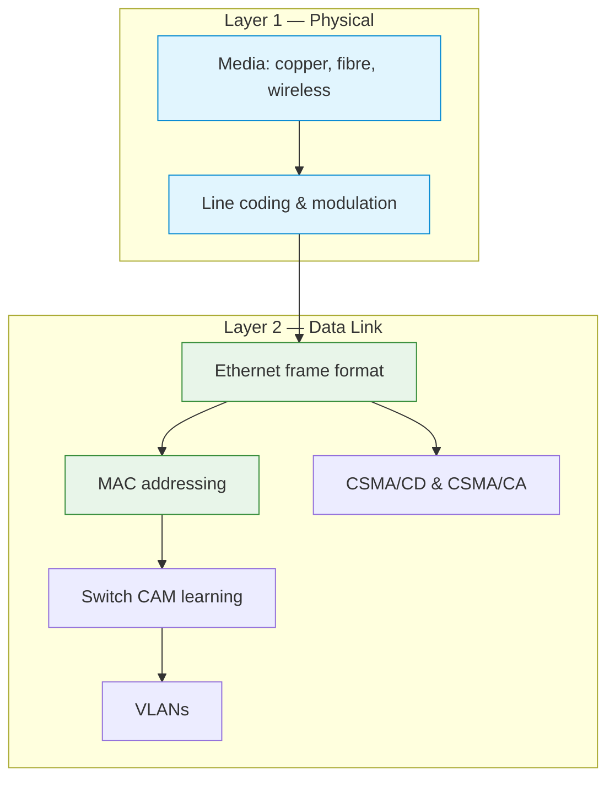

# C04 — The Physical Layer and the Data Link Layer

Week 4 descends to the bottom of the protocol stack. The lecture covers transmission media (copper, fibre and wireless), line coding and modulation, the Ethernet frame format, MAC addressing, CSMA/CD and CSMA/CA, switch CAM table learning, VLANs and the distinction between the LLC and MAC sublayers. Two scenarios provide hands-on exploration: a Python-based line coding visualiser and a MAC/ARP/Ethernet inspection exercise.

## File and Folder Index

| Name | Description | Metric |
|------|-------------|--------|
| [`c4-physical-and-data-link.md`](c4-physical-and-data-link.md) | Slide-by-slide lecture content | 292 lines |
| [`assets/puml/`](assets/puml/) | PlantUML diagram sources | 13 files |
| [`assets/images/`](assets/images/) | Rendered PNG output | .gitkeep |
| [`assets/render.sh`](assets/render.sh) | Diagram rendering script | — |
| [`assets/scenario-line-coding/`](assets/scenario-line-coding/) | Line coding demonstration (Python) | 2 files |
| [`assets/scenario-mac-arp-ethernet/`](assets/scenario-mac-arp-ethernet/) | MAC address and Ethernet frame inspection | README only |

## Visual Overview



## PlantUML Diagrams

| Source file | Subject |
|-------------|---------|
| `fig-csma-ca.puml` | CSMA/CA collision avoidance |
| `fig-csma-cd.puml` | CSMA/CD collision detection |
| `fig-ethernet-frame.puml` | Ethernet II frame structure |
| `fig-l1-l2-context.puml` | L1/L2 in the stack context |
| `fig-l2-encapsulation.puml` | Data link encapsulation |
| `fig-line-coding-overview.puml` | Line coding schemes overview |
| `fig-llc-mac.puml` | LLC and MAC sublayer split |
| `fig-modulation.puml` | Modulation techniques |
| `fig-switch-cam-learning.puml` | Switch MAC address table learning |
| `fig-transfer-media.puml` | Transfer media comparison |
| `fig-vlan.puml` | VLAN segmentation |
| `fig-wifi-channels-24ghz.puml` | 2.4 GHz Wi-Fi channel layout |
| `fig-wifi-frame-concept.puml` | Wi-Fi frame structure concept |

## Usage

Line coding demo (requires Python 3.10+ and matplotlib):

```bash
cd assets/scenario-line-coding
python3 line_coding_demo.py
```

MAC/ARP observation follows the instructions in its README and requires Wireshark or tcpdump.

## Pedagogical Context

This is the most hardware-oriented lecture in the course. Covering L1 and L2 together makes the physical-to-logical transition explicit: students see how electrical signals become frames with addresses. The line coding demo reinforces this by showing NRZ, Manchester and 4B/5B encoding of the same bit sequence.

## Cross-References

### Prerequisites

| Prerequisite | Path | Why |
|---|---|---|
| OSI/TCP-IP models | [`../C02/`](../C02/) | Layer numbering and PDU terminology |
| Socket programming | [`../C03/`](../C03/) | Ability to generate traffic for capture exercises |

### Lecture ↔ Seminar ↔ Project ↔ Quiz

| Content | Seminar | Project | Quiz |
|---------|---------|---------|------|
| Wireshark L2 dissection, Ethernet frames | [`S01`](../../04_SEMINARS/S01/) — Wireshark analysis | — | [W04](../../00_APPENDIX/c%29studentsQUIZes%28multichoice_only%29/COMPnet_W04_Questions.md) |
| SDN firewall and OpenFlow | — | [A01](../../02_PROJECTS/02_administration_security/A01_sdn_firewall_filtering_policies_via_openflow_rules.md) | — |
| ARP spoofing detection | — | [A04](../../02_PROJECTS/02_administration_security/A04_arp_spoofing_detection_and_mitigation_alerts_evidence_and_controlled_blocking.md) | — |
| SDN learning switch | — | [A07](../../02_PROJECTS/02_administration_security/A07_sdn_learning_switch_controller_flow_installation_and_ageing.md) | — |
| VXLAN encapsulation | — | [A08](../../02_PROJECTS/02_administration_security/A08_mininet_encapsulation_and_tunnelling_vxlan_between_two_sites.md) | — |

### Instructor Notes

Romanian outlines: [`roCOMPNETclass_S04-instructor-outline-v2.md`](../../00_APPENDIX/d%29instructor_NOTES4sem/roCOMPNETclass_S04-instructor-outline-v2.md)

### Downstream Dependencies

The MAC addressing and Ethernet frame format are prerequisites for ARP (C06), switch behaviour in routing (C07) and the L2/L3 address interplay seen in every later Docker-based scenario. Multiple administration/security projects (A01, A04, A07, A08) build on the L2 concepts introduced here.

### Suggested Sequence

[`C03/`](../C03/) → this folder → [`04_SEMINARS/S01/`](../../04_SEMINARS/S01/) (L2 exercises) → [`C05/`](../C05/)

## Selective Clone

**Method A — Git sparse-checkout (Git 2.25+)**

```bash
git clone --filter=blob:none --sparse https://github.com/antonioclim/COMPNET-EN.git
cd COMPNET-EN
git sparse-checkout set 03_LECTURES/C04
```

**Method B — Direct download**

Browse at: `https://github.com/antonioclim/COMPNET-EN/tree/main/03_LECTURES/C04`
## Provenance

Course kit version: v13 (February 2026). Author: ing. dr. Antonio Clim — ASE Bucharest, CSIE.
