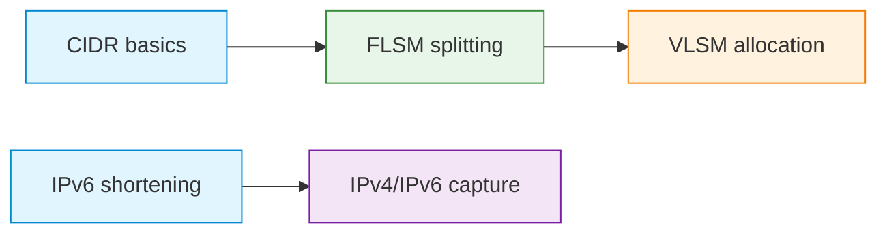

# C05 — Network Layer: IP Addressing, Subnetting and VLSM

Week 5 moves to Layer 3 and the IP protocol family. The lecture covers IPv4 and IPv6 header structure, address classes (historical context), CIDR notation, prefix masks, fixed-length subnet masks (FLSM), variable-length subnet masks (VLSM) and the IPv4-to-IPv6 transition. Five executable scenarios provide calculators and hands-on practice for each addressing technique.

## File and Folder Index

| Name | Description | Metric |
|------|-------------|--------|
| [`c5-network-layer-addressing.md`](c5-network-layer-addressing.md) | Slide-by-slide lecture content | 235 lines |
| [`assets/puml/`](assets/puml/) | PlantUML diagram sources | 10 files |
| [`assets/images/`](assets/images/) | Rendered PNG output | .gitkeep |
| [`assets/render.sh`](assets/render.sh) | Diagram rendering script | — |
| [`assets/scenario-cidr-basic/`](assets/scenario-cidr-basic/) | CIDR calculator (Python) | 2 files |
| [`assets/scenario-ipv4-ipv6-capture/`](assets/scenario-ipv4-ipv6-capture/) | IPv4/IPv6 packet capture exercise | README only |
| [`assets/scenario-ipv6-shortening/`](assets/scenario-ipv6-shortening/) | IPv6 address normalisation tool | 2 files |
| [`assets/scenario-subnetting-flsm/`](assets/scenario-subnetting-flsm/) | FLSM subnet splitter | 2 files |
| [`assets/scenario-vlsm/`](assets/scenario-vlsm/) | VLSM allocation calculator | 2 files |

## Visual Overview



## PlantUML Diagrams

| Source file | Subject |
|-------------|---------|
| `fig-cidr-subnetting.puml` | CIDR and subnetting relationship |
| `fig-ipv4-comm-types.puml` | IPv4 communication types (unicast, broadcast, multicast) |
| `fig-ipv4-header.puml` | IPv4 header field layout |
| `fig-ipv4-vs-ipv6.puml` | IPv4 and IPv6 comparison |
| `fig-ipv6-address-structure.puml` | IPv6 address structure |
| `fig-ipv6-header.puml` | IPv6 header field layout |
| `fig-l3-role.puml` | Role of the network layer |
| `fig-mac-vs-ip.puml` | MAC vs. IP addressing scope |
| `fig-prefix-mask.puml` | Prefix and mask notation |
| `fig-vlsm-allocation.puml` | VLSM allocation strategy |

## Usage

CIDR calculator example:

```bash
cd assets/scenario-cidr-basic
python3 cidr-calc.py
```

VLSM allocation:

```bash
cd assets/scenario-vlsm
python3 vlsm-alloc.py
```

## Pedagogical Context

Subnetting is among the most exam-critical topics in the course. The three calculator scenarios (CIDR, FLSM and VLSM) let students verify hand calculations and build intuition for prefix arithmetic before the examination. The IPv6 shortening tool addresses a common source of errors in address notation.

## Cross-References

### Prerequisites

| Prerequisite | Path | Why |
|---|---|---|
| L1–L2 fundamentals | [`../C04/`](../C04/) | MAC vs. IP address distinction |
| Binary arithmetic | — | Subnet calculations require binary conversion fluency |

### Lecture ↔ Seminar ↔ Project ↔ Quiz

| Content | Seminar | Project | Quiz |
|---------|---------|---------|------|
| IPv4/IPv6 subnetting and simulation | [`S05`](../../04_SEMINARS/S05/) | — | [W05](../../00_APPENDIX/c%29studentsQUIZes%28multichoice_only%29/COMPnet_W05_Questions.md) |
| Distance-vector routing in Mininet | — | [S14](../../02_PROJECTS/01_network_applications/S14_didactic_distance_vector_routing_in_mininet_convergence_and_anti_loop.md) | — |
| VXLAN tunnelling between sites | — | [A08](../../02_PROJECTS/02_administration_security/A08_mininet_encapsulation_and_tunnelling_vxlan_between_two_sites.md) | — |

### Instructor Notes

Romanian outlines: [`roCOMPNETclass_S05-instructor-outline-v2.md`](../../00_APPENDIX/d%29instructor_NOTES4sem/roCOMPNETclass_S05-instructor-outline-v2.md)

### Downstream Dependencies

IP addressing is assumed by every lecture from C06 onward. NAT (C06) requires understanding of private vs. public address ranges. Routing (C07) depends on CIDR prefix matching. Every Docker-based scenario from C10 onward assigns IP addresses to containers.

### Suggested Sequence

[`C04/`](../C04/) → this folder → [`04_SEMINARS/S05/`](../../04_SEMINARS/S05/) → [`C06/`](../C06/)

## Selective Clone

**Method A — Git sparse-checkout (Git 2.25+)**

```bash
git clone --filter=blob:none --sparse https://github.com/antonioclim/COMPNET-EN.git
cd COMPNET-EN
git sparse-checkout set 03_LECTURES/C05
```

**Method B — Direct download**

Browse at: `https://github.com/antonioclim/COMPNET-EN/tree/main/03_LECTURES/C05`
## Provenance

Course kit version: v13 (February 2026). Author: ing. dr. Antonio Clim — ASE Bucharest, CSIE.
