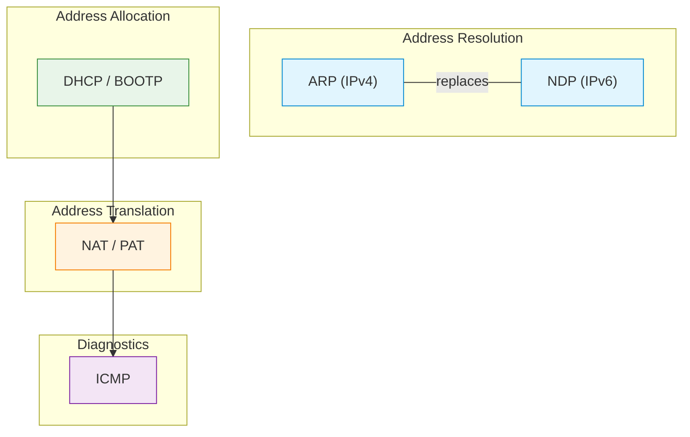

# C06 — Network Layer Support: NAT, ARP, DHCP, NDP and ICMP

Week 6 covers the support protocols that make the network layer operational in practice. The lecture examines NAT and PAT (address translation for IPv4 scarcity mitigation), ARP and Proxy ARP (L3-to-L2 resolution in IPv4), DHCP and BOOTP (dynamic address allocation), NDP (IPv6 neighbour discovery, replacing ARP) and ICMP (diagnostics and error reporting). Five scenarios provide direct observation of each protocol's packet exchange.

## File and Folder Index

| Name | Description | Metric |
|------|-------------|--------|
| [`c6-nat-arp-dhcp-ndp-icmp.md`](c6-nat-arp-dhcp-ndp-icmp.md) | Slide-by-slide lecture content | 225 lines |
| [`assets/puml/`](assets/puml/) | PlantUML diagram sources | 11 files |
| [`assets/images/`](assets/images/) | Rendered PNG output | .gitkeep |
| [`assets/render.sh`](assets/render.sh) | Diagram rendering script | — |
| [`assets/scenario-arp-capture/`](assets/scenario-arp-capture/) | ARP request/reply capture | README only |
| [`assets/scenario-dhcp-capture/`](assets/scenario-dhcp-capture/) | DHCP DORA sequence capture | README only |
| [`assets/scenario-icmp-traceroute/`](assets/scenario-icmp-traceroute/) | ICMP traceroute observation | README only |
| [`assets/scenario-nat-linux/`](assets/scenario-nat-linux/) | Linux iptables NAT demo | 2 files |
| [`assets/scenario-ndp-capture/`](assets/scenario-ndp-capture/) | IPv6 NDP capture | README only |

## Visual Overview



## PlantUML Diagrams

| Source file | Subject |
|-------------|---------|
| `fig-arp.puml` | ARP request/reply exchange |
| `fig-dhcp-dora.puml` | DHCP Discover-Offer-Request-Acknowledge |
| `fig-dhcp-relay.puml` | DHCP relay agent across subnets |
| `fig-icmp-role.puml` | ICMP in the protocol stack |
| `fig-l3-support-map.puml` | Support protocol map for L3 |
| `fig-nat-basic.puml` | Basic NAT operation |
| `fig-nat-dynamic.puml` | Dynamic NAT pool |
| `fig-nat-static.puml` | Static NAT mapping |
| `fig-ndp.puml` | IPv6 Neighbour Discovery Protocol |
| `fig-pat.puml` | Port Address Translation |
| `fig-proxy-arp.puml` | Proxy ARP operation |

## Usage

NAT demonstration with iptables (requires root and network namespaces or Docker):

```bash
cd assets/scenario-nat-linux
bash nat-demo.sh
```

Capture-only scenarios follow their individual READMEs and require Wireshark or tcpdump.

## Cross-References

### Prerequisites

| Prerequisite | Path | Why |
|---|---|---|
| IP addressing and subnetting | [`../C05/`](../C05/) | NAT, DHCP and ARP operate on IP addresses |
| MAC addressing | [`../C04/`](../C04/) | ARP resolves IP to MAC |

### Lecture ↔ Seminar ↔ Project ↔ Quiz

| Content | Seminar | Project | Quiz |
|---------|---------|---------|------|
| Subnetting practice, network simulation | [`S05`](../../04_SEMINARS/S05/) | — | [W06](../../00_APPENDIX/c%29studentsQUIZes%28multichoice_only%29/COMPnet_W06_Questions.md) |
| SDN and routing | [`S06`](../../04_SEMINARS/S06/) | — | — |
| ARP spoofing detection | — | [A04](../../02_PROJECTS/02_administration_security/A04_arp_spoofing_detection_and_mitigation_alerts_evidence_and_controlled_blocking.md) | — |
| NAT/DHCP laboratory | — | [A06](../../02_PROJECTS/02_administration_security/A06_nat_and_dhcp_laboratory_dynamic_allocation_iptables_masquerade_and_pcap_verification.md) | — |
| VXLAN tunnelling between sites | — | [A08](../../02_PROJECTS/02_administration_security/A08_mininet_encapsulation_and_tunnelling_vxlan_between_two_sites.md) | — |
| Distance-vector routing in Mininet | — | [S14](../../02_PROJECTS/01_network_applications/S14_didactic_distance_vector_routing_in_mininet_convergence_and_anti_loop.md) | — |

### Instructor Notes

Romanian outlines: [`roCOMPNETclass_S06-instructor-outline-v2.md`](../../00_APPENDIX/d%29instructor_NOTES4sem/roCOMPNETclass_S06-instructor-outline-v2.md)

### Downstream Dependencies

NAT knowledge is required for the FTP NAT/firewall scenario in C11. ARP understanding is assumed by the security lectures in C13 and project A04. DHCP and ICMP appear in numerous Docker-based scenarios that configure container networking.

### Suggested Sequence

[`C05/`](../C05/) → this folder → [`04_SEMINARS/S05/`](../../04_SEMINARS/S05/) → [`C07/`](../C07/)

## Selective Clone

**Method A — Git sparse-checkout (Git 2.25+)**

```bash
git clone --filter=blob:none --sparse https://github.com/antonioclim/COMPNET-EN.git
cd COMPNET-EN
git sparse-checkout set 03_LECTURES/C06
```

**Method B — Direct download**

Browse at: `https://github.com/antonioclim/COMPNET-EN/tree/main/03_LECTURES/C06`
## Provenance

Course kit version: v13 (February 2026). Author: ing. dr. Antonio Clim — ASE Bucharest, CSIE.
