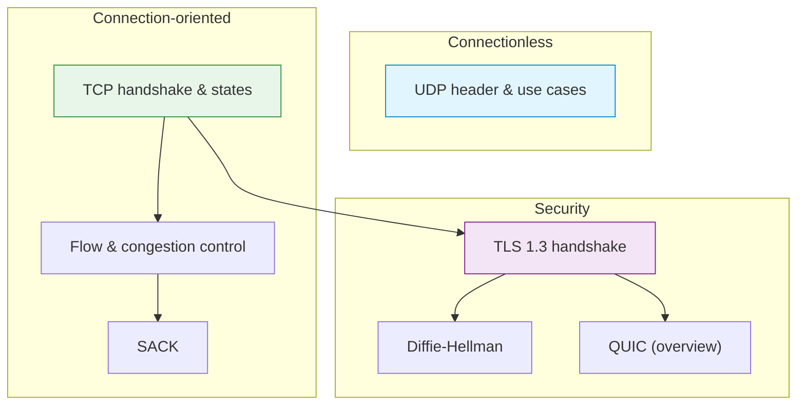

# C08 — The Transport Layer: TCP, UDP, TLS and QUIC

Week 8 is the largest lecture by line count (464 lines) and covers the transport layer in full. Topics include UDP header format and use cases, TCP header fields, the three-way handshake and four-way teardown, TCP state machine, sliding window and flow control, congestion control (Reno, Cubic), selective acknowledgements (SACK), TLS 1.3 handshake with Diffie-Hellman key exchange, the TLS record protocol and a brief treatment of QUIC. Three scenarios offer empirical demonstrations: TCP handshake via tcpdump, TLS certificate generation with OpenSSL and a Mininet-based comparison of UDP vs. TCP behaviour under packet loss.

## File and Folder Index

| Name | Description | Metric |
|------|-------------|--------|
| [`c8-transport-layer.md`](c8-transport-layer.md) | Slide-by-slide lecture content (canonical) | 464 lines |
| [`c8.md`](c8.md) | Legacy redirect to canonical file | 5 lines |
| [`assets/puml/`](assets/puml/) | PlantUML diagram sources | 12 files |
| [`assets/images/`](assets/images/) | Rendered PNG output | .gitkeep |
| [`assets/render.sh`](assets/render.sh) | Diagram rendering script | — |
| [`assets/scenario-tcp-handshake-tcpdump/`](assets/scenario-tcp-handshake-tcpdump/) | TCP three-way handshake capture | 5 files |
| [`assets/scenario-tls-openssl/`](assets/scenario-tls-openssl/) | TLS 1.3 with OpenSSL s_server/s_client | 5 files |
| [`assets/scenario-udp-vs-tcp-loss/`](assets/scenario-udp-vs-tcp-loss/) | UDP vs. TCP under Mininet packet loss | 6 files |

## Visual Overview



## PlantUML Diagrams

| Source file | Subject |
|-------------|---------|
| `fig-diffie-hellman.puml` | Diffie-Hellman key exchange |
| `fig-quic-handshake.puml` | QUIC 0-RTT and 1-RTT handshake |
| `fig-tcp-close.puml` | TCP four-way connection teardown |
| `fig-tcp-handshake.puml` | TCP three-way handshake |
| `fig-tcp-header.puml` | TCP header field layout |
| `fig-tcp-sack.puml` | TCP Selective Acknowledgement |
| `fig-tcp-states.puml` | TCP state machine |
| `fig-tcp-vs-udp.puml` | TCP vs. UDP feature comparison |
| `fig-tls-13.puml` | TLS 1.3 full handshake |
| `fig-tls-stack.puml` | TLS position in the protocol stack |
| `fig-udp-header.puml` | UDP header field layout |
| `fig-udp-vs-tcp-loss-topo.puml` | Mininet topology for loss experiment |

## Usage

TCP handshake capture:

```bash
cd assets/scenario-tcp-handshake-tcpdump
bash run.sh          # starts server, client and tcpdump
bash cleanup.sh      # tears down processes
```

TLS demonstration:

```bash
cd assets/scenario-tls-openssl
bash gen_certs.sh    # generate CA + server certificate
bash run_server.sh & # start OpenSSL s_server
bash run_client.sh   # connect with s_client
```

UDP vs. TCP loss comparison (requires Mininet):

```bash
cd assets/scenario-udp-vs-tcp-loss
sudo bash run.sh
```

## Pedagogical Context

Transport is the pivot of the course: everything below it (C01–C07) provides connectivity; everything above it (C09–C13) builds application semantics atop that connectivity. Combining TCP, TLS and QUIC in a single lecture makes the evolution visible: TCP provides reliability, TLS adds confidentiality and QUIC merges both into a single-RTT protocol.

## Cross-References

### Prerequisites

| Prerequisite | Path | Why |
|---|---|---|
| Socket programming | [`../C03/`](../C03/) | TCP/UDP client-server code patterns |
| IP and routing | [`../C05/`](../C05/), [`../C07/`](../C07/) | Packets must be routable before transport can function |

### Lecture ↔ Seminar ↔ Project ↔ Quiz

| Content | Seminar | Project | Quiz |
|---------|---------|---------|------|
| TCP/UDP socket programming | [`S02`](../../04_SEMINARS/S02/) | — | [W08](../../00_APPENDIX/c%29studentsQUIZes%28multichoice_only%29/COMPnet_W08_Questions.md) |
| Broadcast/multicast, TCP tunnel | [`S03`](../../04_SEMINARS/S03/) | [S09](../../02_PROJECTS/01_network_applications/S09_tcp_tunnel_single_port_session_multiplexing_and_demultiplexing.md) — TCP tunnel | — |
| TLS channel and authentication | — | [S12](../../02_PROJECTS/01_network_applications/S12_client_server_messaging_tls_channel_and_minimal_authentication.md) | — |

### Instructor Notes

Romanian outlines: [`roCOMPNETclass_S08-instructor-outline-v2.md`](../../00_APPENDIX/d%29instructor_NOTES4sem/roCOMPNETclass_S08-instructor-outline-v2.md)

### Downstream Dependencies

TCP state knowledge is assumed by every application-layer lecture (C10–C12). The TLS material is referenced in the HTTPS section of C10 and the email security discussion in C12. The QUIC overview connects forward to HTTP/3 in C10.

### Suggested Sequence

[`C07/`](../C07/) → this folder → [`04_SEMINARS/S02/`](../../04_SEMINARS/S02/) → [`C09/`](../C09/)

## Selective Clone

**Method A — Git sparse-checkout (Git 2.25+)**

```bash
git clone --filter=blob:none --sparse https://github.com/antonioclim/COMPNET-EN.git
cd COMPNET-EN
git sparse-checkout set 03_LECTURES/C08
```

**Method B — Direct download**

Browse at: `https://github.com/antonioclim/COMPNET-EN/tree/main/03_LECTURES/C08`
## Provenance

Course kit version: v13 (February 2026). Author: ing. dr. Antonio Clim — ASE Bucharest, CSIE.
