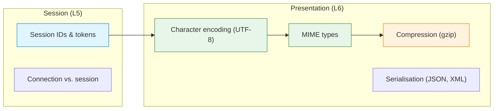

# C09 — The Session Layer and the Presentation Layer

Week 9 addresses OSI Layers 5 and 6 — the session and presentation layers — which lack dedicated protocols in TCP/IP but whose functions appear throughout modern systems. The lecture covers session establishment and teardown, session identifiers and state management (cookies, tokens and JWT), character encoding (ASCII, UTF-8 and Unicode), MIME types, content negotiation, serialisation formats (JSON, XML and binary encodings), compression (gzip, Brotli) and the connection-vs-session distinction. Two scenarios demonstrate encoding behaviour and MIME/gzip serving.

## File and Folder Index

| Name | Description | Metric |
|------|-------------|--------|
| [`c9-session-presentation.md`](c9-session-presentation.md) | Slide-by-slide lecture content (canonical) | 219 lines |
| [`c9.md`](c9.md) | Legacy redirect to canonical file | 5 lines |
| [`assets/puml/`](assets/puml/) | PlantUML diagram sources | 6 files |
| [`assets/images/`](assets/images/) | Rendered PNG output | .gitkeep |
| [`assets/render.sh`](assets/render.sh) | Diagram rendering script | — |
| [`assets/scenario-encoding-utf8/`](assets/scenario-encoding-utf8/) | UTF-8 encoding server demo | 3 files |
| [`assets/scenario-mime-encoding-gzip/`](assets/scenario-mime-encoding-gzip/) | MIME type serving with gzip compression | 5 files |

## Visual Overview



## PlantUML Diagrams

| Source file | Subject |
|-------------|---------|
| `fig-connection-vs-session.puml` | Connection vs. session lifetime |
| `fig-content-type-vs-encoding.puml` | Content-Type vs. Content-Encoding |
| `fig-mime-examples.puml` | MIME type examples |
| `fig-osi-l5-l6.puml` | L5 and L6 in the OSI model |
| `fig-presentation-pipeline.puml` | Presentation layer pipeline (encode → compress → encrypt) |
| `fig-session-mechanisms-modern.puml` | Modern session mechanisms (cookies, JWT) |

## Usage

UTF-8 encoding demo:

```bash
cd assets/scenario-encoding-utf8
bash run.sh
```

MIME + gzip scenario (serves `data.json` and `index.html` with content negotiation):

```bash
cd assets/scenario-mime-encoding-gzip
bash run.sh
```

## Pedagogical Context

Although TCP/IP collapses L5–L6 into the application layer, modern web development relies heavily on session management and content negotiation. Treating these as a distinct lecture ensures students understand that HTTP headers such as `Content-Type`, `Content-Encoding` and `Set-Cookie` implement well-defined presentation and session functions — not ad-hoc application logic.

## Cross-References

### Prerequisites

| Prerequisite | Path | Why |
|---|---|---|
| Transport layer | [`../C08/`](../C08/) | Sessions run atop TCP connections |
| Network programming | [`../C03/`](../C03/) | Socket-level understanding of send/recv |

### Lecture ↔ Seminar ↔ Project ↔ Quiz

| Content | Seminar | Project | Quiz |
|---------|---------|---------|------|
| Custom text and binary protocols | [`S04`](../../04_SEMINARS/S04/) | — | [W09](../../00_APPENDIX/c%29studentsQUIZes%28multichoice_only%29/COMPnet_W09_Questions.md) |
| JSON-RPC, Protobuf and gRPC | [`S12`](../../04_SEMINARS/S12/) | [S13](../../02_PROJECTS/01_network_applications/S13_grpc_rpc_service_proto_definition_unary_and_streaming_methods.md) — gRPC project | — |

### Instructor Notes

Romanian outlines: [`roCOMPNETclass_S09-instructor-outline-v2.md`](../../00_APPENDIX/d%29instructor_NOTES4sem/roCOMPNETclass_S09-instructor-outline-v2.md)

### Downstream Dependencies

MIME types and content negotiation are directly used in C10 (HTTP). Character encoding issues resurface in C12 (email MIME). Serialisation formats (JSON, Protobuf) appear in the gRPC seminar (S12) and project S13.

### Suggested Sequence

[`C08/`](../C08/) → this folder → [`04_SEMINARS/S04/`](../../04_SEMINARS/S04/) → [`C10/`](../C10/)

## Selective Clone

**Method A — Git sparse-checkout (Git 2.25+)**

```bash
git clone --filter=blob:none --sparse https://github.com/antonioclim/COMPNET-EN.git
cd COMPNET-EN
git sparse-checkout set 03_LECTURES/C09
```

**Method B — Direct download**

Browse at: `https://github.com/antonioclim/COMPNET-EN/tree/main/03_LECTURES/C09`
## Provenance

Course kit version: v13 (February 2026). Author: ing. dr. Antonio Clim — ASE Bucharest, CSIE.
