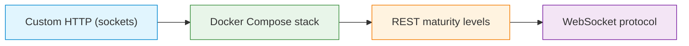

# C10 — Application Layer: HTTP(S), REST and WebSockets

Week 10 covers the dominant application-layer protocol family. The lecture examines HTTP request/response structure, methods and idempotency, status codes, HTTP/1.1 persistent connections, HTTP/2 multiplexing, HTTPS and TLS termination, caching with 304 Not Modified, CORS preflight, reverse proxies, REST maturity levels (Richardson model) and WebSocket upgrade and framing. Four scenarios provide increasing complexity: a raw socket HTTP server, a Docker Compose stack with Nginx reverse proxy, a REST maturity level progression and a WebSocket protocol implementation.

## File and Folder Index

| Name | Description | Metric |
|------|-------------|--------|
| [`c10-http-application-layer.md`](c10-http-application-layer.md) | Slide-by-slide lecture content (canonical) | 329 lines |
| [`c10.md`](c10.md) | Legacy redirect to canonical file | 5 lines |
| [`assets/puml/`](assets/puml/) | PlantUML diagram sources | 10 files |
| [`assets/images/`](assets/images/) | Rendered PNG output | .gitkeep |
| [`assets/render.sh`](assets/render.sh) | Diagram rendering script | — |
| [`assets/scenario-custom-http-semantics/`](assets/scenario-custom-http-semantics/) | Raw HTTP server and client (Python sockets) | 3 files |
| [`assets/scenario-http-compose/`](assets/scenario-http-compose/) | Nginx + Flask + static site (Docker Compose) | 8 files |
| [`assets/scenario-rest-maturity/`](assets/scenario-rest-maturity/) | REST levels 0–3 servers with test client | 6 files |
| [`assets/scenario-websocket-protocol/`](assets/scenario-websocket-protocol/) | WebSocket server, client and protocol spec | 4 files |

## Visual Overview



## PlantUML Diagrams

| Source file | Subject |
|-------------|---------|
| `fig-cors-preflight.puml` | CORS preflight request flow |
| `fig-http-caching-304.puml` | HTTP caching and 304 response |
| `fig-http-methods-idempotency.puml` | HTTP methods and idempotency |
| `fig-http-request-response.puml` | HTTP request/response structure |
| `fig-http-reverse-proxy.puml` | Reverse proxy architecture |
| `fig-http11-vs-http2.puml` | HTTP/1.1 vs. HTTP/2 multiplexing |
| `fig-https-tls-termination.puml` | HTTPS TLS termination at proxy |
| `fig-rest-maturity-levels.puml` | Richardson REST maturity model |
| `fig-websocket-upgrade-proxy.puml` | WebSocket upgrade through proxy |
| `fig-websocket-vs-polling.puml` | WebSocket vs. long-polling comparison |

## Usage

Custom HTTP from sockets:

```bash
cd assets/scenario-custom-http-semantics
python3 server.py &
python3 client.py
```

Docker Compose stack (requires Docker):

```bash
cd assets/scenario-http-compose
docker compose up --build
```

This starts Nginx (port 80) proxying to a Flask API and a static web server.

REST maturity progression:

```bash
cd assets/scenario-rest-maturity
python3 server-level0.py &  # then test with:
python3 client-test.py
```

Repeat for `server-level1.py` through `server-level3.py` to see the progression.

WebSocket demo:

```bash
cd assets/scenario-websocket-protocol
python3 server.py &
# Open index.html in a browser, or use a WebSocket client
```

## Pedagogical Context

HTTP is the most widely encountered application protocol. The four scenarios move from understanding HTTP at the byte level (raw sockets) through production-style deployment (Docker Compose with reverse proxy) to API design patterns (REST levels) and bidirectional communication (WebSockets). This progression ensures students can both construct and operate HTTP-based systems.

## Cross-References

### Prerequisites

| Prerequisite | Path | Why |
|---|---|---|
| Transport layer (TCP, TLS) | [`../C08/`](../C08/) | HTTP runs over TCP; HTTPS requires TLS |
| Session and presentation | [`../C09/`](../C09/) | MIME types, cookies and content negotiation |
| Docker basics | [`../../00_TOOLS/Prerequisites/`](../../00_TOOLS/Prerequisites/) | Docker Compose scenario requires container runtime |

### Lecture ↔ Seminar ↔ Project ↔ Quiz

| Content | Seminar | Project | Quiz |
|---------|---------|---------|------|
| HTTP server and Nginx reverse proxy | [`S08`](../../04_SEMINARS/S08/) | [S03](../../02_PROJECTS/01_network_applications/S03_http11_socket_server_no_framework_static_files.md) — HTTP/1.1 server | [W10](../../00_APPENDIX/c%29studentsQUIZes%28multichoice_only%29/COMPnet_W10_Questions.md) |
| Nginx load balancing, Docker Compose | [`S11`](../../04_SEMINARS/S11/) | [S05](../../02_PROJECTS/01_network_applications/S05_application_level_http_load_balancer_health_checks_and_two_algorithms.md) — HTTP LB | — |
| REST microservices | — | [S11](../../02_PROJECTS/01_network_applications/S11_rest_microservices_service_registry_api_gateway_dynamic_routing.md) | — |
| Forward HTTP proxy | — | [S04](../../02_PROJECTS/01_network_applications/S04_forward_http_proxy_with_filtering_and_traffic_logging.md) | — |

### Portainer Guides

The Docker Compose scenario is supported by [`../../00_TOOLS/Portainer/SEMINAR08/`](../../00_TOOLS/Portainer/SEMINAR08/) and [`../../00_TOOLS/Portainer/SEMINAR11/`](../../00_TOOLS/Portainer/SEMINAR11/).

### Instructor Notes

Romanian outlines: [`roCOMPNETclass_S10-instructor-outline-v2.md`](../../00_APPENDIX/d%29instructor_NOTES4sem/roCOMPNETclass_S10-instructor-outline-v2.md)

### Downstream Dependencies

HTTP knowledge is assumed by FTP comparisons in C11, email protocol discussions in C12 and by the IoT HTTP API in C13 scenario. Multiple projects (S03, S04, S05, S11) build directly on the HTTP theory presented here.

### Suggested Sequence

[`C09/`](../C09/) → this folder → [`04_SEMINARS/S08/`](../../04_SEMINARS/S08/) → [`C11/`](../C11/)

## Selective Clone

**Method A — Git sparse-checkout (Git 2.25+)**

```bash
git clone --filter=blob:none --sparse https://github.com/antonioclim/COMPNET-EN.git
cd COMPNET-EN
git sparse-checkout set 03_LECTURES/C10
```

**Method B — Direct download**

Browse at: `https://github.com/antonioclim/COMPNET-EN/tree/main/03_LECTURES/C10`
## Provenance

Course kit version: v13 (February 2026). Author: ing. dr. Antonio Clim — ASE Bucharest, CSIE.
