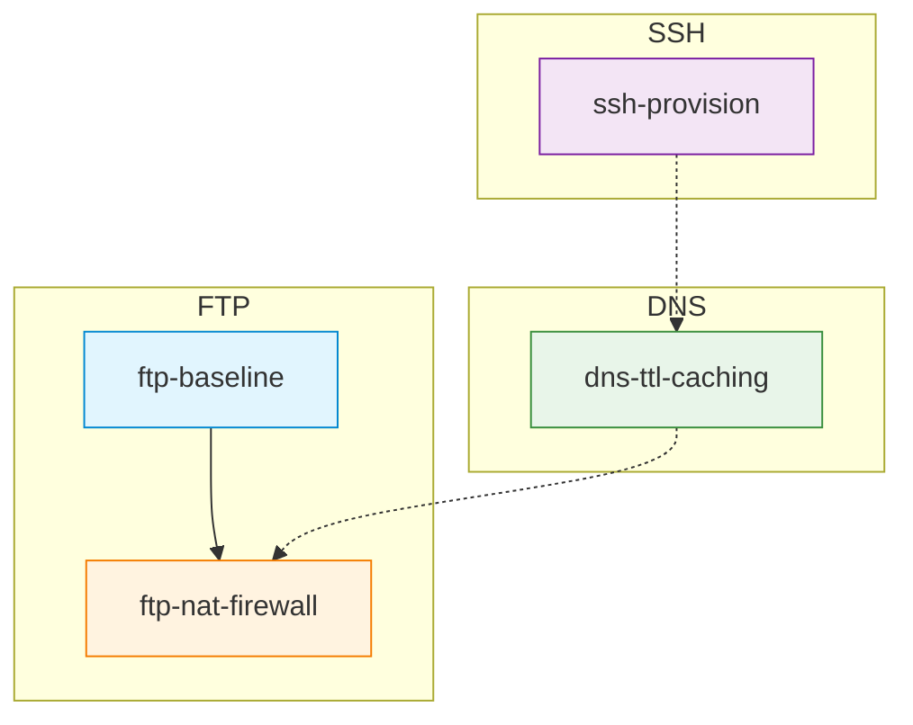

# C11 — Application Layer: FTP, DNS and SSH

Week 11 treats three classic application protocols that predate the web yet remain operationally critical. The lecture covers FTP command/data channel separation, active vs. passive mode, FTP through NAT and firewalls, DNS hierarchy, recursive vs. iterative resolution, zone files, TTL and caching, DNSSEC chain of trust, SSH key exchange, channel multiplexing and port forwarding (local and remote). Four Docker-based scenarios allow students to run full FTP, DNS and SSH environments locally.

## File and Folder Index

| Name | Description | Metric |
|------|-------------|--------|
| [`c11-ftp-dns-ssh.md`](c11-ftp-dns-ssh.md) | Slide-by-slide lecture content (canonical) | 314 lines |
| [`c11.md`](c11.md) | Legacy redirect to canonical file | 5 lines |
| [`assets/puml/`](assets/puml/) | PlantUML diagram sources | 7 files |
| [`assets/images/`](assets/images/) | Rendered PNG output | .gitkeep |
| [`assets/render.sh`](assets/render.sh) | Diagram rendering script | — |
| [`assets/scenario-dns-ttl-caching/`](assets/scenario-dns-ttl-caching/) | DNS caching with BIND resolver and auth server (Docker Compose) | 7 files |
| [`assets/scenario-ftp-baseline/`](assets/scenario-ftp-baseline/) | Basic FTP server and client (Docker Compose) | 5 files |
| [`assets/scenario-ftp-nat-firewall/`](assets/scenario-ftp-nat-firewall/) | FTP through NAT/firewall (Docker Compose) | 8 files |
| [`assets/scenario-ssh-provision/`](assets/scenario-ssh-provision/) | SSH-based multi-node provisioning (Docker Compose) | 6 files |

## Visual Overview



## PlantUML Diagrams

| Source file | Subject |
|-------------|---------|
| `fig-dns-actors.puml` | DNS actors (stub, resolver, authoritative) |
| `fig-dns-resolution-overview.puml` | DNS resolution sequence |
| `fig-dnssec-chain-of-trust.puml` | DNSSEC trust chain |
| `fig-ftp-active-vs-passive.puml` | FTP active vs. passive mode |
| `fig-ftp-control-data.puml` | FTP control and data channels |
| `fig-ssh-channels.puml` | SSH channel multiplexing |
| `fig-ssh-port-forwarding.puml` | SSH local and remote port forwarding |

## Usage

All four scenarios use Docker Compose:

```bash
# DNS TTL and caching
cd assets/scenario-dns-ttl-caching && docker compose up --build

# Basic FTP
cd assets/scenario-ftp-baseline && docker compose up --build

# FTP through NAT/firewall
cd assets/scenario-ftp-nat-firewall && docker compose up --build

# SSH provisioning
cd assets/scenario-ssh-provision && docker compose up --build
```

## Pedagogical Context

FTP, DNS and SSH are grouped because they exemplify three distinct application-layer design patterns: dual-channel (FTP), hierarchical delegation (DNS) and multiplexed secure channel (SSH). Placing them after HTTP (C10) allows comparison: students can articulate why HTTP replaced FTP for most file transfers, why DNS underlies every HTTP request and why SSH tunnelling provides a general-purpose secure transport.

## Cross-References

### Prerequisites

| Prerequisite | Path | Why |
|---|---|---|
| NAT and firewall concepts | [`../C06/`](../C06/) | FTP NAT/firewall scenario depends on NAT understanding |
| TCP and TLS | [`../C08/`](../C08/) | All three protocols run over TCP; SSH uses key exchange |
| Docker and Compose | [`../../00_TOOLS/Prerequisites/`](../../00_TOOLS/Prerequisites/) | All scenarios are containerised |

### Lecture ↔ Seminar ↔ Project ↔ Quiz

| Content | Seminar | Project | Quiz |
|---------|---------|---------|------|
| FTP, file transfer and containers | [`S09`](../../04_SEMINARS/S09/) | [S02](../../02_PROJECTS/01_network_applications/S02_file_transfer_server_control_and_data_channels_ftp_passive.md) — FTP server | [W11](../../00_APPENDIX/c%29studentsQUIZes%28multichoice_only%29/COMPnet_W11_Questions.md) |
| DNS, SSH and FTP in Docker | [`S10`](../../04_SEMINARS/S10/) | [S07](../../02_PROJECTS/01_network_applications/S07_udp_dns_resolver_local_zone_forwarding_and_ttl_cache.md) — DNS resolver | — |

### Portainer Guides

[`../../00_TOOLS/Portainer/SEMINAR09/`](../../00_TOOLS/Portainer/SEMINAR09/) and [`../../00_TOOLS/Portainer/SEMINAR10/`](../../00_TOOLS/Portainer/SEMINAR10/) provide container management guidance for the Docker-based exercises.

### Instructor Notes

Romanian outlines: [`roCOMPNETclass_S11-instructor-outline-v2.md`](../../00_APPENDIX/d%29instructor_NOTES4sem/roCOMPNETclass_S11-instructor-outline-v2.md)

### Downstream Dependencies

DNS knowledge is assumed by the email protocol lecture (C12), where MX record lookup is central to SMTP delivery. SSH appears again in the security discussion of C13.

### Suggested Sequence

[`C10/`](../C10/) → this folder → [`04_SEMINARS/S09/`](../../04_SEMINARS/S09/) → [`04_SEMINARS/S10/`](../../04_SEMINARS/S10/) → [`C12/`](../C12/)

## Selective Clone

**Method A — Git sparse-checkout (Git 2.25+)**

```bash
git clone --filter=blob:none --sparse https://github.com/antonioclim/COMPNET-EN.git
cd COMPNET-EN
git sparse-checkout set 03_LECTURES/C11
```

**Method B — Direct download**

Browse at: `https://github.com/antonioclim/COMPNET-EN/tree/main/03_LECTURES/C11`
## Provenance

Course kit version: v13 (February 2026). Author: ing. dr. Antonio Clim — ASE Bucharest, CSIE.
