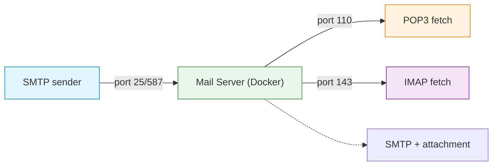

# C12 — Email Protocols: SMTP, POP3, IMAP and Webmail

Week 12 treats the email system as a distributed application built from multiple protocols. The lecture covers SMTP transaction flow (envelope vs. headers), SMTP extensions (STARTTLS, AUTH), MX record lookup, POP3 session states and command set, IMAP folder model and session states, MIME multipart message structure, email security layers (SPF, DKIM and DMARC) and modern webmail architecture. A single Docker Compose scenario deploys a complete local mail stack with Python scripts for sending and retrieving messages via SMTP, POP3 and IMAP.

## File and Folder Index

| Name | Description | Metric |
|------|-------------|--------|
| [`c12-email-protocols.md`](c12-email-protocols.md) | Slide-by-slide lecture content (canonical) | 424 lines |
| [`c12.md`](c12.md) | Legacy redirect to canonical file | 5 lines |
| [`assets/puml/`](assets/puml/) | PlantUML diagram sources | 10 files |
| [`assets/images/`](assets/images/) | Rendered PNG output | .gitkeep |
| [`assets/render.sh`](assets/render.sh) | Diagram rendering script | — |
| [`assets/scenario-local-mailbox/`](assets/scenario-local-mailbox/) | Full mail stack: SMTP send, POP3/IMAP fetch (Docker Compose) | 8 files |

## Visual Overview



## PlantUML Diagrams

| Source file | Subject |
|-------------|---------|
| `fig-docker-mailstack.puml` | Docker mail stack architecture |
| `fig-email-security-layers.puml` | SPF, DKIM and DMARC layers |
| `fig-email-system.puml` | Email system: MUA, MTA, MDA |
| `fig-imap-session-states.puml` | IMAP session state machine |
| `fig-mime-multipart.puml` | MIME multipart message structure |
| `fig-pop3-session.puml` | POP3 session command sequence |
| `fig-pop3-vs-imap.puml` | POP3 vs. IMAP comparison |
| `fig-smtp-envelope-vs-headers.puml` | SMTP envelope vs. message headers |
| `fig-smtp-transaction.puml` | SMTP transaction sequence |
| `fig-webmail-architecture.puml` | Webmail system architecture |

## Usage

Deploy the complete mail stack:

```bash
cd assets/scenario-local-mailbox
docker compose up --build
```

Then in separate terminals:

```bash
# Send a plain-text email
python3 scripts/send_mail_smtp.py

# Send an email with attachment
python3 scripts/send_attachment_smtp.py

# Fetch via POP3
python3 scripts/fetch_pop3.py

# Fetch via IMAP
python3 scripts/fetch_imap.py
```

Python dependencies are listed in `requirements.txt`.

## Pedagogical Context

Email is the oldest and most widely deployed application-layer system still in active use. The single scenario is deliberately monolithic — a complete mail stack in Docker — because email's complexity arises from the interaction among protocols (SMTP relay → DNS MX lookup → POP3/IMAP retrieval) rather than from any individual protocol in isolation. Students must reason about the full pipeline to understand delivery failures and security mechanisms.

## Cross-References

### Prerequisites

| Prerequisite | Path | Why |
|---|---|---|
| DNS and MX records | [`../C11/`](../C11/) | SMTP delivery depends on DNS MX lookup |
| TLS | [`../C08/`](../C08/) | STARTTLS and email encryption |
| MIME types | [`../C09/`](../C09/) | MIME multipart message structure |
| Docker and Compose | [`../../00_TOOLS/Prerequisites/`](../../00_TOOLS/Prerequisites/) | Scenario is containerised |

### Lecture ↔ Seminar ↔ Project ↔ Quiz

| Content | Seminar | Project | Quiz |
|---------|---------|---------|------|
| Email system implementation | — | [S08](../../02_PROJECTS/01_network_applications/S08_minimal_email_system_smtp_delivery_and_pop3_retrieval.md) — minimal email system | [W12](../../00_APPENDIX/c%29studentsQUIZes%28multichoice_only%29/COMPnet_W12_Questions.md) |

No seminar directly maps to email protocols; the practical assessment is through project S08.

### Instructor Notes

Romanian outlines: [`roCOMPNETclass_S12-instructor-outline-v2.md`](../../00_APPENDIX/d%29instructor_NOTES4sem/roCOMPNETclass_S12-instructor-outline-v2.md)

### Downstream Dependencies

Email security (SPF, DKIM, DMARC) is revisited in the security discussion of C13. The MIME structure connects back to the presentation layer material in C09.

### Suggested Sequence

[`C11/`](../C11/) → this folder → project [S08](../../02_PROJECTS/01_network_applications/S08_minimal_email_system_smtp_delivery_and_pop3_retrieval.md) → [`C13/`](../C13/)

## Selective Clone

**Method A — Git sparse-checkout (Git 2.25+)**

```bash
git clone --filter=blob:none --sparse https://github.com/antonioclim/COMPNET-EN.git
cd COMPNET-EN
git sparse-checkout set 03_LECTURES/C12
```

**Method B — Direct download**

Browse at: `https://github.com/antonioclim/COMPNET-EN/tree/main/03_LECTURES/C12`
## Provenance

Course kit version: v13 (February 2026). Author: ing. dr. Antonio Clim — ASE Bucharest, CSIE.
