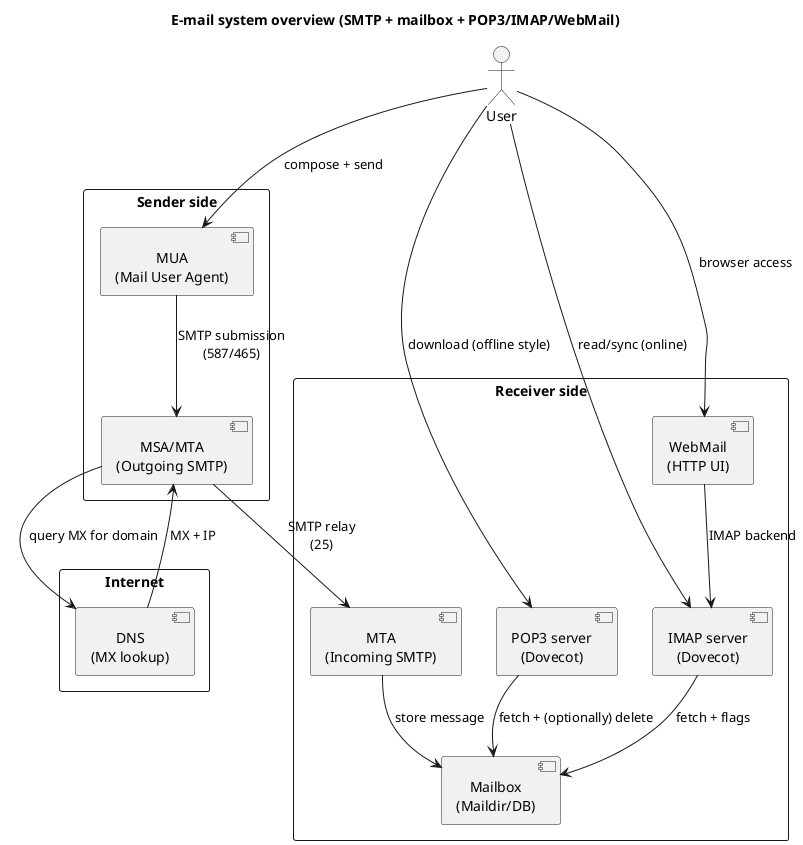
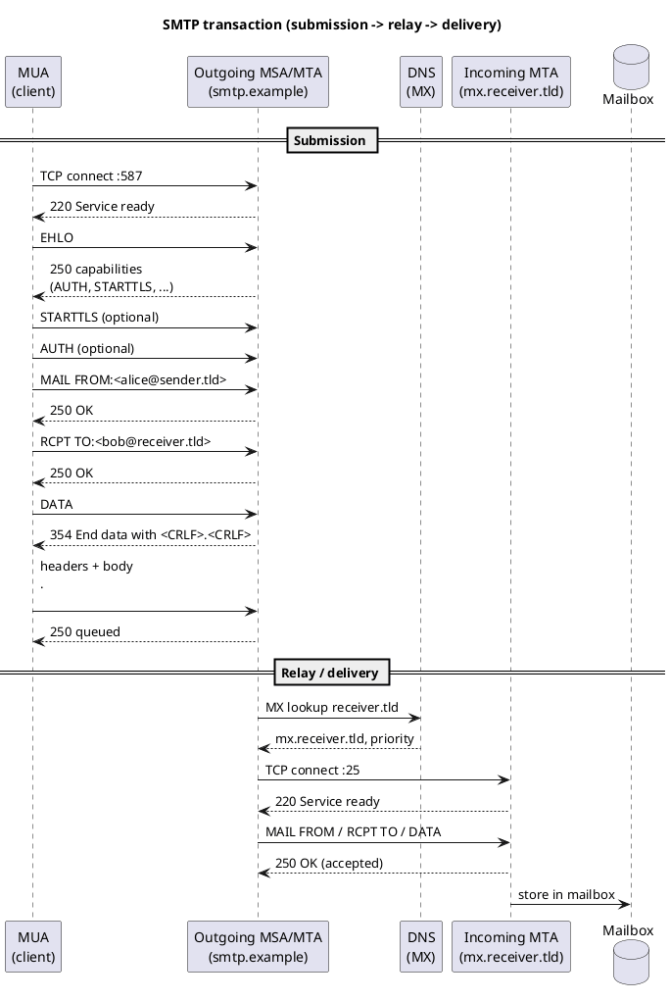
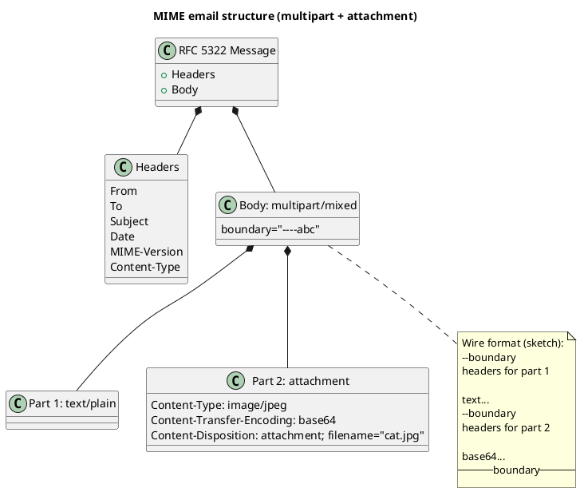
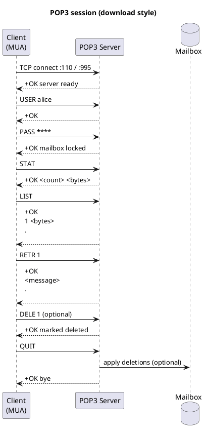

## Lecture 12 – Application layer

### SMTP, POP3, IMAP and webmail

---

### COMPUTER NETWORKS

### Lecture 12

---

### EMAIL: SMTP, POP3, IMAP and WEBMAIL

---

## Learning objectives

* Describe the architecture of email systems
* Explain the role and limitations of SMTP, POP3 and IMAP
* Describe email message structure (RFC 822 and MIME)
* Compare the operational models of POP3 and IMAP
* Explain the role of webmail as an application interface
* Relate the protocols to practical scenarios and Python implementations

---

## The general email architecture

* Distributed, asynchronous system
* Based on:

  * SMTP – transfer
  * POP3/IMAP – access
  * MIME – content
  * DNS (MX) – routing
* Clear separation between:

  * transport
  * storage
  * presentation

---

## Email system components

* **MUA (Mail User Agent)**

  * Email client
  * CLI, GUI or webmail
* **MTA (Mail Transfer Agent)**

  * Transfer between servers
* **MDA (Mail Delivery Agent)**

  * Delivery into a mailbox
* **Mailbox**

  * Persistent storage

(see the email architecture diagram)

---

## SMTP – Simple Mail Transfer Protocol

---

### The role of SMTP

* A **transfer** protocol, not a reading protocol
* Text-based
* Request–response model
* Runs over TCP
* Stateless
* Initially without authentication

---

### SMTP ports

* 25 – relay server-to-server
* 587 – submission (client → server)
* 465 – SMTPS (implicit TLS)

---

### Typical SMTP flow

1. Client → SMTP submission
2. Relay between servers
3. Delivery to the recipient mailbox
4. Available for POP3/IMAP/webmail

---

### Envelope vs message

* **SMTP envelope**

  * MAIL FROM
  * RCPT TO
* **Message**

  * RFC 822 headers
  * MIME body

---

### RFC 822 headers (essential)

* From
* To
* Cc/Bcc
* Subject
* Date
* Message-ID
* Received (added along the path)

---

### MIME – Multipurpose Internet Mail Extensions

* Enables:

  * attachments
  * binary encoding
  * multipart messages
* Headers:

  * Content-Type
  * Content-Transfer-Encoding
  * MIME-Version

---

### Common MIME types

* text/plain
* text/html
* image/jpeg
* application/pdf
* multipart/mixed
* multipart/alternative

---

### SMTP: basic commands

* HELO/EHLO
* MAIL FROM
* RCPT TO
* DATA
* RSET
* NOOP
* QUIT

---

### SMTP: response codes

* 2xx – success
* 3xx – continuation
* 4xx – temporary error
* 5xx – permanent error

---

### SMTP limitations

* Does not provide:

  * message access
  * synchronisation
  * mailbox structure
* Initially insecure
* Historically vulnerable to spam

---

## POP3 – Post Office Protocol

---

### POP3 characteristics

* A **download** protocol
* Simple client–server model
* Port 110/995 (TLS)
* Authentication is mandatory
* Messages are:

  * downloaded
  * optionally deleted from the server

---

### POP3: common commands

* USER/PASS
* STAT
* LIST
* RETR
* DELE
* NOOP
* QUIT

---

### POP3 operational model

* Connect
* Download messages
* Store locally
* (Optionally) delete on the server
* Disconnect

---

### POP3 advantages

* Simple
* Offline-friendly
* Minimal server resource usage
* Easy to implement

---

### POP3 disadvantages

* No synchronisation
* No folders
* Multi-device issues
* Risk of local data loss

---

## IMAP – Internet Message Access Protocol

---

### IMAP characteristics

* An **access** protocol
* Messages remain on the server
* Port 143/993 (TLS)
* Multi-client support
* State synchronisation

---

### IMAP functionality

* folders
* flags
* partial download
* notifications
* concurrent access

---

### IMAP session states

* Not authenticated
* Authenticated
* Selected
* Logout

---

### IMAP flags

* \Seen
* \Answered
* \Flagged
* \Deleted
* \Draft
* \Recent

---

### IMAP: common commands

* LOGIN
* SELECT
* FETCH
* SEARCH
* STORE
* COPY
* EXPUNGE
* LOGOUT

---

### IMAP operational model

* Connect
* Authenticate
* Select mailbox
* Perform incremental operations
* Disconnect

---

## POP3 vs IMAP

| Feature | POP3 | IMAP |
| --- | --- | --- |
| Storage | Local | Server |
| Multi-device | No | Yes |
| Folders | No | Yes |
| Offline | Good | Limited |
| Complexity | Low | High |

---

## Webmail

---

### What is webmail?

* A web interface for email
* Uses:

  * SMTP for sending
  * IMAP for access
* Runs entirely at the application layer

(see the email architecture diagram again)

---

### Webmail advantages

* No dedicated client
* Multi-device
* No local cache
* Integration with contacts and filters

---

### Webmail in the architecture

* Browser → HTTPS
* Webmail server → IMAP/SMTP
* No email logic in the browser

---

## Email security

* STARTTLS/SMTPS/IMAPS
* Authentication
* Spam filtering
* DKIM/SPF/DMARC (conceptual mention)

---

## Link to the laboratory scenarios

* **SMTP**

  * Local server
  * Relay
  * MIME attachments
* **POP3**

  * Message download
* **IMAP**

  * Selective access
  * Flags
* **Webmail**

  * A full interface over the same protocols

---

## Key takeaway

Email:

* is not only SMTP
* is an **ecosystem of protocols**
* separates:

  * transport
  * storage
  * presentation

---

## Thank you

### See you in the next lecture
