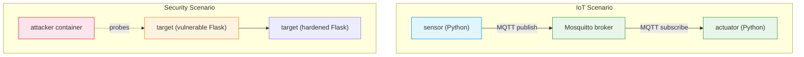

# C13 — IoT and Network Security

Week 13 combines two topics that share a common thread: constrained environments and attack surfaces. The IoT portion covers the sensor–broker–actuator pattern, MQTT publish-subscribe, CoAP and lightweight protocol stacks. The security portion covers vulnerability classification, the vulnerability lifecycle, port scanning, common network attacks, hardening principles and defence-in-depth. Two Docker Compose scenarios provide hands-on experience: an MQTT-based IoT pipeline and a controlled vulnerability laboratory with a hardened counterpart.

## File and Folder Index

| Name | Description | Metric |
|------|-------------|--------|
| [`c13-iot-security.md`](c13-iot-security.md) | Slide-by-slide lecture content (canonical) | 237 lines |
| [`c13.md`](c13.md) | Legacy redirect to canonical file | 5 lines |
| [`assets/puml/`](assets/puml/) | PlantUML diagram sources | 6 files |
| [`assets/images/`](assets/images/) | Rendered PNG output | .gitkeep |
| [`assets/render.sh`](assets/render.sh) | Diagram rendering script | — |
| [`assets/scenario-iot-basic/`](assets/scenario-iot-basic/) | MQTT sensor → broker → actuator (Docker Compose) | 7 files |
| [`assets/scenario-vulnerability-lab/`](assets/scenario-vulnerability-lab/) | Vulnerable and hardened Flask apps (Docker Compose) | 6 files |

## Visual Overview



## PlantUML Diagrams

| Source file | Subject |
|-------------|---------|
| `fig-hardening-before-after.puml` | Application before and after hardening |
| `fig-iot-architecture.puml` | IoT three-tier architecture |
| `fig-iot-scenario-runtime.puml` | IoT scenario runtime flow |
| `fig-mqtt-pub-sub.puml` | MQTT publish-subscribe model |
| `fig-vuln-lab-architecture.puml` | Vulnerability lab Docker architecture |
| `fig-vulnerability-lifecycle.puml` | Vulnerability discovery-to-patch lifecycle |

## Usage

IoT scenario:

```bash
cd assets/scenario-iot-basic
docker compose up --build
```

This starts Mosquitto, a sensor publishing temperature readings and an actuator reacting to thresholds.

Vulnerability lab:

```bash
cd assets/scenario-vulnerability-lab
docker compose up --build
```

The `target` container runs a deliberately vulnerable Flask application; the `attacker` container provides tools for probing. Compare `app.py` (vulnerable) with `app-hardened.py` to study the mitigations.

## Pedagogical Context

Pairing IoT with security in the penultimate lecture serves two purposes: it introduces a protocol family (MQTT, CoAP) outside the traditional OSI web-centric stack, and it revisits the entire stack from a defensive perspective. Students see how every layer — from L2 (MAC spoofing) to L7 (injection attacks) — presents an attack surface, reinforcing the integrated view that C14 will test.

## Cross-References

### Prerequisites

| Prerequisite | Path | Why |
|---|---|---|
| HTTP and REST | [`../C10/`](../C10/) | Vulnerability lab targets a web application |
| TCP/UDP sockets | [`../C03/`](../C03/) | MQTT and CoAP use TCP/UDP |
| Docker and Compose | [`../../00_TOOLS/Prerequisites/`](../../00_TOOLS/Prerequisites/) | Both scenarios are containerised |

### Lecture ↔ Seminar ↔ Project ↔ Quiz

| Content | Seminar | Project | Quiz |
|---------|---------|---------|------|
| Packet sniffing, filtering and IDS | [`S07`](../../04_SEMINARS/S07/) | [A02](../../02_PROJECTS/02_administration_security/A02_ids_simple_rules_scan_detection_tcp_anomalies_and_payload_patterns.md) — IDS | [W13](../../00_APPENDIX/c%29studentsQUIZes%28multichoice_only%29/COMPnet_W13_Questions.md) |
| Security, port scanning | [`S13`](../../04_SEMINARS/S13/) | [A05](../../02_PROJECTS/02_administration_security/A05_laboratory_port_scanning_tcp_connect_scan_and_minimal_service_fingerprinting.md) — port scanning | — |
| Network hardening | — | [A10](../../02_PROJECTS/02_administration_security/A10_network_hardening_containerised_services_segmentation_egress_filtering_docker_user.md) | — |
| IoT gateway | — | [S15](../../02_PROJECTS/01_network_applications/S15_iot_gateway_udp_telemetry_ingestion_http_api_query_and_streaming.md) | — |

### Portainer Guides

[`../../00_TOOLS/Portainer/SEMINAR13/`](../../00_TOOLS/Portainer/SEMINAR13/) provides container management guidance for the security-related Docker exercises.

### Instructor Notes

Romanian outlines: [`roCOMPNETclass_S13-instructor-outline-v2.md`](../../00_APPENDIX/d%29instructor_NOTES4sem/roCOMPNETclass_S13-instructor-outline-v2.md)

### Downstream Dependencies

Security concepts are assessed in the final quiz (W14) and in multiple administration projects (A02, A05, A09, A10). The IoT gateway project (S15) extends the MQTT scenario into a full telemetry pipeline.

### Suggested Sequence

[`C12/`](../C12/) → this folder → [`04_SEMINARS/S07/`](../../04_SEMINARS/S07/) → [`04_SEMINARS/S13/`](../../04_SEMINARS/S13/) → [`C14/`](../C14/)

## Selective Clone

**Method A — Git sparse-checkout (Git 2.25+)**

```bash
git clone --filter=blob:none --sparse https://github.com/antonioclim/COMPNET-EN.git
cd COMPNET-EN
git sparse-checkout set 03_LECTURES/C13
```

**Method B — Direct download**

Browse at: `https://github.com/antonioclim/COMPNET-EN/tree/main/03_LECTURES/C13`
## Provenance

Course kit version: v13 (February 2026). Author: ing. dr. Antonio Clim — ASE Bucharest, CSIE.
