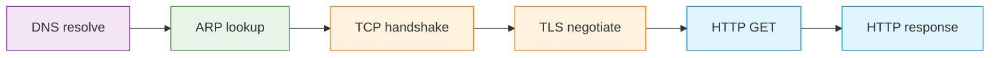

# C14 — Revision and Examination Preparation

Week 14 is the final lecture and serves as an integrative review. Rather than introducing new protocols, it traces a single network transaction — a user loading a web page — through every layer of the stack, from DNS resolution and ARP at the bottom through TCP handshake and TLS negotiation to HTTP request/response at the top. The lecture revisits key concepts from each prior week, highlights common examination pitfalls and provides a structured revision checklist. A single PlantUML diagram maps the full course.

## File and Folder Index

| Name | Description | Metric |
|------|-------------|--------|
| [`c14-revision-and-exam-prep.md`](c14-revision-and-exam-prep.md) | Slide-by-slide lecture content | 242 lines |
| [`c14-week14-integration-lab.md`](c14-week14-integration-lab.md) | Week 14 integration lab handout (capstone) | — |
| [`assets/puml/`](assets/puml/) | PlantUML diagram sources | 1 file |
| [`assets/images/`](assets/images/) | Rendered PNG output | .gitkeep |
| [`assets/render.sh`](assets/render.sh) | Diagram rendering script | — |
| [`assets/scenario-week14-integration-lab/`](assets/scenario-week14-integration-lab/) | Integrated Docker Compose capstone lab (DNS → HTTP → TLS → proxy) | scenario |

## PlantUML Diagrams

| Source file | Subject |
|-------------|---------|
| `fig-course-map.puml` | Full course topic map |

## Visual Overview



The diagram traces the single end-to-end transaction used as the revision vehicle: loading a web page from URL entry to rendered response, touching every OSI layer.

## Pedagogical Context

A dedicated revision lecture anchors the entire course sequence. By walking through a single end-to-end scenario, students are forced to integrate knowledge that was acquired layer by layer across thirteen weeks. The course-map diagram serves as both a revision aid and a self-assessment tool: students who cannot explain a node in the diagram know where to revisit.

## Cross-References

### Prerequisites

Every previous lecture (C01–C13) is a prerequisite. The revision assumes full-stack familiarity.

### Lecture ↔ Seminar ↔ Project ↔ Quiz

| Content | Seminar | Project | Quiz |
|---------|---------|---------|------|
| Full-stack integration and revision | All (S01–S14) | All | [W14](../../00_APPENDIX/c%29studentsQUIZes%28multichoice_only%29/COMPnet_W14_Questions.md) |

### Downstream Dependencies

No other repository components depend on this directory. The `fig-course-map.puml` diagram may be referenced from the root README or course orientation materials.

### Suggested Sequence

[`C13/`](../C13/) → this folder → `assets/scenario-week14-integration-lab/` → examination

## Selective Clone

**Method A — Git sparse-checkout (Git 2.25+)**

```bash
git clone --filter=blob:none --sparse https://github.com/antonioclim/COMPNET-EN.git
cd COMPNET-EN
git sparse-checkout set 03_LECTURES/C14
```

**Method B — Direct download**

Browse at: `https://github.com/antonioclim/COMPNET-EN/tree/main/03_LECTURES/C14`
## Provenance

Course kit version: v13 (February 2026). Author: ing. dr. Antonio Clim — ASE Bucharest, CSIE.
