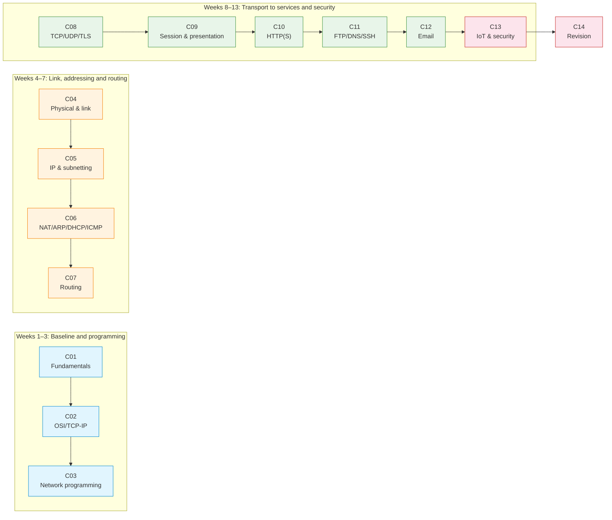

# 03_LECTURES — Lecture Notes, Diagrams and Micro-Scenarios

Fourteen lecture units (C01–C14) provide the theoretical spine of COMPNET-EN. Each lecture directory pairs Markdown lecture notes (maintained as slide-like documents) with reproducible diagrams (PlantUML source in `assets/puml/`, rendered PNGs in `assets/images/`) and short runnable scenarios intended to generate observable artefacts such as packet captures, logs and protocol transcripts.

## File and Folder Index

| Name | Description | Metric |
|---|---|---:|
| [`README.md`](README.md) | Lecture index, conventions and repository links for this section | 176 lines |
| [`C01/`](C01/) | Week 01 lecture — Network Fundamentals: Concepts, Components and Classifications (canonical slides: `c1-network-fundamentals.md`) | 17 files, 2 scenarios, 9 puml |
| [`C02/`](C02/) | Week 02 lecture — Architectural Models: OSI and TCP/IP (canonical slides: `c2-architectural-models.md`) | 17 files, 1 scenarios, 8 puml |
| [`C03/`](C03/) | Week 03 lecture — Introduction to Network Application Programming (canonical slides: `c3-intro-network-programming.md`) | 22 files, 4 scenarios, 7 puml |
| [`C04/`](C04/) | Week 04 lecture — The Physical Layer and the Data Link Layer (canonical slides: `c4-physical-and-data-link.md`) | 20 files, 2 scenarios, 13 puml |
| [`C05/`](C05/) | Week 05 lecture — Network Layer: IP Addressing, Subnetting and VLSM (canonical slides: `c5-network-layer-addressing.md`) | 23 files, 5 scenarios, 10 puml |
| [`C06/`](C06/) | Week 06 lecture — Network Layer Support: NAT, ARP, DHCP, NDP and ICMP (canonical slides: `c6-nat-arp-dhcp-ndp-icmp.md`) | 21 files, 5 scenarios, 11 puml |
| [`C07/`](C07/) | Week 07 lecture — Routing Protocols (canonical slides: `c7-routing-protocols.md`) | 19 files, 3 scenarios, 9 puml |
| [`C08/`](C08/) | Week 08 lecture — The Transport Layer: TCP, UDP, TLS and QUIC (canonical slides: `c8-transport-layer.md`) | 34 files, 3 scenarios, 12 puml |
| [`C09/`](C09/) | Week 09 lecture — The Session Layer and the Presentation Layer (canonical slides: `c9-session-presentation.md`) | 19 files, 2 scenarios, 6 puml |
| [`C10/`](C10/) | Week 10 lecture — Application Layer: HTTP(S), REST and WebSockets (canonical slides: `c10-http-application-layer.md`) | 38 files, 4 scenarios, 10 puml |
| [`C11/`](C11/) | Week 11 lecture — Application Layer: FTP, DNS and SSH (canonical slides: `c11-ftp-dns-ssh.md`) | 36 files, 4 scenarios, 7 puml |
| [`C12/`](C12/) | Week 12 lecture — Email Protocols: SMTP, POP3, IMAP and Webmail (canonical slides: `c12-email-protocols.md`) | 24 files, 1 scenarios, 10 puml |
| [`C13/`](C13/) | Week 13 lecture — IoT and Network Security (canonical slides: `c13-iot-security.md`) | 24 files, 2 scenarios, 6 puml |
| [`C14/`](C14/) | Week 14 lecture — Revision and Examination Preparation (canonical slides: `c14-revision-and-exam-prep.md`) | 5 files, 0 scenarios, 1 puml |

## Visual Overview



## Directory Layout Pattern

Lecture folders follow a stable pattern so that diagrams and scenarios can be located quickly:

```text
CNN/
├── README.md
├── cNN-*.md
├── cNN.md                      (optional legacy redirect)
└── assets/
    ├── puml/                   (PlantUML source diagrams)
    ├── images/                 (rendered PNG output, often placeholder only)
    ├── render.sh               (batch diagram renderer)
    └── scenario-*/             (runnable micro-scenarios)
```

## Usage

Rendering diagrams for a single lecture (requires Java and `plantuml.jar`):

```bash
bash 00_TOOLS/plantuml/get_plantuml_jar.sh
cd 03_LECTURES/C01/assets
bash render.sh
```

Running a scenario follows the README in that scenario directory. Typical patterns:

| Scenario type | Typical command | Evidence to capture |
|---|---|---|
| Python client/server | `python3 server.py` then `python3 client.py` | terminal logs, packet capture (Wireshark or tcpdump) |
| Docker Compose stack | `docker compose up --build` | container logs, HTTP transcripts, network inspection |
| Algorithmic scripts | `python3 <script>.py` | deterministic output for reasoning and checking |

## Pedagogical Context

Lecture notes alone are insufficient for network work because most claims are about behaviour over time and under constraints. The scenarios in `assets/scenario-*` provide controlled stimuli so that students can create evidence and then justify it with protocol reasoning, rather than repeating untested statements.

## Cross-References and Contextual Connections

### Prerequisites and Dependencies

| Prerequisite | Path | Why |
|---|---|---|
| Environment setup | [`../00_TOOLS/Prerequisites/`](../00_TOOLS/Prerequisites/) | Packet capture tools, Python and Docker are required across later lectures and seminars |
| PlantUML tooling | [`../00_TOOLS/plantuml/`](../00_TOOLS/plantuml/) | Lecture figures are authored in PlantUML and rendered locally |
| Python self-study | [`../00_APPENDIX/a)PYTHON_self_study_guide/`](../00_APPENDIX/a%29PYTHON_self_study_guide/) | Many scenarios assume ability to read and run small Python programs |

### Lecture ↔ Seminar ↔ Project ↔ Quiz Mapping

| Week | Lecture | Scheduled seminar | Quiz | Portainer guide (if used) |
|---:|---|---|---|---|
| 01 | [`C01`](C01/) | [`S01`](../04_SEMINARS/S01/) | [`W01`](../00_APPENDIX/c%29studentsQUIZes%28multichoice_only%29/COMPnet_W01_Questions.md) | — |
| 02 | [`C02`](C02/) | [`S02`](../04_SEMINARS/S02/) | [`W02`](../00_APPENDIX/c%29studentsQUIZes%28multichoice_only%29/COMPnet_W02_Questions.md) | — |
| 03 | [`C03`](C03/) | [`S03`](../04_SEMINARS/S03/) | [`W03`](../00_APPENDIX/c%29studentsQUIZes%28multichoice_only%29/COMPnet_W03_Questions.md) | — |
| 04 | [`C04`](C04/) | [`S04`](../04_SEMINARS/S04/) | [`W04`](../00_APPENDIX/c%29studentsQUIZes%28multichoice_only%29/COMPnet_W04_Questions.md) | — |
| 05 | [`C05`](C05/) | [`S05`](../04_SEMINARS/S05/) | [`W05`](../00_APPENDIX/c%29studentsQUIZes%28multichoice_only%29/COMPnet_W05_Questions.md) | — |
| 06 | [`C06`](C06/) | [`S06`](../04_SEMINARS/S06/) | [`W06`](../00_APPENDIX/c%29studentsQUIZes%28multichoice_only%29/COMPnet_W06_Questions.md) | — |
| 07 | [`C07`](C07/) | [`S07`](../04_SEMINARS/S07/) | [`W07`](../00_APPENDIX/c%29studentsQUIZes%28multichoice_only%29/COMPnet_W07_Questions.md) | — |
| 08 | [`C08`](C08/) | [`S08`](../04_SEMINARS/S08/) | [`W08`](../00_APPENDIX/c%29studentsQUIZes%28multichoice_only%29/COMPnet_W08_Questions.md) | [`SEMINAR08`](../00_TOOLS/Portainer/SEMINAR08/) |
| 09 | [`C09`](C09/) | [`S09`](../04_SEMINARS/S09/) | [`W09`](../00_APPENDIX/c%29studentsQUIZes%28multichoice_only%29/COMPnet_W09_Questions.md) | [`SEMINAR09`](../00_TOOLS/Portainer/SEMINAR09/) |
| 10 | [`C10`](C10/) | [`S10`](../04_SEMINARS/S10/) | [`W10`](../00_APPENDIX/c%29studentsQUIZes%28multichoice_only%29/COMPnet_W10_Questions.md) | [`SEMINAR10`](../00_TOOLS/Portainer/SEMINAR10/) |
| 11 | [`C11`](C11/) | [`S11`](../04_SEMINARS/S11/) | [`W11`](../00_APPENDIX/c%29studentsQUIZes%28multichoice_only%29/COMPnet_W11_Questions.md) | [`SEMINAR11`](../00_TOOLS/Portainer/SEMINAR11/) |
| 12 | [`C12`](C12/) | [`S12`](../04_SEMINARS/S12/) | [`W12`](../00_APPENDIX/c%29studentsQUIZes%28multichoice_only%29/COMPnet_W12_Questions.md) | — |
| 13 | [`C13`](C13/) | [`S13`](../04_SEMINARS/S13/) | [`W13`](../00_APPENDIX/c%29studentsQUIZes%28multichoice_only%29/COMPnet_W13_Questions.md) | [`SEMINAR13`](../00_TOOLS/Portainer/SEMINAR13/) |
| 14 | [`C14`](C14/) | [`S14`](../04_SEMINARS/S14/) | [`W14`](../00_APPENDIX/c%29studentsQUIZes%28multichoice_only%29/COMPnet_W14_Questions.md) | — |

Projects that assess lecture ideas are indexed in [`../02_PROJECTS/COURSE_SEMINAR_MAPPING.md`](../02_PROJECTS/COURSE_SEMINAR_MAPPING.md). For topic-level links (rather than week scheduling), follow the cross-reference tables in each `CNN/README.md`.

### Downstream Dependencies

The CI workflow runs `00_TOOLS/qa/check_markdown_links.py` and `00_TOOLS/qa/check_integrity.py` against the lecture Markdown. It also runs `00_TOOLS/qa/check_fig_targets.py --puml-only`, which validates that PlantUML targets referenced from lecture files exist and follow the expected naming conventions.

### Suggested Learning Sequence

Suggested sequence: `current-outline.md` → `03_LECTURES/C01/` → `04_SEMINARS/S01/` → continue week by week until `C14/`

## Selective Clone

Method A — Git sparse-checkout (requires Git 2.25+)

```bash
git clone --filter=blob:none --sparse https://github.com/antonioclim/COMPNET-EN.git
cd COMPNET-EN
git sparse-checkout set 03_LECTURES
```

To add the seminars and tooling alongside the lectures:

```bash
git sparse-checkout add 04_SEMINARS
git sparse-checkout add 00_TOOLS
```

Method B — Direct download (no Git required)

```
https://github.com/antonioclim/COMPNET-EN/tree/main/03_LECTURES
```

## Provenance

*Course kit: v13.05.00 (February 2026)*
*Author: ing. dr. Antonio Clim — ASE Bucharest, CSIE*
