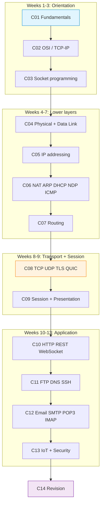

# 03_LECTURES — Lecture Notes and Executable Scenarios

Fourteen lectures (C01–C14) cover computer networking from physical-layer fundamentals through application protocols to IoT and security. Each lecture directory contains a slide-by-slide Markdown file, PlantUML diagram sources in `assets/puml/`, an `assets/images/` directory for rendered PNGs and executable demo scenarios in `assets/scenario-*/`. The progression follows the OSI model bottom-up, with deliberate deviations where pedagogical clarity demands it — socket programming (C03) precedes the physical layer (C04) so that students have empirical tools before descending into theory.

## Lecture Index

| Dir | Week | Topic | Main file | Lines | PlantUML | Scenarios |
|-----|------|-------|-----------|-------|----------|-----------|
| [`C01/`](C01/) | 1 | Network fundamentals | `c1-network-fundamentals.md` | 206 | 9 | 2 |
| [`C02/`](C02/) | 2 | Architectural models (OSI and TCP/IP) | `c2-architectural-models.md` | 354 | 8 | 1 |
| [`C03/`](C03/) | 3 | Network programming (sockets) | `c3-intro-network-programming.md` | 155 | 7 | 4 |
| [`C04/`](C04/) | 4 | Physical and data link layer | `c4-physical-and-data-link.md` | 292 | 13 | 2 |
| [`C05/`](C05/) | 5 | Network layer addressing (IPv4, IPv6, VLSM) | `c5-network-layer-addressing.md` | 235 | 10 | 5 |
| [`C06/`](C06/) | 6 | NAT, ARP, DHCP, NDP and ICMP | `c6-nat-arp-dhcp-ndp-icmp.md` | 225 | 11 | 5 |
| [`C07/`](C07/) | 7 | Routing protocols | `c7-routing-protocols.md` | 187 | 9 | 3 |
| [`C08/`](C08/) | 8 | Transport layer (TCP, UDP, TLS, QUIC) | `c8-transport-layer.md` | 464 | 12 | 3 |
| [`C09/`](C09/) | 9 | Session and presentation layer | `c9-session-presentation.md` | 219 | 6 | 2 |
| [`C10/`](C10/) | 10 | Application layer: HTTP(S), REST, WebSockets | `c10-http-application-layer.md` | 329 | 10 | 4 |
| [`C11/`](C11/) | 11 | FTP, DNS and SSH | `c11-ftp-dns-ssh.md` | 314 | 7 | 4 |
| [`C12/`](C12/) | 12 | Email protocols (SMTP, POP3, IMAP) | `c12-email-protocols.md` | 424 | 10 | 1 |
| [`C13/`](C13/) | 13 | IoT and network security | `c13-iot-security.md` | 237 | 6 | 2 |
| [`C14/`](C14/) | 14 | Revision and examination preparation | `c14-revision-and-exam-prep.md` | 242 | 1 | 0 |

Total: 3 883 lines of lecture content, 119 PlantUML diagrams, 38 executable scenarios.

## Visual Overview



## Lecture ↔ Seminar ↔ Quiz Mapping

Each lecture week has a corresponding seminar session and quiz bank. The mapping is not always one-to-one: some seminars span concepts from two lectures, and some lectures feed multiple projects.

| Lecture | Primary seminar | Quiz bank | Docker Compose in lecture? |
|---------|----------------|-----------|----------------------------|
| C01 | [`S01`](../04_SEMINARS/S01/) | [W01](../00_APPENDIX/c%29studentsQUIZes%28multichoice_only%29/COMPnet_W01_Questions.md) | — |
| C02 | [`S01`](../04_SEMINARS/S01/) | [W02](../00_APPENDIX/c%29studentsQUIZes%28multichoice_only%29/COMPnet_W02_Questions.md) | — |
| C03 | [`S02`](../04_SEMINARS/S02/), [`S03`](../04_SEMINARS/S03/) | [W03](../00_APPENDIX/c%29studentsQUIZes%28multichoice_only%29/COMPnet_W03_Questions.md) | — |
| C04 | [`S04`](../04_SEMINARS/S04/) | [W04](../00_APPENDIX/c%29studentsQUIZes%28multichoice_only%29/COMPnet_W04_Questions.md) | — |
| C05 | [`S05`](../04_SEMINARS/S05/) | [W05](../00_APPENDIX/c%29studentsQUIZes%28multichoice_only%29/COMPnet_W05_Questions.md) | — |
| C06 | [`S05`](../04_SEMINARS/S05/), [`S06`](../04_SEMINARS/S06/) | [W06](../00_APPENDIX/c%29studentsQUIZes%28multichoice_only%29/COMPnet_W06_Questions.md) | — |
| C07 | [`S06`](../04_SEMINARS/S06/) | [W07](../00_APPENDIX/c%29studentsQUIZes%28multichoice_only%29/COMPnet_W07_Questions.md) | — |
| C08 | [`S02`](../04_SEMINARS/S02/), [`S03`](../04_SEMINARS/S03/) | [W08](../00_APPENDIX/c%29studentsQUIZes%28multichoice_only%29/COMPnet_W08_Questions.md) | — |
| C09 | [`S04`](../04_SEMINARS/S04/), [`S12`](../04_SEMINARS/S12/) | [W09](../00_APPENDIX/c%29studentsQUIZes%28multichoice_only%29/COMPnet_W09_Questions.md) | — |
| C10 | [`S08`](../04_SEMINARS/S08/), [`S11`](../04_SEMINARS/S11/) | [W10](../00_APPENDIX/c%29studentsQUIZes%28multichoice_only%29/COMPnet_W10_Questions.md) | Yes (1) |
| C11 | [`S09`](../04_SEMINARS/S09/), [`S10`](../04_SEMINARS/S10/) | [W11](../00_APPENDIX/c%29studentsQUIZes%28multichoice_only%29/COMPnet_W11_Questions.md) | Yes (4) |
| C12 | [`S09`](../04_SEMINARS/S09/) | [W12](../00_APPENDIX/c%29studentsQUIZes%28multichoice_only%29/COMPnet_W12_Questions.md) | Yes (1) |
| C13 | [`S07`](../04_SEMINARS/S07/), [`S13`](../04_SEMINARS/S13/) | [W13](../00_APPENDIX/c%29studentsQUIZes%28multichoice_only%29/COMPnet_W13_Questions.md) | Yes (2) |
| C14 | [`S14`](../04_SEMINARS/S14/) | [W14](../00_APPENDIX/c%29studentsQUIZes%28multichoice_only%29/COMPnet_W14_Questions.md) | — |

## Directory Layout Per Lecture

Every `CNN/` directory follows a uniform structure:

```
CNN/
├── README.md                        orientation document
├── cN-<topic>.md                    slide-by-slide lecture content
├── cN.md                            legacy redirect (C08–C13 only)
└── assets/
    ├── images/                      rendered PNG output (.gitkeep)
    ├── puml/                        PlantUML diagram sources
    ├── render.sh                    diagram rendering script
    └── scenario-<name>/             executable demo
        ├── README.md
        ├── *.py / *.sh
        └── docker-compose.yml       where containerised (C10–C13)
```

## Generating Diagrams

PNG files are generated from `.puml` sources. The repository keeps PlantUML sources under version control and expects PNGs to be generated locally. CI validates that each `[FIG] assets/images/<n>.png` marker has a matching `assets/puml/<n>.puml` source via `check_fig_targets.py --puml-only`.

From any lecture directory:

```bash
cd C01/assets && bash render.sh
```

The script requires Java and expects `plantuml.jar` in `00_TOOLS/plantuml/`. If the JAR is absent:

```bash
bash 00_TOOLS/plantuml/get_plantuml_jar.sh
```

Regenerated PNGs are written to `assets/images/`.

## Scenarios

The `scenario-*` directories inside each lecture contain executable Python code and shell scripts demonstrating the concepts from the slides. Requirements: Python 3.10+ and (optionally) Docker for compose-based scenarios. Lectures C10–C13 include Docker Compose files for multi-container setups; the corresponding Portainer guides are in [`../00_TOOLS/Portainer/`](../00_TOOLS/Portainer/).

## Cross-References

### Prerequisites

| Prerequisite | Path | Why |
|---|---|---|
| Environment setup | [`../00_TOOLS/Prerequisites/`](../00_TOOLS/Prerequisites/) | Docker, WSL2, Python and Wireshark must be configured before running scenarios |
| Python fluency | [`../00_APPENDIX/a)PYTHON_self_study_guide/`](../00_APPENDIX/a%29PYTHON_self_study_guide/) | Socket programming from C03 onward assumes working Python knowledge |

### Downstream Dependencies

The seminar series ([`../04_SEMINARS/`](../04_SEMINARS/)) and both project groups ([`../02_PROJECTS/`](../02_PROJECTS/)) depend directly on lecture content. The quiz banks in [`../00_APPENDIX/c)studentsQUIZes(multichoice_only)/`](../00_APPENDIX/c%29studentsQUIZes%28multichoice_only%29/) test each lecture week's material. CI runs `check_fig_targets.py` against all `.puml` files in this directory tree.

### Instructor Notes

Romanian instructor outlines for each seminar week are in [`../00_APPENDIX/d)instructor_NOTES4sem/`](../00_APPENDIX/d%29instructor_NOTES4sem/). Each `roCOMPNETclass_SNN-instructor-outline-*.md` file corresponds to seminar SNN, which in turn maps to its lecture week per the table above.

## Selective Clone

**Method A — Git sparse-checkout (Git 2.25+)**

```bash
git clone --filter=blob:none --sparse https://github.com/antonioclim/COMPNET-EN.git
cd COMPNET-EN
git sparse-checkout set 03_LECTURES
```

To add a single lecture only (e.g. C08):

```bash
git sparse-checkout set 03_LECTURES/C08
```

Scenarios that use Docker Compose also benefit from the Portainer guides:

```bash
git sparse-checkout add 00_TOOLS/Portainer
```

**Method B — Direct download**

Browse at: `https://github.com/antonioclim/COMPNET-EN/tree/main/03_LECTURES`

## Provenance

Course kit version: v13 (February 2026). Author: ing. dr. Antonio Clim — ASE Bucharest, CSIE.
