# 04_SEMINARS — Practical Laboratory Sessions

Fourteen weekly seminars (S01–S14) form the applied spine of the COMPNET-EN course. They progress from basic network observation through socket programming and protocol design to containerised service deployment, security testing and remote procedure call frameworks. Each seminar directory contains Markdown files (Explanation, Scenario and Tasks), Python source code, Docker Compose configurations where needed and PlantUML diagram sources. Two auxiliary directories supply browser-viewable HTML renderings (`_HTMLsupport/`) and reference solutions (`_tutorial-solve/`).

## Seminar Index

| Dir | Week | Topic | Key Technologies | Files |
|-----|------|-------|-----------------|-------|
| [`S01/`](S01/) | 01 | Network analysis: Wireshark, tshark and netcat | Wireshark, netcat | 11 |
| [`S02/`](S02/) | 02 | Socket programming: TCP and UDP servers with clients | Python sockets, Wireshark | 16 |
| [`S03/`](S03/) | 03 | UDP broadcast, multicast, anycast and multi-client TCP | Python sockets | 21 |
| [`S04/`](S04/) | 04 | Custom text and binary protocols over TCP and UDP | Python struct, serialisation | 22 |
| [`S05/`](S05/) | 05 | IPv4/IPv6 subnetting and Mininet simulation | Mininet, Python | 15 |
| [`S06/`](S06/) | 06 | SDN, static routing and Mininet topologies | Mininet, Ryu/OpenFlow | 20 |
| [`S07/`](S07/) | 07 | Packet sniffing, filtering, port scanning and IDS | Raw sockets, Python | 18 |
| [`S08/`](S08/) | 08 | HTTP server implementation and Nginx reverse proxy | Python, Docker, Nginx | 20 |
| [`S09/`](S09/) | 09 | FTP server, custom file transfer and containers | pyftpdlib, Docker | 23 |
| [`S10/`](S10/) | 10 | DNS, SSH (Paramiko) and port forwarding in Docker | Docker, Paramiko | 24 |
| [`S11/`](S11/) | 11 | Load balancing with Nginx and a custom balancer | Docker Compose, Nginx, Python | 24 |
| [`S12/`](S12/) | 12 | JSON-RPC, Protocol Buffers and gRPC | Python, protobuf, gRPC | 21 |
| [`S13/`](S13/) | 13 | Penetration testing: scanning and vulnerability analysis | Docker, Nmap, Python | 19 |
| [`S14/`](S14/) | 14 | Revision and team project assessment | — | 5 |

## Lecture ↔ Seminar ↔ Quiz Mapping

Each seminar practises concepts from the corresponding lecture. The table below shows the full weekly alignment with quiz and Portainer guide availability.

| Week | Lecture | Seminar | Quiz | Portainer Guide |
|------|---------|---------|------|-----------------|
| 01 | [`C01`](../03_LECTURES/C01/) — Network fundamentals | [`S01`](S01/) | [`W01`](../00_APPENDIX/c%29studentsQUIZes%28multichoice_only%29/COMPnet_W01_Questions.md) | — |
| 02 | [`C02`](../03_LECTURES/C02/) — OSI and TCP/IP models | [`S02`](S02/) | [`W02`](../00_APPENDIX/c%29studentsQUIZes%28multichoice_only%29/COMPnet_W02_Questions.md) | — |
| 03 | [`C03`](../03_LECTURES/C03/) — Intro network programming | [`S03`](S03/) | [`W03`](../00_APPENDIX/c%29studentsQUIZes%28multichoice_only%29/COMPnet_W03_Questions.md) | — |
| 04 | [`C04`](../03_LECTURES/C04/) — Physical and data link | [`S04`](S04/) | [`W04`](../00_APPENDIX/c%29studentsQUIZes%28multichoice_only%29/COMPnet_W04_Questions.md) | — |
| 05 | [`C05`](../03_LECTURES/C05/) — Addressing and subnetting | [`S05`](S05/) | [`W05`](../00_APPENDIX/c%29studentsQUIZes%28multichoice_only%29/COMPnet_W05_Questions.md) | — |
| 06 | [`C06`](../03_LECTURES/C06/) — NAT, ARP, DHCP, NDP, ICMP | [`S06`](S06/) | [`W06`](../00_APPENDIX/c%29studentsQUIZes%28multichoice_only%29/COMPnet_W06_Questions.md) | — |
| 07 | [`C07`](../03_LECTURES/C07/) — Routing protocols | [`S07`](S07/) | [`W07`](../00_APPENDIX/c%29studentsQUIZes%28multichoice_only%29/COMPnet_W07_Questions.md) | — |
| 08 | [`C08`](../03_LECTURES/C08/) — Transport layer (TCP, UDP, TLS) | [`S08`](S08/) | [`W08`](../00_APPENDIX/c%29studentsQUIZes%28multichoice_only%29/COMPnet_W08_Questions.md) | [`SEMINAR08`](../00_TOOLS/Portainer/SEMINAR08/) |
| 09 | [`C09`](../03_LECTURES/C09/) — Session and presentation | [`S09`](S09/) | [`W09`](../00_APPENDIX/c%29studentsQUIZes%28multichoice_only%29/COMPnet_W09_Questions.md) | [`SEMINAR09`](../00_TOOLS/Portainer/SEMINAR09/) |
| 10 | [`C10`](../03_LECTURES/C10/) — HTTP and application layer | [`S10`](S10/) | [`W10`](../00_APPENDIX/c%29studentsQUIZes%28multichoice_only%29/COMPnet_W10_Questions.md) | [`SEMINAR10`](../00_TOOLS/Portainer/SEMINAR10/) |
| 11 | [`C11`](../03_LECTURES/C11/) — FTP, DNS and SSH | [`S11`](S11/) | [`W11`](../00_APPENDIX/c%29studentsQUIZes%28multichoice_only%29/COMPnet_W11_Questions.md) | [`SEMINAR11`](../00_TOOLS/Portainer/SEMINAR11/) |
| 12 | [`C12`](../03_LECTURES/C12/) — Email protocols | [`S12`](S12/) | [`W12`](../00_APPENDIX/c%29studentsQUIZes%28multichoice_only%29/COMPnet_W12_Questions.md) | — |
| 13 | [`C13`](../03_LECTURES/C13/) — IoT and network security | [`S13`](S13/) | [`W13`](../00_APPENDIX/c%29studentsQUIZes%28multichoice_only%29/COMPnet_W13_Questions.md) | [`SEMINAR13`](../00_TOOLS/Portainer/SEMINAR13/) |
| 14 | [`C14`](../03_LECTURES/C14/) — Revision | [`S14`](S14/) | [`W14`](../00_APPENDIX/c%29studentsQUIZes%28multichoice_only%29/COMPnet_W14_Questions.md) | — |

## Visual Overview

```mermaid
graph LR
    subgraph "Foundations (Weeks 1–4)"
        S01["S01<br/>Wireshark &amp; netcat"]
        S02["S02<br/>TCP/UDP sockets"]
        S03["S03<br/>Broadcast &amp; multicast"]
        S04["S04<br/>Custom protocols"]
    end

    subgraph "Infrastructure (Weeks 5–7)"
        S05["S05<br/>Subnetting &amp; Mininet"]
        S06["S06<br/>SDN &amp; routing"]
        S07["S07<br/>Sniffing &amp; scanning"]
    end

    subgraph "Services (Weeks 8–12)"
        S08["S08<br/>HTTP &amp; Nginx"]
        S09["S09<br/>FTP &amp; file transfer"]
        S10["S10<br/>DNS, SSH in Docker"]
        S11["S11<br/>Load balancing"]
        S12["S12<br/>RPC &amp; gRPC"]
    end

    subgraph "Consolidation (Weeks 13–14)"
        S13["S13<br/>Pentest &amp; security"]
        S14["S14<br/>Revision &amp; assessment"]
    end

    S01 --> S02 --> S03 --> S04
    S04 --> S05 --> S06 --> S07
    S07 --> S08 --> S09 --> S10 --> S11 --> S12
    S12 --> S13 --> S14

    style S01 fill:#e1f5fe,stroke:#0288d1
    style S02 fill:#e1f5fe,stroke:#0288d1
    style S03 fill:#e1f5fe,stroke:#0288d1
    style S04 fill:#e1f5fe,stroke:#0288d1
    style S05 fill:#fff3e0,stroke:#f57c00
    style S06 fill:#fff3e0,stroke:#f57c00
    style S07 fill:#fff3e0,stroke:#f57c00
    style S08 fill:#e8f5e9,stroke:#388e3c
    style S09 fill:#e8f5e9,stroke:#388e3c
    style S10 fill:#e8f5e9,stroke:#388e3c
    style S11 fill:#e8f5e9,stroke:#388e3c
    style S12 fill:#e8f5e9,stroke:#388e3c
    style S13 fill:#fce4ec,stroke:#c62828
    style S14 fill:#fce4ec,stroke:#c62828
```



## Supporting Materials

| Directory | Purpose | Contents |
|-----------|---------|----------|
| [`_HTMLsupport/`](_HTMLsupport/) | Browser-viewable HTML renderings of seminar content | HTML pages mirroring the Markdown and Python sources from S01–S13 |
| [`_tutorial-solve/`](_tutorial-solve/) | Reference solutions for student self-assessment | Solutions currently available for S01 and S02; further weeks are added incrementally |

## Diagrams

Every seminar directory contains `assets/puml/` with PlantUML source files and `assets/render.sh` for batch PNG generation. The render script requires Java and `plantuml.jar` from [`../00_TOOLS/plantuml/`](../00_TOOLS/plantuml/). If the JAR is absent, run:

```bash
bash 00_TOOLS/plantuml/get_plantuml_jar.sh
```

Generated PNGs are written to the corresponding `assets/images/` directory.

## Prerequisites

| Prerequisite | Path | Reason |
|---|---|---|
| Environment setup (Docker, WSL2) | [`../00_TOOLS/Prerequisites/`](../00_TOOLS/Prerequisites/) | Docker and WSL2 must be configured before running containerised scenarios (S08 onward) |
| Portainer (for Docker GUI) | [`../00_TOOLS/Portainer/INIT_GUIDE/`](../00_TOOLS/Portainer/INIT_GUIDE/) | Optional but recommended for visual container management |
| Python self-study | [`../00_APPENDIX/a)PYTHON_self_study_guide/`](../00_APPENDIX/a%29PYTHON_self_study_guide/) | Socket programming fluency assumed from S02 onward |

## Downstream Dependencies

The root [`README.md`](../README.md) links to every seminar directory and embeds a week-by-week mapping table referencing `04_SEMINARS/`. Instructor notes in [`../00_APPENDIX/d)instructor_NOTES4sem/`](../00_APPENDIX/d%29instructor_NOTES4sem/) contain Romanian-language outlines keyed to each seminar (e.g. `roCOMPNETclass_S01-instructor-outline-v3.md` corresponds to `S01/`). Portainer guides in [`../00_TOOLS/Portainer/`](../00_TOOLS/Portainer/) provide Docker management walkthroughs for S08–S11 and S13.

## Selective Clone

**Method A — Git sparse-checkout (requires Git 2.25+)**

```bash
git clone --filter=blob:none --sparse https://github.com/antonioclim/COMPNET-EN.git
cd COMPNET-EN
git sparse-checkout set 04_SEMINARS
```

To include supporting tools alongside the seminars:

```bash
git sparse-checkout add 00_TOOLS
```

**Method B — Direct download (no Git required)**

Browse the folder at:

```
https://github.com/antonioclim/COMPNET-EN/tree/main/04_SEMINARS
```

For a single-folder download without cloning the full repository, use a tool such as `download-directory.github.io` or `gitzip`.

---

*Last updated: v13 — February 2026*
*Course: COMPNET-EN (Computer Networks) — ASE Bucharest, CSIE*
*Author: ing. dr. Antonio Clim*
