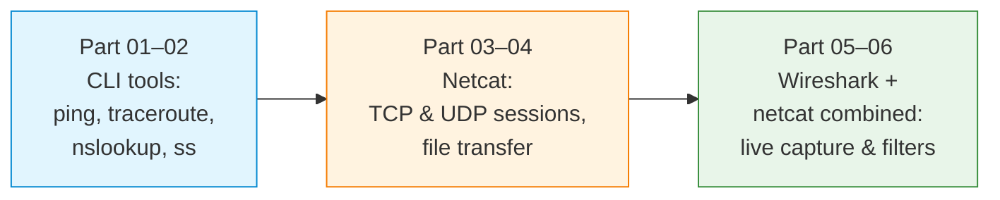

# S01 — Network Analysis: Wireshark, Netcat and Traffic Debugging

Week 1 introduces the fundamental observation and communication tools that underpin every subsequent seminar. Students capture and inspect live traffic with Wireshark and tshark, establish raw TCP and UDP sessions with netcat and develop a systematic methodology for diagnosing network behaviour. No programming is required; the focus is on building instrument literacy before writing socket code.

## File/Folder Index

| Name | Type | Description | Lines |
|---|---|---|---|
| [`S01_Part01_Scenario_Basic_Tools.md`](S01_Part01_Scenario_Basic_Tools.md) | Scenario | Guided walkthrough of `ping`, `traceroute`, `nslookup`, `netstat` and `ss` | — |
| [`S01_Part02_Tasks_Basic_Tools.md`](S01_Part02_Tasks_Basic_Tools.md) | Tasks | Exercises on CLI network diagnostics | — |
| [`S01_Part03_Scenario_Netcat_Basics.md`](S01_Part03_Scenario_Netcat_Basics.md) | Scenario | Netcat TCP and UDP sessions, file transfer, port listening | — |
| [`S01_Part04_Tasks_Netcat_Basics.md`](S01_Part04_Tasks_Netcat_Basics.md) | Tasks | Netcat practice exercises | — |
| [`S01_Part05_Scenario_Wireshark_Netcat.md`](S01_Part05_Scenario_Wireshark_Netcat.md) | Scenario | Packet capture with Wireshark while running netcat sessions | — |
| [`S01_Part06_Tasks_Wireshark_Netcat.md`](S01_Part06_Tasks_Wireshark_Netcat.md) | Tasks | Traffic analysis exercises combining Wireshark and netcat | — |
| [`assets/puml/`](assets/puml/) | Diagrams | 4 PlantUML sources: basic tools overview, netcat TCP vs UDP, TCP vs UDP capture, Wireshark filter pipeline | 4 files |
| [`assets/render.sh`](assets/render.sh) | Script | Renders PlantUML sources to PNG in `assets/images/` | — |

## Visual Overview



## Pedagogical Context

The seminar follows an observe-then-do progression: students first learn to read network state passively (CLI tools), then produce traffic actively (netcat), then observe their own traffic (Wireshark). This sequence ensures that when socket programming begins in S02, students already possess the diagnostic reflex needed to verify their code at the packet level.

## Cross-References

| Related resource | Path | Relationship |
|---|---|---|
| Lecture C01 — Network fundamentals | [`../../03_LECTURES/C01/`](../../03_LECTURES/C01/) | Theoretical foundation for this seminar |
| Quiz Week 01 | [`../../00_APPENDIX/c)studentsQUIZes(multichoice_only)/COMPnet_W01_Questions.md`](../../00_APPENDIX/c%29studentsQUIZes%28multichoice_only%29/COMPnet_W01_Questions.md) | Tests the same concepts |
| Instructor notes (Romanian) | [`../../00_APPENDIX/d)instructor_NOTES4sem/roCOMPNETclass_S01-instructor-outline-v3.md`](../../00_APPENDIX/d%29instructor_NOTES4sem/roCOMPNETclass_S01-instructor-outline-v3.md) | Romanian delivery guide for S01 |
| Instructor notes (no Mininet variant) | [`../../00_APPENDIX/d)instructor_NOTES4sem/roCOMPNETclass_S01-instructor-outline-v3__noMININET-SDN_.md`](../../00_APPENDIX/d%29instructor_NOTES4sem/roCOMPNETclass_S01-instructor-outline-v3__noMININET-SDN_.md) | Variant without SDN/Mininet content |
| HTML support pages | [`../_HTMLsupport/S01/`](../_HTMLsupport/S01/) | 2 browser-viewable HTML renderings |
| Reference solutions | [`../_tutorial-solve/s1/`](../_tutorial-solve/s1/) | Output files for Parts 02, 04 and 06 |
| Next seminar: S02 (TCP/UDP sockets) | [`../S02/`](../S02/) | Applies the observation skills from S01 to socket code |

No prerequisites beyond a working WSL2 or Linux environment with Wireshark and netcat installed.

**Suggested sequence:** [`../../00_TOOLS/Prerequisites/`](../../00_TOOLS/Prerequisites/) → this folder → [`../S02/`](../S02/)

## Downstream Dependencies

The root [`../../README.md`](../../README.md) links directly to this directory as the starting point for practical work. Every subsequent seminar assumes familiarity with the Wireshark and netcat skills practised here.

## Selective Clone

**Method A — Git sparse-checkout (requires Git 2.25+)**

```bash
git clone --filter=blob:none --sparse https://github.com/antonioclim/COMPNET-EN.git
cd COMPNET-EN
git sparse-checkout set 04_SEMINARS/S01
```

**Method B — Direct download**

```
https://github.com/antonioclim/COMPNET-EN/tree/main/04_SEMINARS/S01
```

---

*Course: COMPNET-EN — ASE Bucharest, CSIE*
